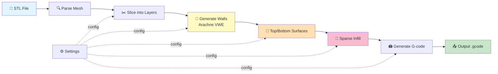
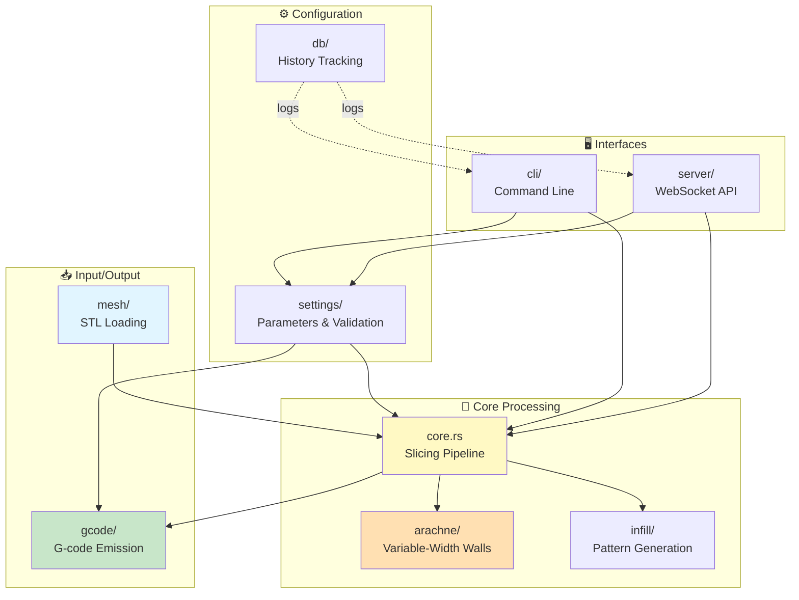
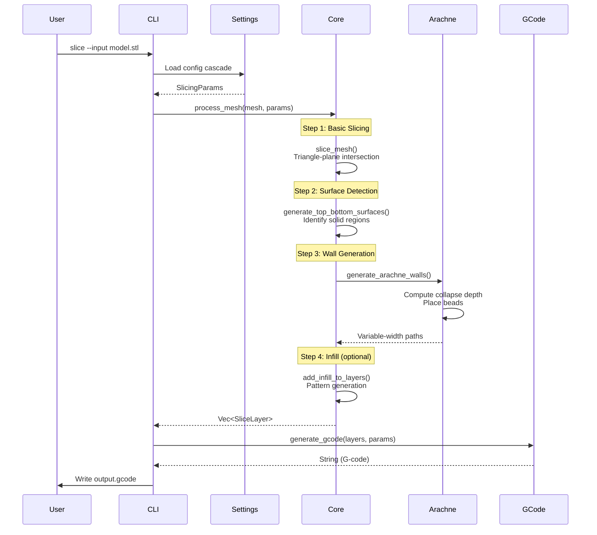
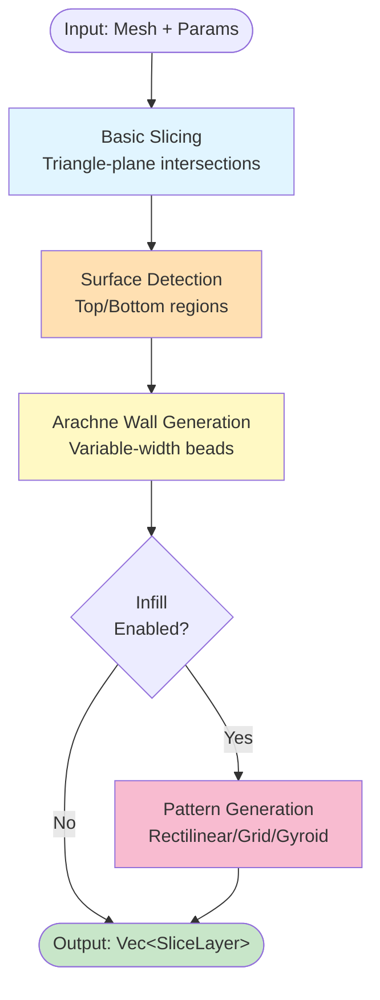
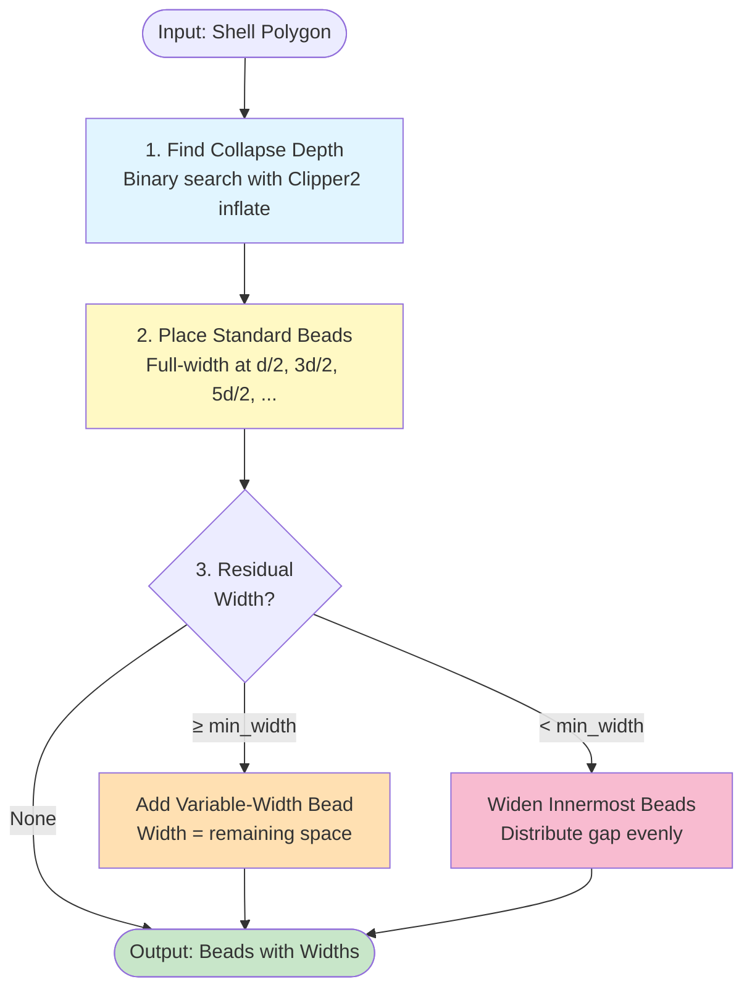
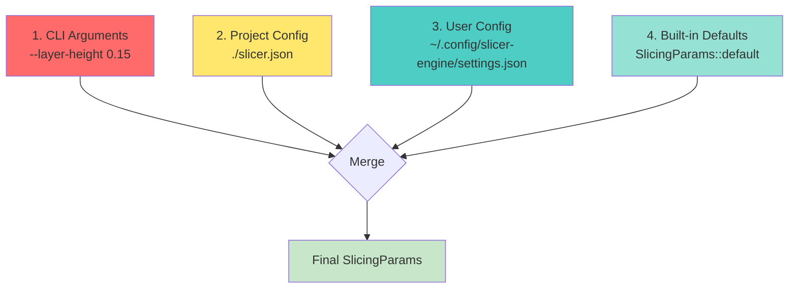
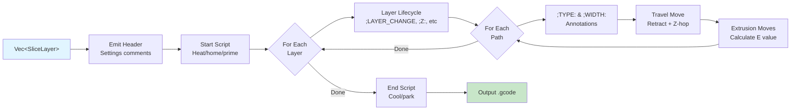

# Architecture Guide

This document provides a comprehensive overview of the slicer-engine architecture, designed to help new contributors understand the codebase structure, data flow, and key algorithms.

## Table of Contents

1. [High-Level Overview](#high-level-overview)
2. [Module Structure](#module-structure)
3. [Data Flow](#data-flow)
4. [The Slicing Pipeline](#the-slicing-pipeline)
5. [Arachne Wall Generation](#arachne-wall-generation)
6. [Settings & Configuration](#settings--configuration)
7. [Key Data Structures](#key-data-structures)
8. [G-code Generation](#g-code-generation)
9. [Learning Resources](#learning-resources)

---

## High-Level Overview

The slicer-engine converts 3D triangle meshes (STL files) into layer-by-layer toolpaths for 3D printers. The core workflow is:



---

## Module Structure

The codebase is organized into focused modules, each with a specific responsibility:



### Module Responsibilities

| Module | Purpose | Key Files |
|--------|---------|-----------|
| **`core.rs`** | Central slicing pipeline, layer generation | `process_mesh()`, `slice_mesh()` |
| **`arachne/`** | Variable-width perimeter generation (Arachne algorithm) | `mod.rs`, bead computation |
| **`mesh/`** | STL loading, mesh types, geometric analysis | `io.rs`, `types.rs`, `transforms.rs` |
| **`gcode/`** | Multi-flavor G-code emission (Marlin, Klipper) | `generator.rs`, `dialects/` |
| **`settings/`** | Configuration parameters, validation, persistence | `params.rs`, `persistence.rs` |
| **`cli/`** | Command-line interface (slice, settings, info) | `commands/` |
| **`server/`** | WebSocket server for web UI | `ws_session.rs`, `handlers.rs` |
| **`db/`** | SQLite-based slicing history tracking | `mod.rs` |

---

## Data Flow

Understanding how data flows through the system is crucial:



---

## The Slicing Pipeline

The core pipeline is implemented in `process_mesh()` and consists of several stages:



### Stage Details

#### 1. Basic Slicing (`slice_mesh`)
Converts 3D mesh into 2D contours at each layer height by intersecting triangles with horizontal planes.

**Algorithm:**
- For each layer Z:
  - Find triangles that cross the plane
  - Compute edge-plane intersection points
  - Chain segments into closed contours

**Output:** `Vec<SliceLayer>` with raw mesh contours (all paths marked as `Perimeter`)

#### 2. Surface Detection (`generate_top_bottom_surfaces`)
Identifies regions that need solid infill (top/bottom surfaces) by analyzing layer coverage.

**Algorithm:**
- For layer `i`:
  - Top surface = regions in layer `i` NOT covered by all of layers `[i+1..i+N]`
  - Bottom surface = regions in layer `i` NOT covered by all of layers `[i-N..i-1]`
  - Generate solid infill patterns at 45° angle

**Key insight:** Uses progressive intersection to correctly handle non-monotonic shapes and mid-model surfaces (ledges, internal floors).

#### 3. Arachne Wall Generation (`generate_arachne_walls`)
Replaces fixed-width perimeters with variable-width beads that adapt to local wall thickness.

**See:** [Arachne Wall Generation](#arachne-wall-generation) section below for detailed explanation.

#### 4. Sparse Infill (optional, `add_infill_to_layers`)
Generates internal support structure with configurable pattern and density.

**Supported patterns:**
- Rectilinear (alternating 0°/90° lines)
- Grid (perpendicular lines)
- Honeycomb (hexagonal tessellation)
- Gyroid (3D mathematical surface)

---

## Arachne Wall Generation

Arachne is a **variable-width extrusion (VWE)** algorithm that replaces traditional fixed-width perimeters. Instead of printing N lines of constant width, Arachne adapts extrusion width to match the local wall thickness.

### Why Arachne?

**Traditional approach problems:**
- Gaps at thin walls (< nozzle diameter)
- Over-extrusion at corners
- Requires separate thin-wall gap fill

**Arachne benefits:**
- Single-pass variable-width beads fill thin regions exactly
- No gaps or over-extrusion
- Cleaner walls with fewer artifacts

### Algorithm Overview



### Detailed Steps

#### Step 1: Collapse Depth Calculation
The **collapse depth D** is the polygon's inradius — the largest distance you can offset inward before the polygon disappears.

**Method:** Binary search using Clipper2's `inflate()` with negative offset.

```
24 iterations → sub-nanometer precision
Iteration:   offset = (lo + hi) / 2
Check:       inflate(polygon, -offset) non-empty?
  Yes → D >= offset (update lo)
  No  → D < offset  (update hi)
```

**Result:** `D` = half the minimum wall thickness at any point in the polygon.

#### Step 2: Standard Beads
Place full-width beads (width = nozzle diameter `d`) at centerline depths:

```
Bead 0: depth = d/2   (outermost wall)
Bead 1: depth = 3d/2
Bead 2: depth = 5d/2
...
Bead k: depth = (k + 0.5) × d
```

Stop when:
- `(k + 0.5) × d >= D` (would collapse the polygon), OR
- `k >= wall_count` (reached max wall count)

#### Step 3: Residual Handling
After standard beads, remaining inner space has width:

```
remaining_width = 2 × (D - n_fit × d)
```

**Case A:** `remaining_width ≥ wall_line_width_min × d`
- Add one **variable-width bead** at center with `width = remaining_width`
- Capped at `wall_line_width_max × d` to prevent excessive over-extrusion

**Case B:** `0 < remaining_width < wall_line_width_min × d`
- Gap too thin for separate bead
- **Widen** the innermost `wall_distribution_count` beads by distributing the gap
- Preserves total extrusion volume

**Case C:** `remaining_width ≤ 0`
- No residual space — standard beads fill the entire wall

### Visual Example

```
Wall: 5mm wide, nozzle: 0.4mm, wall_count: 3

Standard beads:
  Bead 0 @ depth 0.2mm → width 0.4mm  ✓
  Bead 1 @ depth 0.6mm → width 0.4mm  ✓
  Bead 2 @ depth 1.0mm → width 0.4mm  ✓

Collapse depth D = 2.5mm
Remaining width = 2 × (2.5 - 1.2) = 2.6mm

→ Add variable bead @ depth 1.9mm, width 0.6mm
```

### Configuration Parameters

| Parameter | Default | Meaning |
|-----------|---------|---------|
| `wall_count` | 3 | Max number of perimeter beads |
| `wall_line_width_min` | 0.85×d | Min bead width (fraction of nozzle) |
| `wall_line_width_max` | 1.5×d | Max bead width (fraction of nozzle) |
| `wall_transition_threshold` | 0.6×d | Min thickness before reducing bead count |
| `wall_transition_length` | 1.0 mm | Distance to smooth bead transitions |
| `wall_distribution_count` | 1 | How many beads absorb residual width |

### Implementation Details

**Location:** `src/arachne/mod.rs`

**Key functions:**
- `find_collapse_depth()` — Binary search for inradius
- `compute_arachne_beads()` — Main bead placement logic
- `generate_arachne_walls()` — Per-layer orchestration

**Integration:** Called from `process_mesh()` after surface detection, replaces all `Perimeter`-role paths while preserving top/bottom surface paths.

**Output:** Each bead's width is stored in `SliceLayer.path_widths[i]`, used by G-code generator for accurate extrusion calculation.

---

## Settings & Configuration

Settings follow a **4-level cascade** with clear priority:



### Priority Rules

| Priority | Source | Example |
|----------|--------|---------|
| **1 (Highest)** | CLI args | `--layer-height 0.15` |
| **2** | Project config | `./slicer.json` or `--config FILE` |
| **3** | User config | `~/.config/slicer-engine/settings.json` |
| **4 (Lowest)** | Defaults | `SlicingParams::default()` |

### Parameter Categories

**Core Slicing:**
- `layer_height`: Layer thickness (mm)
- `top_layers`, `bottom_layers`: Solid surface count
- `surface_infill_angle`: Top/bottom fill angle (degrees)

**Arachne Walls:**
- `wall_count`: Max perimeter beads
- `wall_line_width_min`, `wall_line_width_max`: Width range (× nozzle)
- `wall_transition_threshold`, `wall_transition_length`: Bead transition control
- `wall_distribution_count`: Residual width distribution

**Infill:**
- `infill_density`: Sparse fill ratio (0.0–1.0)
- `infill_pattern`: Pattern type (rectilinear, grid, honeycomb, gyroid)

**Hardware:**
- `nozzle_diameter_mm`, `filament_diameter_mm`: Physical constraints
- `print_speed`, `travel_speed_mm_min`: Movement speeds
- `z_hop_mm`, `retract_mm`: Travel settings

**Temperatures:**
- `nozzle_temp`, `bed_temp`: Heating targets (°C)

**Flavor-Specific:**
- `gcode_flavor`: Target firmware (marlin, klipper)
- `start_print_gcode`, `end_print_gcode`: Custom scripts
- `lifecycle_markers`: Per-flavor marker config

---

## Key Data Structures

### `SliceLayer`

Represents one horizontal slice at height Z:

```rust
pub struct SliceLayer {
    pub z: f64,                        // Layer height (mm)
    pub paths: Paths,                  // Closed contours (Clipper2)
    pub path_roles: Vec<ExtrusionRole>,// Role per path
    pub path_widths: Vec<Option<f64>>, // Arachne widths (mm)
}
```

**Path roles:**
- `Perimeter` — Wall contours (Arachne beads)
- `TopSurface`, `BottomSurface` — Solid infill
- `Infill` — Sparse internal fill
- `Support` — Support structures
- `Skirt` — First-layer adhesion ring

### `ExtrusionRole`

Annotates each path's purpose for G-code comments and firmware features:

```rust
pub enum ExtrusionRole {
    Perimeter,    // ;TYPE:Perimeter
    Infill,       // ;TYPE:Infill
    TopSurface,   // ;TYPE:Top surface
    BottomSurface,// ;TYPE:Bottom surface
    Bridge,       // ;TYPE:Bridge
    Support,      // ;TYPE:Support
    Skirt,        // ;TYPE:Skirt
}
```

### `SlicingParams`

Complete configuration bag — see [Settings & Configuration](#settings--configuration) section.

---

## G-code Generation

The final stage converts `Vec<SliceLayer>` into printer-ready G-code:



### Multi-Flavor Support

Different firmwares have different G-code dialects:

**Marlin:**
```gcode
G28 ; home all axes
M104 S210 ; set hotend temp
M190 S60  ; wait for bed temp
```

**Klipper:**
```gcode
G28
START_PRINT BED_TEMP=60 EXTRUDER_TEMP=210
```

**Abstraction:** The `GcodeDialect` trait defines firmware-specific commands. The `GcodeGenerator` uses the active dialect to emit appropriate syntax.

### Lifecycle Markers

Annotate layers and moves for post-processing and firmware features:

```gcode
;LAYER_CHANGE
;Z:0.400
;HEIGHT:0.200
;BEFORE_LAYER_CHANGE
G92 E0         ; reset extruder
G1 Z0.400 F300 ; move to layer
;AFTER_LAYER_CHANGE
;TYPE:Perimeter
;WIDTH:0.42mm
G1 X10 Y10 E0.05 ; extrude
```

**Per-flavor customization:** Override marker templates with `{z}`, `{height}`, `{type}`, `{width}` placeholders.

### Variable-Width Extrusion

Arachne beads have per-path widths stored in `SliceLayer.path_widths[i]`.

**Extrusion calculation:**
```rust
// Volume = cross_section × length
let cross_section = layer_height × width_mm;  // ← uses Arachne width
let filament_area = π × (filament_diameter / 2)²;
let e_length = length × cross_section / filament_area;
```

**Key difference from fixed-width:**
- Traditional: Always uses `nozzle_diameter_mm`
- Arachne: Uses actual bead `width_mm` (varies per path)

This ensures correct material flow for thin-wall beads (e.g., 0.3mm width) and wider beads (e.g., 0.5mm width).

---

## Learning Resources

### Core Algorithms & Theory

**Computational Geometry:**
- [Clipper2 Documentation](https://www.angusj.com/clipper2/Docs/Overview.htm) — Polygon clipping and offsetting
- [Polygon offsetting algorithms](https://mcmains.me.berkeley.edu/pubs/DAC05OffsetPolygon.pdf) — Academic paper on offset methods

**Arachne VWE:**
- [Arachne: Arc-based Toolpath Generation](https://github.com/Ultimaker/CuraEngine/blob/main/docs/arachne.md) — Ultimaker's original paper & docs
- [CuraEngine Arachne Implementation](https://github.com/Ultimaker/CuraEngine/tree/main/src/WallsComputation) — Reference C++ code
- [OrcaSlicer Arachne](https://github.com/SoftFever/OrcaSlicer/tree/main/src/libslic3r/Arachne) — Alternative implementation

**Slicing & 3D Printing:**
- [Slic3r Manual](https://manual.slic3r.org/advanced/slicing) — Concepts and terminology
- [RepRap Wiki: G-code](https://reprap.org/wiki/G-code) — G-code command reference
- [Marlin Documentation](https://marlinfw.org/meta/gcode/) — Marlin-specific G-code
- [Klipper Documentation](https://www.klipper3d.org/G-Codes.html) — Klipper G-code reference

### Rust Ecosystem

**Language & Tools:**
- [The Rust Book](https://doc.rust-lang.org/book/) — Official Rust programming guide
- [Rust by Example](https://doc.rust-lang.org/rust-by-example/) — Learn Rust with examples
- [Clippy Lints](https://rust-lang.github.io/rust-clippy/master/) — Rust linter rules

**Relevant Crates:**
- [clipper2 docs](https://docs.rs/clipper2/) — Rust bindings for Clipper2
- [serde docs](https://serde.rs/) — Serialization framework (settings)
- [clap docs](https://docs.rs/clap/) — CLI argument parsing

### 3D Printing & FFF/FDM

**General Resources:**
- [3D Printing Handbook](https://www.3dhubs.com/knowledge-base/) — Materials, processes, troubleshooting
- [All3DP Guides](https://all3dp.com/2/3d-printing-infill-the-basics/) — Infill patterns explained
- [Teaching Tech Calibration](https://teachingtechyt.github.io/calibration.html) — Printer calibration guides

**Advanced Topics:**
- [Voronoi diagrams & medial axis](https://en.wikipedia.org/wiki/Medial_axis) — Math behind Arachne
- [Straight skeleton algorithm](https://en.wikipedia.org/wiki/Straight_skeleton) — Alternative to Voronoi for offsetting

---

## Next Steps for Contributors

1. **Read the code:** Start with `src/core.rs` → `process_mesh()` function
2. **Run examples:** `cargo run -- slice --input stls/benchy.stl --verbose`
3. **Explore tests:** `cargo test --release` to see unit test coverage
4. **Modify parameters:** Try changing Arachne settings in `settings.json`
5. **Trace execution:** Add `println!` debug statements to understand flow
6. **Check issues:** Look for "good first issue" labels on GitHub

**Documentation updates:** If you find gaps or errors in this guide, please open a PR!

---

## Quick Reference

### Build & Test
```bash
cargo build                # Debug build (fast iteration)
cargo build --release      # Optimized build
cargo test --release       # Run test suite
cargo clippy --all-targets --all-features -- -D warnings  # Lint
cargo fmt                  # Format code
```

### Project Layout
```
src/
├── core.rs              # Main pipeline (process_mesh)
├── arachne/mod.rs       # Variable-width walls
├── mesh/                # STL loading
│   ├── io.rs
│   ├── types.rs
│   └── transforms.rs
├── gcode/               # G-code emission
│   ├── generator.rs
│   └── dialects/
├── settings/            # Configuration
│   ├── params.rs
│   └── persistence.rs
├── cli/                 # Commands
│   └── commands/
├── server/              # WebSocket API
└── db/                  # History tracking
```

### Module Dependencies
```
mesh → core → arachne → gcode
              ↓
           infill
settings → (all modules)
cli → core + settings
server → core + settings
```

---

**Last Updated:** 2026-04-27  
**Maintainers:** See CONTRIBUTING.md for guidelines
