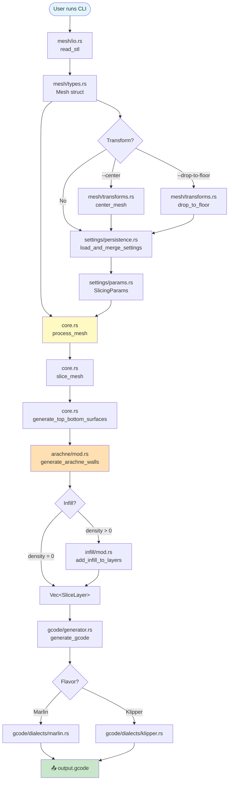
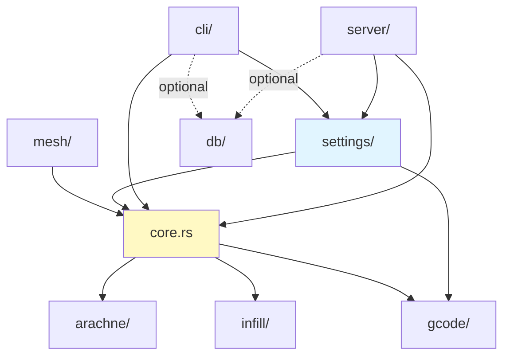
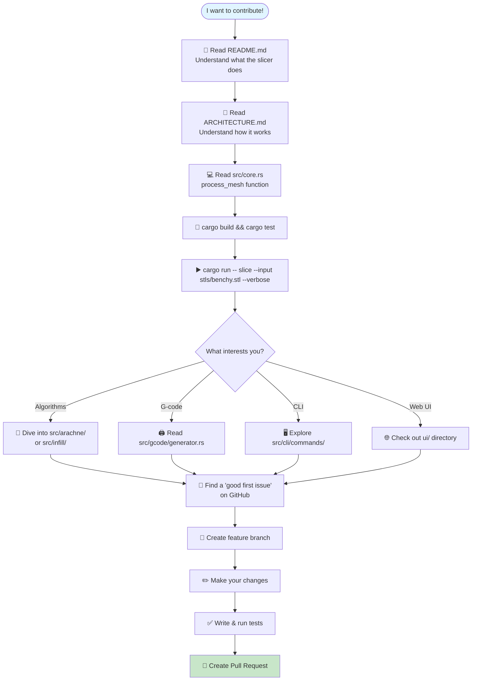

# Quick Reference Diagrams

Visual cheat sheets for understanding the slicer-engine codebase structure and flow.

## 🗂️ File Organization

```
slicer-engine/
│
├── 📄 ARCHITECTURE.md          ← Complete architecture guide (START HERE!)
├── 📄 CONTRIBUTING.md          ← Development workflow & standards
├── 📄 README.md                ← Usage guide
│
├── src/
│   ├── 📦 core.rs              ← Main pipeline (process_mesh)
│   ├── 📦 lib.rs               ← Public API exports
│   ├── 📦 main.rs              ← Binary entry point
│   │
│   ├── 📁 arachne/             ← Variable-width wall generation
│   │   └── mod.rs              ← Collapse depth, bead placement
│   │
│   ├── 📁 mesh/                ← STL loading & mesh operations
│   │   ├── io.rs               ← STL parser (binary/ASCII)
│   │   ├── types.rs            ← Mesh, Vertex, Face structs
│   │   └── transforms.rs       ← Center, drop-to-floor, scale
│   │
│   ├── 📁 gcode/               ← G-code emission
│   │   ├── generator.rs        ← Main generator (uses dialects)
│   │   ├── flavor.rs           ← GcodeFlavor enum
│   │   └── dialects/           ← Marlin, Klipper implementations
│   │       ├── marlin.rs
│   │       └── klipper.rs
│   │
│   ├── 📁 settings/            ← Configuration management
│   │   ├── params.rs           ← SlicingParams, GlobalSettings
│   │   ├── persistence.rs      ← Load/save JSON configs
│   │   └── validator.rs        ← Parameter validation rules
│   │
│   ├── 📁 cli/                 ← Command-line interface
│   │   ├── mod.rs              ← CLI dispatcher
│   │   └── commands/           ← Slice, settings, info commands
│   │       ├── slice.rs
│   │       ├── settings.rs
│   │       └── info.rs
│   │
│   ├── 📁 server/              ← WebSocket server
│   │   ├── mod.rs              ← Actix-web setup
│   │   └── ws_session.rs       ← WebSocket message handling
│   │
│   ├── 📁 db/                  ← SQLite history tracking
│   │   └── mod.rs              ← Schema & queries
│   │
│   └── 📁 infill/              ← Sparse infill patterns
│       ├── mod.rs              ← Pattern dispatcher
│       ├── rectilinear.rs      ← Alternating lines (0°/90°)
│       ├── grid.rs             ← Perpendicular grid
│       ├── honeycomb.rs        ← Hexagonal tessellation
│       ├── gyroid.rs           ← 3D mathematical surface
│       └── utils.rs            ← Line clipping, intersection
│
├── 📁 ui/                      ← Angular 21 web interface
│   └── src/app/                ← Angular components & services
│
└── 📁 tests/                   ← Integration tests
```

## 🔄 Data Flow Path

**Follow the data from STL to G-code:**



## 🧩 Module Dependencies

**Who depends on whom:**



**Key insight:** `core.rs` is the central hub. Most modules don't depend on each other directly — they all connect through core.

## 🎯 Where to Start for Common Tasks

### Adding a New Infill Pattern

```
1. Create src/infill/your_pattern.rs
2. Implement generate_your_pattern(region, density, angle, ...)
3. Add to InfillPattern enum in src/infill/mod.rs
4. Add dispatch case in generate_infill_for_layer()
5. Write tests in your_pattern.rs
6. Update ARCHITECTURE.md § Infill Patterns
```

**Files to touch:**
- `src/infill/your_pattern.rs` (new)
- `src/infill/mod.rs` (enum + dispatch)
- `ARCHITECTURE.md` (docs)

### Adding a New G-code Flavor

```
1. Create src/gcode/dialects/your_flavor.rs
2. Implement GcodeDialect trait
3. Add to GcodeFlavor enum in src/gcode/flavor.rs
4. Add match case in src/gcode/generator.rs :: new()
5. Write tests
6. Update ARCHITECTURE.md § G-code Generation
```

**Files to touch:**
- `src/gcode/dialects/your_flavor.rs` (new)
- `src/gcode/flavor.rs` (enum)
- `src/gcode/generator.rs` (instantiation)
- `ARCHITECTURE.md` (docs)

### Adding a New SlicingParam

```
1. Add field to SlicingParams in src/settings/params.rs
2. Add #[serde(default = "SlicingParams::default_your_param")]
3. Implement default_your_param() function
4. Add to compare_settings() in src/settings/diff.rs
5. Add to SlicingParamsSchema in src/cli/schemas.rs
6. Add to display in src/cli/commands/settings.rs
7. Use in process_mesh() or relevant function
8. Write tests
9. Update ARCHITECTURE.md § Configuration Parameters
```

**Files to touch:**
- `src/settings/params.rs` (struct + default)
- `src/settings/diff.rs` (comparison)
- `src/cli/schemas.rs` (schema)
- `src/cli/commands/settings.rs` (display)
- `src/core.rs` or relevant module (usage)
- `ARCHITECTURE.md` (docs)

### Debugging a G-code Quality Issue

```
1. Run with verbose logging:
   cargo run -- slice --input model.stl --verbose

2. Check intermediate layer data:
   Add println!("{:?}", layers) in src/core.rs

3. Visualize Clipper2 paths:
   let svg = paths.to_svg(1000, 1000);
   std::fs::write("debug.svg", svg)?;

4. Profile performance:
   cargo flamegraph --bin slicer-engine -- slice --input model.stl

5. Inspect G-code markers:
   grep ";TYPE:" output.gcode
   grep ";WIDTH:" output.gcode
```

**Key files:**
- `src/gcode/generator.rs` — Extrusion calculation
- `src/core.rs` — Layer path roles
- `src/arachne/mod.rs` — Bead widths

### Investigating a Slicing Bug

```
1. Create a minimal test case (small STL)

2. Enable debug output in src/core.rs:
   logger.log_debug(&format!("Layer {} has {} paths", i, layer.paths.len()));

3. Check mesh validity:
   println!("AABB: {:?}", mesh.aabb());
   println!("Triangles: {}", mesh.faces.len());

4. Visualize a specific layer:
   if layer.z.abs() - 5.0 < 0.01 {
       // Export layer 5 as SVG for inspection
   }

5. Compare with reference slicer (PrusaSlicer, Cura)
```

**Key files:**
- `src/core.rs` — Slicing logic
- `src/mesh/types.rs` — Mesh validation
- `src/SLICING.md` — Algorithm explanation

## 📊 Critical Constants

**Where the magic numbers live:**

| Constant | Location | Value | Purpose |
|----------|----------|-------|---------|
| `COLLAPSE_DEPTH_ITERATIONS` | `arachne/mod.rs` | 24 | Binary search precision for Arachne |
| `WIDTH_EPSILON` | `gcode/generator.rs` | 1e-6 | Width change threshold for `;WIDTH:` |
| `T_VALUE_EPSILON` | `infill/utils.rs` | 1e-9 | Segment intersection tolerance |
| `PARALLEL_EPSILON` | `infill/utils.rs` | 1e-9 | Parallel line detection |
| `MIN_SEGMENT_LENGTH_SQ` | `infill/utils.rs` | 1e-8 | Minimum infill line length |

**When to change them:**
- Seeing numerical instability? → Increase epsilon values
- Need more precision? → Increase iteration counts
- Getting too many tiny segments? → Increase minimum lengths

## 🧪 Test Strategy Map

```
Unit Tests           Integration Tests       Manual Tests
─────────────        ─────────────────       ────────────
src/*/tests.rs       tests/*.rs              Real STL files
│                    │                       │
├─ Arachne beads     ├─ Full pipeline        ├─ Benchy.stl
├─ Infill patterns   ├─ Settings cascade     ├─ Calibration cubes
├─ Mesh transforms   ├─ G-code generation    ├─ Torture tests
├─ Clipper2 ops      └─ Multi-flavor         └─ Real prints
└─ Settings load
```

**Run tests:**
```bash
cargo test                    # Unit tests only
cargo test --release          # With optimizations
cargo test arachne            # Specific module
cargo test test_process_mesh  # Specific test
```

## 🎓 Learning Path for New Contributors



**Estimated time to first contribution:**
- **Docs/tests:** 2-4 hours
- **Small bug fix:** 4-8 hours
- **New feature:** 1-3 days

## 🔗 Quick Links

- [ARCHITECTURE.md](ARCHITECTURE.md) — Complete system guide
- [CONTRIBUTING.md](CONTRIBUTING.md) — Development workflow
- [README.md](README.md) — Usage guide
- [src/SLICING.md](src/SLICING.md) — Slicing algorithm deep-dive
- [GitHub Issues](https://github.com/max-scopp/slicer-engine/issues) — Bug reports & feature requests
- [GitHub Discussions](https://github.com/max-scopp/slicer-engine/discussions) — Q&A and ideas

---

**Pro tip:** Keep this file open in a side tab while coding. It's designed for quick reference!
