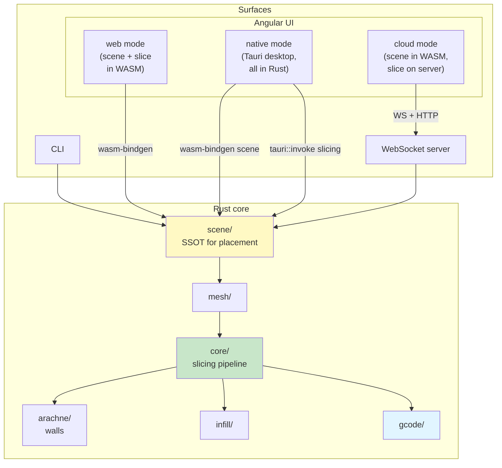

# Slicer Engine

> **3D model slicing, in Rust.** One engine, four surfaces — CLI, WebSocket server, Angular UI (via WebAssembly), and a native desktop app (Tauri).

A ground-up slicer that turns STL / OBJ / 3MF meshes into G-code for FFF 3D printers. Built on [Clipper2](https://github.com/AngusJohnson/Clipper2), bringing modern practice from Cura, PrusaSlicer, and SuperSlicer into a single, unified codebase.

📖 **Full documentation: [https://max-scopp.github.io/slicer-engine/](https://max-scopp.github.io/slicer-engine/)** — architecture, module guides, and contributor docs.

---

## Quick Start

```bash
# Slice an STL to G-code
cargo run --release -- slice --input model.stl --output output.gcode

# Run the WebSocket + UI server (default port 5201)
cargo run --release -- serve

# Inspect or edit persisted settings
cargo run --release -- settings show
cargo run --release -- settings set layer_height 0.15
```

---

## Architecture at a glance



The same Rust core is compiled three ways — natively for CLI/server, to WebAssembly for the browser, and as a Tauri backend for the desktop — so previews and final output never disagree.

The Angular UI selects its **runtime mode** at startup:

| Mode     | Scene            | Slicing          | When               |
| -------- | ---------------- | ---------------- | ------------------ |
| `cloud`  | WASM (local)     | WebSocket server | Default web build  |
| `web`    | WASM (local)     | WASM (local)     | `web-slicer` build |
| `native` | WASM (local)     | Tauri IPC → Rust | Tauri desktop      |

See [Scene Engine](src/scene/README.md) and [Slicing Pipeline](src/core/README.md) for the contract.

---

## Configuration

Slicer Engine is configured via [`slicer.toml`](src/config/README.md). Resolution order:

1. CLI flags (per invocation, never persisted)
2. Project config — `./slicer.toml` in the working directory
3. User config — platform path (e.g. `~/.config/slicer-engine/slicer.toml`)
4. Built-in defaults

```toml
[machine]
nozzle_diameter = 0.4
build_volume_x = 220.0

[slicing]
layer_height = 0.2
wall_count = 3
infill_density = 0.20

[server]
port = 5201
```

Manage it from the CLI:

```bash
slicer-engine config show
slicer-engine config set slicing.layer_height 0.15
slicer-engine slice --input model.stl --config ./slicer.toml
```

Full reference → [Settings](src/settings/README.md) · [Config (TOML)](src/config/README.md) · [CLI](src/cli/README.md).

---

## Web UI (cloud mode — Angular + server)

```bash
# 1. Build WASM scene bindings
pnpm run hydrate            # wasm-pack + schema/type gen

# 2. Start dev servers (both must run)
pnpm run ui:dev             # Angular dev server → http://localhost:4200
cargo run --release -- serve # WebSocket/HTTP server → http://localhost:5201
```

The default environment (`src/environments/environment.ts`) sets `runtimeMode: 'cloud'` so the UI sends slicing jobs to the local server while using WASM for scene management.

---

## Web UI (web mode — fully in-browser)

Includes the slicing pipeline in the WASM bundle. Requires a wasm-capable C++ toolchain (`clang++`) for `clipper2`.

```bash
# Build the full WASM bundle (scene + slicer)
pnpm run hydrate:web-slicer

# Dev server — no backend required
pnpm run ui:dev:web-slicer   # http://localhost:4200

# Production build
pnpm run ui:build:web-slicer
```

---

## Desktop app (native mode — Tauri)

Bundles the Angular UI and the full Rust engine into a native desktop application. No server required.

```bash
# Prerequisites: install Tauri CLI
cargo install tauri-cli --version "^2"
# or: pnpm add -g @tauri-apps/cli

# Dev mode (hot-reloads Angular, rebuilds Rust on change)
pnpm run desktop:dev

# Production build (outputs a platform installer)
pnpm run desktop:build
```

The desktop app detects `window.__TAURI__` at runtime and automatically activates `native` mode. Scene edits still use the shared WASM `SceneState` used by the browser UI; slicing receives that scene snapshot plus the selected model bytes over `tauri::invoke` and runs in the bundled native Rust engine.

---

## Building

```bash
cargo build --release                                       # Native (host target)
cargo build --release --target x86_64-pc-windows-msvc       # Windows
cargo build --release --target x86_64-apple-darwin          # macOS Intel
cargo build --release --target aarch64-apple-darwin         # macOS ARM
wasm-pack build --target web --release                      # WebAssembly

# Or use the Makefile (Linux/macOS):
make build-release build-windows build-macos build-wasm
```

---

## Development

```bash
cargo build                                                 # fast iteration (debug)
cargo test
cargo fmt && cargo clippy --all-targets --all-features -- -D warnings
pnpm --filter slicer-engine-docs docs:dev                   # live docs site
sea-orm-cli migrate generate "my_migration" -d src/db       # scaffold DB migration
```

See [CONTRIBUTING.md](CONTRIBUTING.md) for workflow, [AGENTS.md](AGENTS.md) for AI-agent guidance, and [ARCHITECTURE.md](ARCHITECTURE.md) for the long-form architecture overview (also rendered on the [docs site](https://max-scopp.github.io/slicer-engine/guide/architecture)).

---

## Features

STL / OBJ / 3MF input · Triangle-plane slicing · Arachne variable-width walls · Infill patterns (rectilinear, grid, honeycomb, gyroid, TPMS-D) · Multi-dialect G-code (Marlin, Klipper) · Custom start/end G-code · Lifecycle markers · Single source of truth scene engine (CLI / WS / WASM / Tauri share state) · Three runtime modes (cloud, web, native) · TOML config with deep merge · Per-object overrides · Cross-platform (Windows, macOS, Linux, browser, desktop).

---

## References

[RepRap G-code Wiki](https://reprap.org/wiki/G-code) · [Arachne Paper](https://github.com/Ultimaker/CuraEngine/blob/main/docs/arachne.md) · [Clipper2](https://www.angusj.com/clipper2/Docs/Overview.htm) · [Marlin G-code](https://marlinfw.org/meta/gcode/) · [Klipper G-code](https://www.klipper3d.org/G-Codes.html) · [Tauri](https://v2.tauri.app/)

---

## Implementation notes

Built on proven approaches from established slicers, but written from scratch in Rust. AI tools assist with development and problem-solving; all AI-generated code is reviewed and approved by human maintainers before merge.

---

## License

All rights reserved until an official license is decided. No use, reproduction, modification, or distribution permitted without written authorization. TBD.

---

## Support

[Issues](https://github.com/max-scopp/slicer-engine/issues) · [Discussions](https://github.com/max-scopp/slicer-engine/discussions) · [Contributing](CONTRIBUTING.md) · [Documentation site](https://max-scopp.github.io/slicer-engine/)
