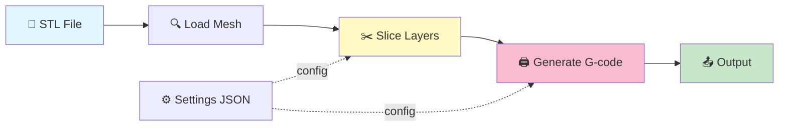

# Slicer Engine

A high-performance 3D model slicer engine written in Rust. Converts STL meshes into layer-by-layer slices and generates G-code for FFF 3D printers.

## Quick Start

```bash
# Build
cargo build --release

# Slice a model
cargo run --release -- slice --input model.stl --output output.gcode

# Validate settings
cargo run --release -- settings validate --global global.json --object object.json
```

## Pipeline



## Documentation

- **[Mesh Operations](src/mesh/README.md)** – Loading STL, mesh types
- **[Slicing Algorithm](src/SLICING.md)** – How slicing works (with diagrams)
- **[Settings](src/settings/README.md)** – Configuration parameters and priority
- **[CLI Commands](src/cli/README.md)** – Usage reference

## Project Structure

```
src/
├── core.rs          # Slicing algorithm
├── gcode/           # G-code emission (multi-flavor)
├── mesh/            # STL loading & types
├── settings/        # Parameters & validation
└── cli/             # Command interface
```

## CLI Usage

### Slice Command

```bash
# Basic slice with default settings
slicer-engine slice --input model.stl

# Custom layer height and output file
slicer-engine slice --input model.stl --layer-height 0.15 --output result.gcode

# Klipper firmware flavor
slicer-engine slice --input model.stl --gcode-flavor klipper

# Custom start/end G-code (string or file path)
slicer-engine slice --input model.stl \
  --start-print-gcode "START_PRINT BED_TEMP=60 EXTRUDER_TEMP=210" \
  --end-print-gcode "END_PRINT"

# Force-enable or disable layer lifecycle markers
slicer-engine slice --input model.stl --lifecycle-markers
slicer-engine slice --input model.stl --no-lifecycle-markers

# Use an explicit project config file
slicer-engine slice --input model.stl --config ./slicer.json

# Center and drop mesh to Z=0 before slicing
slicer-engine slice --input model.stl --center --drop-to-floor

# JSON output format
slicer-engine slice --input model.stl --output-format json
```

### Settings Command

Manage persistent settings stored in `~/.config/slicer-engine/settings.json`.

#### Get / Set values

Both flat aliases and full dot-separated paths are accepted:

```bash
# Get a value (flat alias or dotted path — equivalent)
slicer-engine settings get layer_height
slicer-engine settings get params.layer_height

# Set a value
slicer-engine settings set layer_height 0.15
slicer-engine settings set params.nozzle_temp 215
slicer-engine settings set gcode_flavor klipper

# Set custom start/end G-code
slicer-engine settings set start_print_gcode "START_PRINT BED_TEMP=60 EXTRUDER_TEMP=210"
slicer-engine settings set end_print_gcode "END_PRINT"

# Clear an optional field
slicer-engine settings set start_print_gcode null

# JSON output
slicer-engine settings get layer_height --output-format json
```

#### Show all settings

```bash
slicer-engine settings show
slicer-engine settings show --output-format json
```

#### Validate / Diff

```bash
# Validate global + object settings files
slicer-engine settings validate --global global.json --object object.json

# Show which object params override the globals
slicer-engine settings diff --global global.json --object object.json
```

### Info Command

```bash
slicer-engine info
slicer-engine info --verbose
slicer-engine info --output-format json
```

## Settings & Config Priority

Settings are resolved in this order (highest priority first):

| Priority | Source |
|----------|--------|
| 1 (highest) | CLI arguments (`--layer-height`, `--gcode-flavor`, …) |
| 2 | `slicer.json` in CWD (or `--config FILE`) |
| 3 | `~/.config/slicer-engine/settings.json` (user config) |
| 4 (lowest) | Built-in defaults |

### Project config (`slicer.json`)

Drop a `slicer.json` into your project directory to set project-level defaults.
Only the keys you include are overridden; everything else falls back to the user config or defaults.

```json
{
  "params": {
    "layer_height": 0.15,
    "nozzle_temp": 215
  },
  "gcode_flavor": "klipper"
}
```

The file is auto-discovered when you run `slicer-engine slice` from the same directory.
Use `--config FILE` for an explicit path:

```bash
slicer-engine slice --input model.stl --config ./profiles/klipper.json
```

See [Settings Reference](src/settings/README.md) for all parameters and validation rules.

## Build Targets

```bash
cargo build --release                                          # Native
cargo build --release --target x86_64-pc-windows-msvc        # Windows
cargo build --release --target x86_64-apple-darwin           # macOS Intel
cargo build --release --target aarch64-apple-darwin          # macOS ARM
wasm-pack build --target web --release                        # WebAssembly
```

## Development

```bash
cargo test --release
cargo fmt && cargo clippy --all-targets --all-features -- -D warnings
```

## Web UI

A minimal Angular 21 single-page application lives in the `ui/` directory.
It uses **signals**, standalone components, and the `@if`/`@for` control-flow
syntax throughout — no NgModules.

### Development

```bash
cd ui
npm install          # first time only
npm start            # Angular dev server → http://localhost:4200
```

### Production build

```bash
cd ui && npm run build   # output → ui/dist/slicer-ui/browser/
```

### Serve via CLI

After building, launch the bundled UI with the Rust CLI:

```bash
# Default: http://127.0.0.1:4200, ui dir = ./ui/dist/slicer-ui/browser
cargo run -- serve

# Custom port / directory
cargo run -- serve --port 8080 --ui-dir /path/to/dist
```

The `serve` command starts an **actix-web** static-file server with SPA
fallback (all unknown routes return `index.html`), so Angular client-side
routing works out of the box.

## Features

- ✓ Cross-platform (Windows, macOS, WASM)
- ✓ STL loading (ASCII & binary)
- ✓ Triangle-plane intersection slicing
- ✓ G-code generation (Marlin & Klipper)
- ✓ Custom start/end G-code (string or file)
- ✓ Layer lifecycle markers with per-flavor, per-marker template overrides (`{z}`, `{height}`, `{type}`, `{width}`)
- ✓ Four-level settings priority cascade with `slicer.json` project config
- ✓ Dotted-path settings access (`params.layer_height`)
- ✓ Settings validation & per-object overrides
- ✓ Powered by [Clipper2](https://github.com/AngusJohnson/Clipper2)
- ✓ Angular 21 web UI with signals & standalone components

## CI/CD Pipeline

GitHub Actions automatically builds all platform targets, runs linting, formatting, and the test suite on every push and pull request.

## Implementation & AI Disclaimer

This project is not a clean-room rewrite from a formal, derived requirements list.
Development may be inspired by ideas, optimization strategies, and implementation patterns commonly used in other slicers.
That said, this repository has a different purpose, codebase, language (Rust), and infrastructure, and is implemented independently for its own architecture and goals.

The primary goal of AI use in this project is development velocity, logic research, and solving mathematical challenges effectively.

IMPORTANT: ALL AI-GENERATED OR AI-ASSISTED CODE MUST BE REVIEWED AND APPROVED BY HUMAN MAINTAINERS BEFORE MERGE OR RELEASE.
"BLIND AUTOPILOT" DEVELOPMENT IS NOT ENCOURAGED OR ACCEPTED.

## License

**LEGAL NOTICE:** This is an interim state. Until an official license is decided and published, all rights are reserved and no use, reproduction, modification, or distribution of this software is permitted without explicit written authorization.

TBD

## Contributing

1. Create a feature branch
2. Make changes and test locally
3. Ensure code passes linting: `cargo clippy`
4. Format code: `cargo fmt`
5. Push and create a pull request

