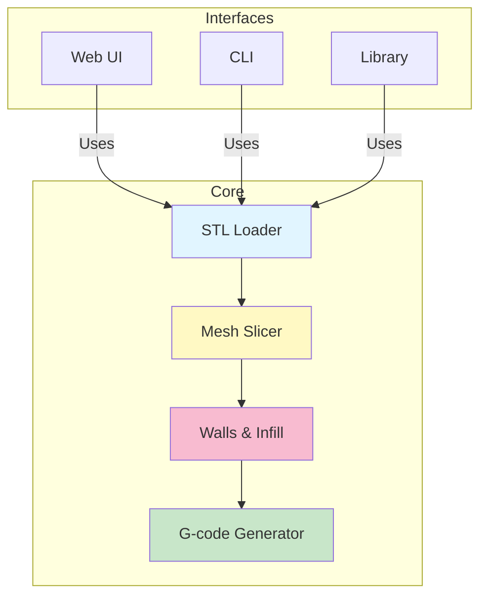

# Slicer Engine

A 3D model slicing engine written in Rust. Ground-up rewrite bringing the best practices from established slicers (Cura, PrusaSlicer, SuperSlicer) to a modern, unified codebase. Converts STL meshes into layer-by-layer slices and generates G-code for FFF 3D printers.

Runs as desktop CLI, web UI (WebAssembly), or embedded library. Supports multiple G-code dialects (Marlin, Klipper, etc.).

## Quick Start

```bash
cargo run --release -- slice --input model.stl --output output.gcode
cargo run --release -- serve --port 3000
cargo run --release -- settings validate --global global.json --object object.json
```

## Architecture



---

## Documentation

- [QUICK_REFERENCE.md](QUICK_REFERENCE.md) – Commands
- [ARCHITECTURE.md](ARCHITECTURE.md) – Design & modules
- [CONTRIBUTING.md](CONTRIBUTING.md) – Workflow
- [Mesh Operations](src/mesh/README.md) – STL, mesh types
- [Slicing Algorithm](src/SLICING.md) – Implementation
- [Settings](src/settings/README.md) – Configuration
- [CLI](src/cli/README.md) – Commands
- [G-code](src/gcode/README.md) – Output formats
- [Arachne](src/arachne/README.md) – Variable-width walls

---

## Usage & Configuration

### Slice
```bash
slicer-engine slice --input model.stl --output output.gcode --layer-height 0.15 --gcode-flavor klipper
slicer-engine slice --input model.stl --config ./slicer.json
```

### Settings
```bash
slicer-engine settings get/set layer_height 0.15
slicer-engine settings show --output-format json
slicer-engine settings validate --global global.json --object object.json
```

### Priority: CLI args → `slicer.json` (project) → `~/.config/slicer-engine/settings.json` (user) → defaults

Example `slicer.json`:
```json
{ "params": { "layer_height": 0.15, "nozzle_temp": 215 }, "gcode_flavor": "klipper" }
```

---

## Web UI & Building

### Web UI (Angular 21)
```bash
cd ui && npm install && npm start  # http://localhost:4200
cargo run --release -- serve --port 3000
```

### Build
```bash
cargo build --release                                      # Native
cargo build --release --target x86_64-pc-windows-msvc    # Windows
cargo build --release --target x86_64-apple-darwin       # macOS Intel
cargo build --release --target aarch64-apple-darwin      # macOS ARM
wasm-pack build --target web --release                    # WebAssembly
```

---

## Development

```bash
cargo build --release
cargo test --release
cargo fmt && cargo clippy --all-targets --all-features -- -D warnings
```

See [CONTRIBUTING.md](CONTRIBUTING.md) for workflow details.

---

## Features

STL (ASCII/binary) • Triangle-plane slicing • Arachne variable-width walls • Infill patterns (rectilinear, grid, honeycomb, gyroid) • Multi-dialect G-code (Marlin, Klipper, Prusa) • Custom start/end G-code • Settings priority cascade • Per-object overrides • Web UI • CLI • Library API • Cross-platform (Windows, macOS, Linux, browser, embedded) • Built with [Clipper2](https://github.com/AngusJohnson/Clipper2)

---

## References & More

- [RepRap G-code Wiki](https://reprap.org/wiki/G-code) • [Arachne Paper](https://github.com/Ultimaker/CuraEngine/blob/main/docs/arachne.md) • [Clipper2](https://www.angusj.com/clipper2/Docs/Overview.htm) • [Marlin](https://marlinfw.org/meta/gcode/) • [Klipper](https://www.klipper3d.org/G-Codes.html) • [Rust](https://doc.rust-lang.org/book/)

See [ARCHITECTURE.md](ARCHITECTURE.md#learning-resources) for more. Contribute via [CONTRIBUTING.md](CONTRIBUTING.md).

---

## Implementation Notes

Built on proven approaches from established slicers, but written from scratch in Rust. AI tools assist with development and problem-solving; all AI-generated code is reviewed and approved by human maintainers before merge.

---

## License

All rights reserved until an official license is decided. No use, reproduction, modification, or distribution permitted without written authorization. TBD

---

## Support

[Issues](https://github.com/max-scopp/slicer-engine/issues) • [Discussions](https://github.com/max-scopp/slicer-engine/discussions) • [Contributing](CONTRIBUTING.md)

