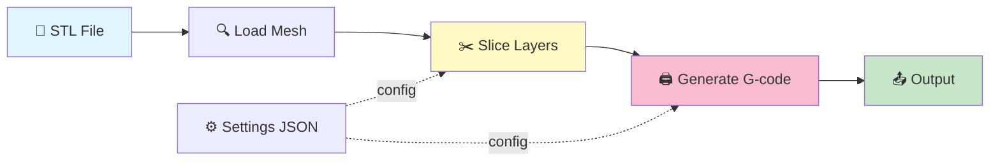

# Slicer Engine

A high-performance 3D model slicer engine written in Rust. Converts STL meshes into layer-by-layer slices and generates G-code for FFF 3D printers.

## Quick Start

```bash
# Build
cargo build --release

# Slice a model
cargo run --release -- slice --input model.stl --output output.gcode

# Validate settings
cargo run --release -- settings validate --global global.json --object object.json
```

## Pipeline



## Documentation

- **[Mesh Operations](src/mesh/README.md)** – Loading STL, mesh types
- **[Slicing Algorithm](src/SLICING.md)** – How slicing works (with diagrams)
- **[Settings](src/settings/README.md)** – Configuration parameters
- **[CLI Commands](src/cli/README.md)** – Usage reference

## Project Structure

```
src/
├── core.rs          # Slicing algorithm
├── gcode.rs         # G-code emission
├── mesh/            # STL loading & types
├── settings/        # Parameters & validation
└── cli/             # Command interface
```

## Build Targets

```bash
cargo build --release                    # Native
cargo build --release --target x86_64-pc-windows-msvc     # Windows
cargo build --release --target x86_64-apple-darwin        # macOS Intel
cargo build --release --target aarch64-apple-darwin       # macOS ARM
wasm-pack build --target web --release                    # WebAssembly
```

## Development

```bash
cargo test --release    # Run tests
cargo fmt && cargo clippy -- -D warnings
```

## Web UI

A minimal Angular 21 single-page application lives in the `ui/` directory.
It uses **signals**, standalone components, and the `@if`/`@for` control-flow
syntax throughout — no NgModules.

### Development

```bash
cd ui
npm install          # first time only
npm start            # Angular dev server → http://localhost:4200
```

### Production build

```bash
cd ui && npm run build   # output → ui/dist/slicer-ui/browser/
```

### Serve via CLI

After building, launch the bundled UI with the Rust CLI:

```bash
# Default: http://127.0.0.1:4200, ui dir = ./ui/dist/slicer-ui/browser
cargo run --release -- serve

# Custom port / directory
cargo run --release -- serve --port 8080 --ui-dir /path/to/dist
```

The `serve` command starts an **actix-web** static-file server with SPA
fallback (all unknown routes return `index.html`), so Angular client-side
routing works out of the box.

## Features

- ✓ Cross-platform (Windows, macOS, WASM)
- ✓ STL loading (ASCII & binary)
- ✓ Triangle-plane intersection slicing
- ✓ G-code generation with temperature control
- ✓ Settings validation & per-object overrides
- ✓ Powered by [Clipper2](https://github.com/AngusJohnson/Clipper2)
- ✓ Angular 21 web UI with signals & standalone components

---

**License:** See LICENSE  
**Coordinates:** All dimensions in millimeters, Z-axis is vertical

# Show version
cargo run --release -- --version
```

### Info Command

Display build and library information:

```bash
# Basic info
cargo run --release -- info

# Verbose info with features
cargo run --release -- info --verbose

# JSON format
cargo run --release -- info --output-format json


```

### Slice Command

Slice a 3D model into layers:

```bash
# Basic slice with default layer height (0.2mm)
cargo run --release -- slice --input model.stl

# Slice with custom layer height
cargo run --release -- slice --input model.stl --layer-height 0.1

# Specify output file
cargo run --release -- slice --input model.stl --output result.gcode

# JSON output format
cargo run --release -- slice --input model.stl --output-format json

# Verbose output with debug information
cargo run --release -- slice --input model.stl --verbose

# Show slice command help
cargo run --release -- slice --help
```

## Testing

```bash
cargo test --release
```

## Code Quality

Format code:
```bash
cargo fmt
```

Check for issues with clippy:
```bash
cargo clippy --all-targets --all-features
```

## CI/CD Pipeline

The project includes GitHub Actions workflows that automatically:
- Build for Windows (x86_64)
- Build for macOS (x86_64 and ARM64)
- Build for WebAssembly
- Run tests
- Check code formatting
- Run linter

Workflows are triggered on push to `main` and `develop` branches, and on pull requests.

## Dependencies

- **clipper2**: Polygon clipping library
  - Version: 1.3
  - Used for geometric operations on 2D paths

## License

## License

**LEGAL NOTICE:** This is an interim state. Until an official license is decided and published, all rights are reserved and no use, reproduction, modification, or distribution of this software is permitted without explicit written authorization.

However, this is only a temporary measure while I chart a path forward with the code. The final license will be heavily influenced by community opinions and needs. I welcome your input and feedback on what licensing approach would best serve the community and the project's goals.

TBD

## Contributing

1. Create a feature branch
2. Make changes and test locally
3. Ensure code passes linting: `cargo clippy`
4. Format code: `cargo fmt`
5. Push and create a pull request
