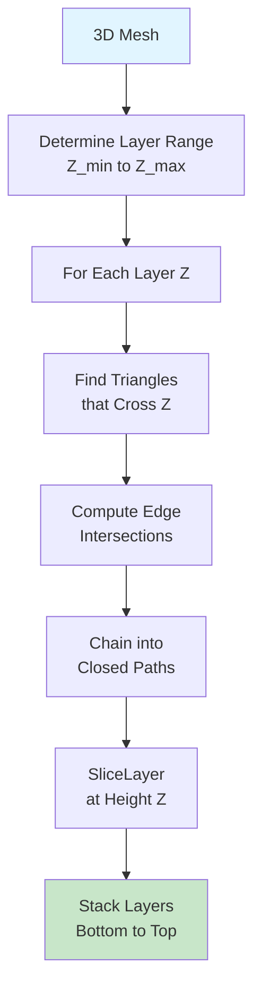
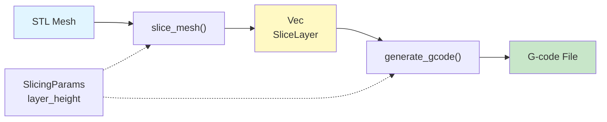

# Slicing Algorithm

Converts 3D triangle meshes into layer-by-layer 2D contours by intersecting triangles with horizontal planes.

## How It Works



## Step by Step

### 1. Layer Range
```
Model Z extent: 0 to 50 mm
Layer height: 0.2 mm
→ 250 layers at Z = 0, 0.2, 0.4, ..., 49.8, 50.0
```

### 2. Triangle-Plane Intersection

For each triangle, check if it crosses the plane at height Z:

```
Triangle vertices: A(z=1), B(z=3), C(z=2)
Plane at Z=2.5

A(z=1) is below ✓
B(z=3) is above ✓
→ Triangle crosses! Intersect edges AB and BC
```

### 3. Interpolate XY Points

Where edge crosses the plane:

```
Edge from A(x=0, y=0, z=1) to B(x=10, y=10, z=3)
Plane at Z=2.5

t = (2.5 - 1) / (3 - 1) = 0.75
x = 0 + 0.75 * 10 = 7.5
y = 0 + 0.75 * 10 = 7.5
→ Intersection at (7.5, 7.5)
```

### 4. Chain into Closed Paths

Connect intersection points into loops (contours):


## Example: Pyramid Slicing

```
Input: Pyramid with 10×10 mm base at Z=0, apex at Z=10 mm
Layer height: 2 mm

Result:
Z=0:  10×10 mm square (base)
Z=2:   8×8 mm square (tapered)
Z=4:   6×6 mm square
Z=6:   4×4 mm square
Z=8:   2×2 mm square
Z=10: point (apex)
```

Each layer is a horizontal "slice" through the model.

## Integration



**Usage:**
```rust
let mesh = load_stl("model.stl")?;
let layers = slice_mesh(&mesh, 0.2);  // 0.2 mm layer height
let gcode = generate_gcode(&layers, &params);
```

## Key Concepts

| Concept | Meaning |
|---------|---------|
| **SliceLayer** | One horizontal slice at height Z with closed contour paths |
| **Paths** | Set of closed loops (from Clipper2) representing contours |
| **Z-ordering** | Layers stack bottom-to-top for printing |
| **Degenerate triangles** | Area ≈ 0; skipped during intersection |

## Performance

- **Time:** O(triangles × layers)
- **Space:** O(layers + total segments)

**Optimization:** Cache triangle Z-extents to skip impossible layers.

## Limitations

- No infill generation (future)
- No support structure (future)
- Assumes manifold mesh (closed, no holes)

## See Also

- [Mesh Loading](mesh/README.md) – How STL is parsed
- [Settings](settings/README.md) – Layer height configuration
- [G-code](../gcode.rs) – Converting layers to printer commands
- [Root](../README.md) – Overview
