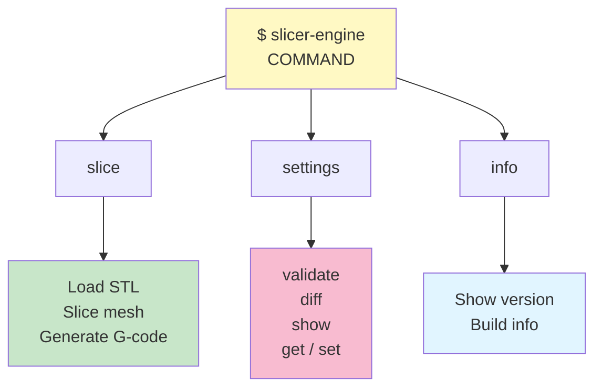

# Command-Line Interface

User-friendly commands for slicing, settings, and build info.

## Commands



## Slice: STL → G-code

Convert a 3D model to printer-ready G-code.

```bash
# Basic
slicer-engine slice --input model.stl --output output.gcode

# Custom layer height
slicer-engine slice --input model.stl --output out.gcode --layer-height 0.15

# Klipper firmware flavor
slicer-engine slice --input model.stl --gcode-flavor klipper

# Custom start/end G-code (string or file path)
slicer-engine slice --input model.stl \
  --start-print-gcode "START_PRINT BED_TEMP=60 EXTRUDER_TEMP=210" \
  --end-print-gcode "END_PRINT"

# Force-enable or disable layer lifecycle markers
slicer-engine slice --input model.stl --lifecycle-markers
slicer-engine slice --input model.stl --no-lifecycle-markers

# Use an explicit project config file
slicer-engine slice --input model.stl --config ./slicer.json

# Center and drop mesh to Z=0 before slicing
slicer-engine slice --input model.stl --center --drop-to-floor --verbose
```

**Arguments:**

| Flag | Type | Required | Default | Purpose |
|------|------|----------|---------|---------|
| `--input` | path | ✓ | – | Input STL file |
| `--output` | path | | auto | Output G-code file |
| `--layer-height` | float | | from settings | Slice spacing (mm) |
| `--gcode-flavor` | string | | from settings | `marlin` or `klipper` |
| `--start-print-gcode` | string | | from settings | Custom start G-code or file path |
| `--end-print-gcode` | string | | from settings | Custom end G-code or file path |
| `--lifecycle-markers` | flag | | from settings | Force-enable layer lifecycle markers |
| `--no-lifecycle-markers` | flag | | from settings | Force-disable layer lifecycle markers |
| `--config` | path | | auto-discover | Explicit `slicer.json` path |
| `--center` | flag | | false | Center mesh horizontally |
| `--drop-to-floor` | flag | | false | Drop mesh to Z=0 |
| `--verbose` | flag | | false | Print mesh stats |
| `--output-format` | string | | human | `json` or `human` |

## Settings: Manage Configuration

Validate, compare, and modify slicing parameters.  
Settings are persisted in `~/.config/slicer-engine/settings.json`.

### Get / Set

Both flat aliases and full dot-separated paths are accepted:

```bash
# Get — flat alias or full path (equivalent)
slicer-engine settings get layer_height
slicer-engine settings get params.layer_height

# Set — flat alias or full path
slicer-engine settings set layer_height 0.15
slicer-engine settings set params.nozzle_temp 215

# Top-level fields
slicer-engine settings set gcode_flavor klipper
slicer-engine settings set start_print_gcode "START_PRINT BED_TEMP=60 EXTRUDER_TEMP=210"
slicer-engine settings set end_print_gcode "END_PRINT"

# Clear an optional field
slicer-engine settings set start_print_gcode null

# JSON output
slicer-engine settings get gcode_flavor --output-format json
```

### Show / Validate / Diff

```bash
# Display all persisted settings
slicer-engine settings show
slicer-engine settings show --output-format json

# Validate global and object settings files
slicer-engine settings validate \
  --global global.json --object object.json

# Show differences (what's overridden in an object file)
slicer-engine settings diff \
  --global global.json --object object.json
```

See [Settings Reference](../settings/README.md) for all parameters and the full priority cascade.

## Info: Build Information

```bash
slicer-engine info
slicer-engine info --verbose
slicer-engine info --output-format json
```

Shows: version, Rust info, Clipper2 details.

## Complete Workflow

```bash
# 1. Set your preferred defaults once
slicer-engine settings set gcode_flavor klipper
slicer-engine settings set params.nozzle_temp 215

# 2. Add a project-specific slicer.json (overrides user settings for this project)
cat > slicer.json << 'EOF'
{
  "params": { "layer_height": 0.15 },
  "gcode_flavor": "klipper"
}
EOF

# 3. Slice — picks up slicer.json automatically
slicer-engine slice --input cube.stl --output cube.gcode
```

## Input/Output Formats

| Format | Type | Supported | Example |
|--------|------|-----------|---------|
| **STL** | Input | ASCII, Binary | `model.stl` |
| **G-code** | Output | FFF printer | `model.gcode` |
| **JSON** | Settings | Global & Object | `settings.json` |

### Example G-code Snippet

```gcode
; Generated by slicer-engine | flavor: marlin
G21 ; millimetres
M104 S210 ; set nozzle temp
G28 ; home axes
M109 S210 ; wait for heat

;LAYER_CHANGE
;Z:0.200
;HEIGHT:0.200
;BEFORE_LAYER_CHANGE
;0.200
G92 E0
G1 Z0.200 F9000
;AFTER_LAYER_CHANGE
;0.200
;TYPE:WALL-OUTER
;WIDTH:0.40mm
G1 X10.000 Y10.000 F9000 ; travel
G1 X20.000 Y10.000 E0.12345 F3600
```

## Global Flags

```bash
slicer-engine --version   # Show version
slicer-engine --help      # Show help
slicer-engine slice --help  # Command help
```

## Error Messages

| Error | Fix |
|-------|-----|
| `Cannot read input file` | Check STL path exists |
| `Invalid STL format` | Re-export from CAD tool |
| `Invalid settings JSON` | Fix JSON syntax |
| `Settings validation failed` | Check parameter ranges |
| `Cannot write output` | Check disk space & permissions |
| `Invalid gcode_flavor` | Use `marlin` or `klipper` |

## See Also

- [Mesh Loading](../mesh/README.md) – STL parsing
- [Slicing](../SLICING.md) – How slicing works
- [Settings](../settings/README.md) – Parameter reference and priority cascade
- [Root](../../README.md) – Project overview
