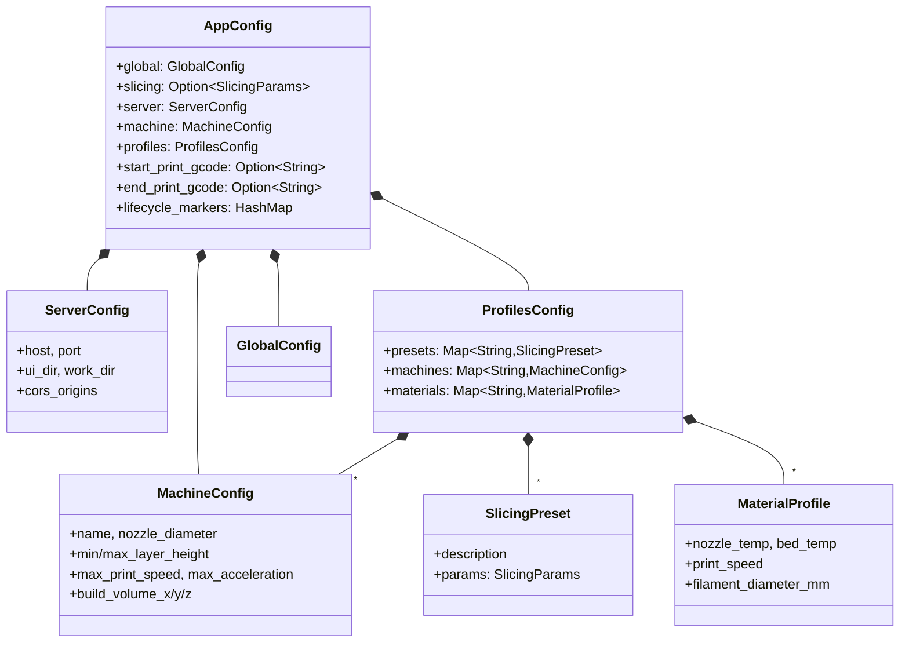
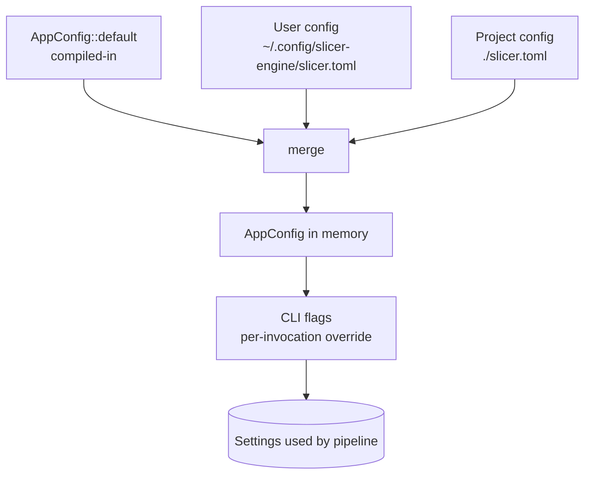
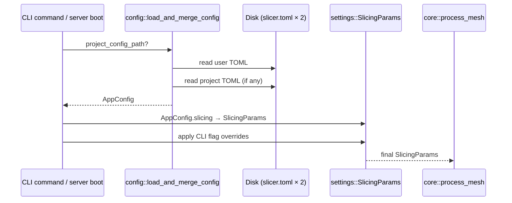

# Config — TOML, Loaded Once, Merged in Order

This module owns `slicer.toml`: how it is found, parsed, merged, and written
back. It is the single mechanism by which the CLI, the server, and the UI
agree on what the slicer's defaults are.

> _Built-in defaults → user file → project file → CLI flags. In that order. Always._

---

## Why it exists

Before there was a config module, "what's the default layer height?" had at
least three answers — one in code, one in `~/.config/slicer-engine/`, one in
each command's argument parser. Different commands disagreed. Adding a new
parameter meant editing four places.

`AppConfig` collapses all of that into one Rust struct serialised to one
file format. Everything that wants a setting reads `AppConfig`. Everything
that wants to persist a setting writes `AppConfig`. The merge order is
defined once in [`io::load_and_merge_config`](io.rs) and obeyed everywhere.

The legacy JSON paths (`settings.json`, `slicer.json`) still load for back-
compat — see the chain in
[`settings::persistence::load_and_merge_settings`](../settings/persistence.rs)
— but new code writes TOML.

---

## The contract

1. **`AppConfig` is the persisted shape.** Anything that should survive a
   restart goes here. Anything that shouldn't (CLI args, in-flight scene
   state) lives elsewhere.
2. **Merge is deep + last-writer-wins.** Object fields merge recursively;
   scalars and arrays are replaced wholesale. CLI flags layer on top
   without ever being persisted.
3. **TOML is the only authoritative format.** The legacy JSON files are
   read for migration, never written by current code paths.
4. **All defaults live in `Default` impls.** `serde(default = "…")`
   helpers point at the same functions, so a missing field in TOML
   produces the exact value `AppConfig::default()` would.

---

## Anatomy



`SlicingParams` itself lives in [`settings::params`](../settings/params.rs)
because it predates the TOML config and is also serialised over the WS
protocol — see [`settings/README.md`](../settings/README.md).

---

## Merge precedence



Resolved by [`io::load_and_merge_config`](io.rs):

1. **Compiled-in defaults** — `AppConfig::default()`.
2. **Global user config** — platform-specific path from `dirs`:
   - Linux: `~/.config/slicer-engine/slicer.toml`
   - macOS: `~/Library/Application Support/slicer-engine/slicer.toml`
   - Windows: `%APPDATA%\slicer-engine\slicer.toml`
3. **Project config** — `./slicer.toml` in the current working directory,
   auto-discovered by [`io::find_project_config_toml`](io.rs).
4. **CLI flags** — applied over the merged config in the command's
   `execute` method. Never written back.

CLI commands can also persist a single field via
[`cli::commands::config::apply_config_field`](../cli/commands/config.rs),
which the `PATCH /api/config` server handler also calls.

---

## File-format example

```toml
# ~/.config/slicer-engine/slicer.toml or ./slicer.toml

[global]
log_level = "info"

[machine]
name = "Voron 0.2 / 0.4mm"
nozzle_diameter = 0.4
build_volume_x = 120.0
build_volume_y = 120.0
build_volume_z = 120.0

[server]
port = 5201
host = "0.0.0.0"

[slicing]
layer_height = 0.2
wall_count = 3
infill_density = 0.20

[profiles.presets.draft]
description = "Fast 0.3 mm draft"
layer_height = 0.3

[profiles.materials.pla]
nozzle_temp = 210
bed_temp = 60
filament_diameter_mm = 1.75

[lifecycle_markers.klipper]
enabled = true
layer_change = ";LAYER_CHANGE"
```

---

## Role in the wider system



The config module hands out `AppConfig`. The actual slicing parameters used
during a run are `SlicingParams`, derived from `AppConfig.slicing` and
overridden by CLI flags in the command layer. The pipeline never touches
`AppConfig` directly.

---

## What this module deliberately does _not_ do

- **No validation.** Range checking and consistency rules live in
  [`settings::validator`](../settings/validator.rs).
- **No CLI flag parsing.** Commands own their `clap::Parser` structs and
  the logic to fold flags onto a loaded `AppConfig`.
- **No schema generation.** `JsonSchema` derives for the WS protocol live
  in [`crate::ws_protocol`](../ws_protocol.rs); CLI schema export is
  driven by [`cli::schemas`](../cli/schemas.rs).
- **No live-reload.** The config is loaded once per process. Editing
  `slicer.toml` while the server is running has no effect until restart.

---

## See also

- [types.rs](types.rs) — `AppConfig`, `MachineConfig`, `ServerConfig`,
  `ProfilesConfig`, `SlicingPreset`, `MaterialProfile`
- [io.rs](io.rs) — `load_config`, `save_config`, `load_and_merge_config`,
  path helpers, project discovery
- [../settings/README.md](../settings/README.md) — `SlicingParams` reference,
  legacy JSON cascade, lifecycle markers
- [../cli/README.md](../cli/README.md) — `settings`, `config` commands
- [../server/README.md](../server/README.md) — `GET` / `PATCH /api/config`
