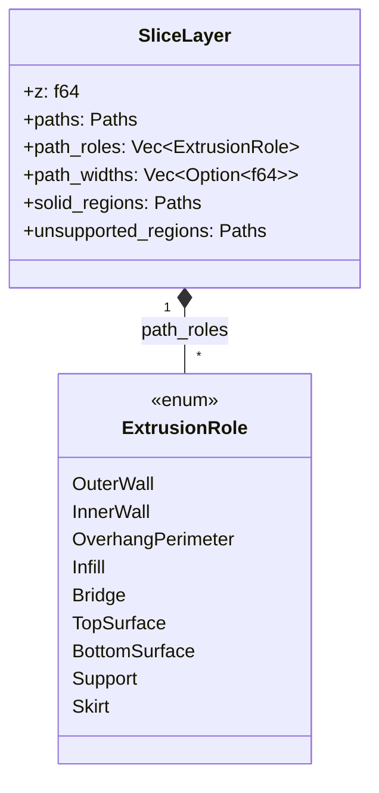
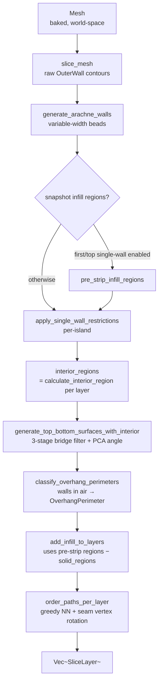
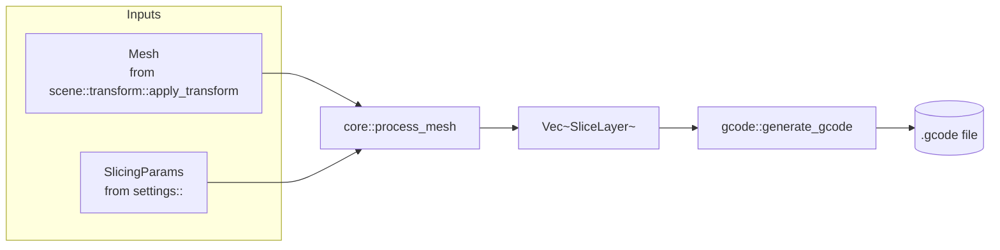

# Core — The Slicing Pipeline

This module turns a baked, world-space `Mesh` into a stack of `SliceLayer`s
ready for G-code emission. It is the engine's main loop.

> _Triangles in. Layers out. Order of operations matters._

---

## Why it exists

Slicing is not a single algorithm — it's seven of them, glued together in a
specific order, each consuming what the previous one produced:

1. Cut the mesh into 2D contours (one set per Z plane).
2. Replace those contours with variable-width wall beads (Arachne).
3. Snapshot the infill region _before_ any walls get stripped.
4. Strip inner walls from first-layer / top-surface islands when configured.
5. Detect and fill top / bottom solid surfaces (with bridge sub-classification).
6. Re-tag perimeters that cross unsupported air as `OverhangPerimeter`.
7. Add sparse infill to whatever is left, then order all paths per layer to
   minimise travel — including rotating closed loops to start at the
   configured seam vertex.

Each step depends on the geometric output of the one before. Putting them in
the wrong order — or running surface detection on the original contours
instead of the post-Arachne ones — produces visibly wrong G-code. The
pipeline lives here, in [`pipeline::process_mesh`](pipeline.rs), as one
function so the order is impossible to misread.

---

## The contract

1. **`process_mesh` is the only public entry point** for the full pipeline.
   The CLI, the WS server, and the wasm preview all call it. There is no
   "subset" pipeline; partial slicing is achieved by feeding fewer params,
   not by skipping steps.
2. **All progress is reported through `ProcessLogger`.** No `eprintln!`,
   no `println!`. CLI verbosity and WS log streaming are then identical
   by construction.
3. **Order of operations is fixed.** The comments in
   [`pipeline.rs`](pipeline.rs) explain _why_ each step sits where it does;
   re-ordering is a behaviour change, not a refactor.
4. **`SliceLayer` is the sole carrier between phases.** Each phase reads from
   and writes back into the same `Vec<SliceLayer>`; nothing escapes to
   global state.

---

## Anatomy



`paths`, `path_roles`, and `path_widths` are parallel arrays — index `i`
identifies the same emitted contour across all three. `solid_regions` is a
union of every top / bottom surface area on this layer; sparse infill
subtracts from it to avoid double-printing. `unsupported_regions` is the raw
layer footprint that has nothing solid in the layer below; the wall-
classification post-pass uses it to flag walls printed in air as
`OverhangPerimeter`.

---

## Pipeline order



### Path ordering & seam placement

After every path on a layer has been classified, the pipeline runs a
role-grouped greedy-nearest-neighbour ordering pass to minimise travel
between extrusions. Closed loops are **cyclic** — picking vertex 0 as the
start point would force unnecessary travel to a fixed first point — so the
ordering pass picks the start vertex per loop using
`SlicingParams::seam_position`:

| Policy                | Vertex choice                                                                                           | Use case                                   |
| --------------------- | ------------------------------------------------------------------------------------------------------- | ------------------------------------------ |
| `Nearest` _(default)_ | Vertex closest to the previous path's end                                                               | Fastest print, scattered seams             |
| `Rear`                | Vertex with the largest Y (tie-break smallest X)                                                        | Single back-of-model seam line             |
| `Aligned`             | Vertex with the largest projection onto a fixed direction (+Y)                                          | Consistent seam line across all layers     |
| `SharpestCorner`      | Vertex with the largest convex turn angle; falls back to `Nearest` for smooth loops (max corner < ~10°) | Hides the blob in geometry corners         |
| `Random`              | Hash of the loop's first-vertex bits (deterministic per loop)                                           | Spreads blobs evenly on cylinders/organics |

Once the start vertex is chosen the loop's vertices are rotated in place
(`pts[(start + k) % n]`) so the emitted G-code begins at that point. The
rotation is the only mutation — geometry is preserved exactly. Combined
with the role-grouped nearest-neighbour pass this single change reduced
benchmark travel by ~18 % vs always starting at vertex 0.

### Bridge & overhang quality

Bridge detection lives inside `generate_top_bottom_surfaces_with_interior`
and runs a three-stage filter on the raw "footprint with no support below"
region (matching OrcaSlicer / PrusaSlicer behaviour):

1. **Morphological opening** (`bridge_noise_filter_mm`, default 0.05 mm) —
   erode then dilate to wipe out sub-pixel slivers caused by Clipper2's
   Centi quantisation. Kept small so genuine 0.4 mm-wide bridge frames
   (window mullions, text overhangs) survive intact.
2. **Minimum-area filter** (`bridge_min_area_mm2`, default 0.5 mm²) — drop
   surviving islands smaller than the threshold; they get reclassified as
   ordinary `BottomSurface` so the layer remains fully solid below the gap.
3. **Anchor expansion** (`bridge_anchor_mm`, default 0.5 mm) — dilate the
   surviving regions outward and clip back to **`interior_regions[i]`**
   (the inside-walls bound) so each strand bites into the supported solid
   bottom material on either side of the gap _without_ expanding into the
   wall band.

Bridge **direction** uses principal-axis analysis (PCA) of the unsupported
region. Strands print perpendicular to the dominant axis so the shortest
possible span is bridged, even when the gap is rotated relative to the
print bed. Falls back to bounding-box short-axis when the region is
square / circular.

After surfaces are assigned, `classify_overhang_perimeters` re-tags each
`OuterWall` / `InnerWall` whose centerline is ≥ 50 % **inside or on the
boundary of** the layer's `unsupported_regions` as `OverhangPerimeter`.

The crucial detail is how `unsupported_regions` is built. Naïvely you
would think `perimeters[i] − perimeters[i-1]` (raw centerline difference),
but that is **wrong in two complementary ways** that took several rounds
to disentangle:

1. **`perimeters[i]` IS the wall path.** `perimeter_paths_of(layer)`
   returns the OuterWall centerline polygons of the layer — i.e. the same
   closed paths the wall classifier iterates over. So every wall vertex
   lies _exactly on_ the boundary of `perimeters[i]`, and therefore on the
   outer boundary of any region derived by subtracting another polygon
   set from `perimeters[i]`. A "strictly inside" parity test (treating
   `IsOn` as outside) flags **nothing**, ever.
2. **A current-layer wall is supported by the previous-layer bead, not
   by its centerline.** The previous-layer bead extends `d/2` outward
   from its centerline, so the geometric support envelope is
   `inflate(perimeters[i-1], +d/2)`.

The two fixes go together:

```text
unsupported_regions = perimeters[i] − inflate(perimeters[i-1], +d/2)
```

with `IsOn` counted as **inside** in the parity test:

- For a slight outward lean (horizontal step `S < d/2`) the inflated
  previous perimeter fully contains `perimeters[i]`, so
  `unsupported_regions` is empty → no wall flagged. This kills the
  "80 % of the Benchy is overhang" false positive without any vertex-
  fraction tuning.
- For a real overhang (`S > d/2`, ≈ 45° lean for 0.2 mm layer / 0.4 mm
  nozzle) a meaningful air strip exists. Wall vertices lie on its outer
  boundary (= the current centerline), and the `IsOn`-counts-as-inside
  parity test flags them.

**Don't** restore the raw centerline difference, the strict-inside
boundary policy, or the `0.6 × nozzle_diameter` "safety" erosion that
was tried at one point — any one of them suppresses _all_ overhang
detection. See `test_classify_overhang_e2e_*` in `walls.rs` for the
production-geometry lockdown tests.

Reclassified paths inherit the bridge speed (`bridge_speed`) and reduced-flow
width (`nozzle_diameter_mm × bridge_flow_ratio`) in the G-code generator and
trigger the bridge fan boost via `has_bridges`. This eliminates sagging
walls printed across windows, slots, and similar mid-air features.

Two things to note:

- **Snapshot before strip.** The single-wall-strip step (step 4) removes
  walls _per island_, but `calculate_interior_region` would still
  miscount islands on the same layer if the strip happened first.
  Snapshotting the infill region while all walls are present prevents the
  sparse-infill boundary from ballooning into the wall zone on unaffected
  islands.
- **Surfaces use post-Arachne geometry.** Top/bottom detection compares
  `OuterWall` paths between adjacent layers. Running it before Arachne
  would compare raw mesh contours instead — same shape, but with
  inconsistent winding from the slicer.

---

## Phase catalog

| Phase                         | Function                                                                      | Reads                                       | Writes                                       |
| ----------------------------- | ----------------------------------------------------------------------------- | ------------------------------------------- | -------------------------------------------- |
| Slice                         | [`slice_mesh`](slicer.rs)                                                     | `Mesh`                                      | `paths` (OuterWall)                          |
| Arachne walls                 | [`arachne::generate_arachne_walls`](../arachne/mod.rs)                        | `paths`                                     | `paths`, `path_roles`, `path_widths`         |
| Infill snapshot               | [`infill::calculate_interior_region`](infill.rs)                              | `paths` (all walls)                         | `pre_strip_infill_regions` local             |
| Single-wall strip             | [`walls::apply_single_wall_restrictions`](walls.rs)                           | `paths`, `path_roles`                       | `paths`, `path_roles` (some islands shorter) |
| Interior regions for surfaces | [`infill::calculate_interior_region`](infill.rs)                              | `paths` (post-strip)                        | `interior_regions` local                     |
| Top / bottom surfaces         | [`surfaces::generate_top_bottom_surfaces_with_interior`](surfaces.rs)         | `paths`, `interior_regions`                 | `paths`, `path_roles`, `solid_regions`       |
| Overhang classification       | [`walls::classify_overhang_perimeters`](walls.rs)                             | `paths`, `unsupported_regions`              | `path_roles` (some `OverhangPerimeter`)      |
| Sparse infill                 | [`infill::add_infill_to_layers`](infill.rs)                                   | `pre_strip_infill_regions`, `solid_regions` | `paths`, `path_roles`                        |
| Path ordering & seams         | inline in [`pipeline::process_mesh`](pipeline.rs) (uses `choose_seam_vertex`) | `paths`, `path_roles`, `seam_position`      | `paths` (rotated/reordered)                  |

`pre_strip_infill_regions` is computed only when at least one of
`only_one_wall_first_layer` / `only_one_wall_top` is enabled; otherwise the
post-strip and pre-strip regions are identical and the snapshot would be
wasted work.

---

## Role in the wider system



The pipeline does not load files, does not write G-code, and does not know
about printer profiles. It is a pure function from `(Mesh, SlicingParams)`
to `Vec<SliceLayer>`, with logging as a side channel.

---

## Performance

### Native / server (x86-64, AArch64)

The three most expensive pipeline phases all parallelise across layers via
[`rayon`](https://docs.rs/rayon):

| Phase                     | Strategy                               | Notes                                                                                  |
| ------------------------- | -------------------------------------- | -------------------------------------------------------------------------------------- |
| `perimeter_snapshot`      | `par_iter().unzip()` across all layers | Both `perimeter_paths_of` and `compute_wall_bead_footprint` run concurrently per layer |
| `surfaces` detection      | `into_par_iter().map(detect_region)`   | Each layer's bridge/top/bottom regions are independent                                 |
| `overhang_classification` | `par_iter().map(process_layer)`        | Each layer's densification + boundary tests are independent                            |

Measured on a 3DBenchy at 0.2 mm layer height (240 layers), 8-core host:

| Phase                     | Serial (before) | Parallel (after) | Δ        |
| ------------------------- | --------------- | ---------------- | -------- |
| `perimeter_snapshot`      | 3 004 ms        | 108 ms           | −96%     |
| `surfaces`                | 2 926 ms        | 273 ms           | −90%     |
| `overhang_classification` | 426 ms          | 54 ms            | −87%     |
| **Wall-clock total**      | **4 119 ms**    | **1 163 ms**     | **−72%** |

`compute_wall_bead_footprint` was also rewritten from one Clipper2
`inflate+union` _per wall path_ (quadratic accumulation) to one batched
`inflate` _per `(is_open, radius)` bucket_, typically reducing it to 1–2
Clipper2 calls per layer regardless of wall count.

### WASM (`wasm32-unknown-unknown`)

`rayon` is excluded from the WASM build via `cfg(not(target_arch = "wasm32"))`.
The same phases fall back to sequential `iter()` / `map()`. Three additional
WASM-specific constraints reduce throughput further:

1. **Single-threaded execution.** WebAssembly in browsers runs on one JS
   thread. `SharedArrayBuffer`-based threading exists but requires
   cross-origin isolation headers that most hosts don't enable.
2. **Clipper2 C++ allocator shim.** `src/cpp_shims.rs` provides `operator
new/delete` implementations that compile Clipper2 entirely into the WASM
   binary — no `env` module imports, no JS boundary crossings. However,
   every C++ heap allocation prepends an 8-byte bookkeeping header, adding
   a small constant overhead to the many short-lived `Paths` objects that
   inflate/union produce in per-path loops.
3. **Memory pressure.** Wasm32 has a 4 GiB address limit and is typically
   allocated 256 MiB by browsers. Very large models or high layer counts
   can OOM before completion.

As a rough guide, expect the WASM slicer to be **5–15× slower** than the
native server-side slicer for the same model and settings. The browser UI
uses the WASM path only for the live preview; the production slice
(server or desktop) always runs the native binary.

**What this means in practice:**

| Scenario                  | Binary                  | Expected slice time (Benchy 0.2 mm) |
| ------------------------- | ----------------------- | ----------------------------------- |
| WS server / Tauri desktop | `slicer-engine` release | ~1 s                                |
| Browser preview (WASM)    | `scene_wasm.js`         | ~10–15 s                            |
| CI (cross-compile test)   | debug build             | ~10–20 s (LTO off)                  |

Per-phase timings are reported through the `ProcessLogger::log_phase_*`
hooks. Sub-timings for Arachne (`collapse_depth_ms`, `bead_shrink_ms`) and
surface generation (`perimeter_snapshot_ms`, `detection_ms`,
`infill_gen_ms`) are summed across worker threads on native, so they can
exceed the wall-clock duration of those phases.

---

## Critical invariants

These have all been hit as bugs at least once. Read before changing
[`pipeline.rs`](pipeline.rs).

### 1. Snapshot infill regions _before_ wall stripping

Even though the strip is per-island, the snapshot is the safety net that
keeps `calculate_interior_region` honest if the strip ever changes again.
Computing `pre_strip_infill_regions` after the strip would cause sparse
infill to expand into the (now wall-less) zone on stripped islands.

### 2. Surfaces depend on Arachne `OuterWall` paths only

[`surfaces`](surfaces.rs) calls `perimeter_paths_of()`, which intentionally
returns only `OuterWall` paths. Including `InnerWall` beads makes the
EvenOdd fill rule see alternating in/out bands between concentric beads —
phantom "exposed" strips appear and get tagged as top/bottom surfaces.

### 3. `calculate_interior_region` preserves winding

`OuterWall` paths from holes are legitimately CW. Normalising them to CCW
before the inward inflate makes Clipper2 treat hole interiors as solid —
infill is then generated through the void. The `−0.5 × d` correction in
the inflate accounts for the fact that `OuterWall` centerlines are already
inset half a bead width from the model surface.

See [`../arachne/README.md`](../arachne/README.md) for the wall-side
implications and [`../../AGENTS.md`](../../AGENTS.md) for fill-rule
guidance across the whole engine.

---

## What this module deliberately does _not_ do

- **No mesh placement.** Transforms are baked into the mesh by
  [`scene::transform::apply_transform`](../scene/transform.rs) before
  `process_mesh` runs.
- **No G-code emission.** `Vec<SliceLayer>` goes to [`gcode::`](../gcode/),
  not to disk.
- **No file I/O.** The CLI loads the mesh; the pipeline doesn't know paths
  exist.
- **No profile validation.** `SlicingParams` arrives already validated by
  [`settings::validator`](../settings/validator.rs).

---

## See also

- [pipeline.rs](pipeline.rs) — `process_mesh` orchestrator
- [slicer.rs](slicer.rs) — triangle-plane intersection, segment chaining
- [walls.rs](walls.rs) — per-island first/top single-wall restriction
- [surfaces.rs](surfaces.rs) — top / bottom solid surface detection and infill
- [infill.rs](infill.rs) — `calculate_interior_region`, sparse infill driver
- [types.rs](types.rs) — `SliceLayer`, `ExtrusionRole`
- [../arachne/README.md](../arachne/README.md) — variable-width wall generation
- [../infill/README.md](../infill/README.md) — sparse infill pattern catalog
- [../SLICING.md](../SLICING.md) — slicing-algorithm walkthrough
- [../../AGENTS.md](../../AGENTS.md) — pipeline-wide invariants and fill-rule guidance
