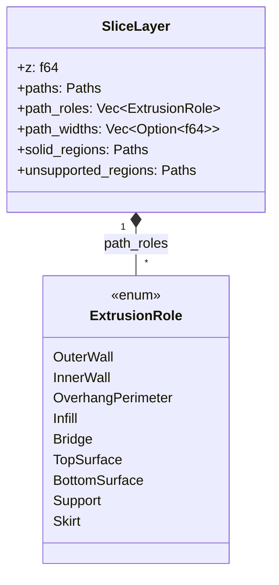
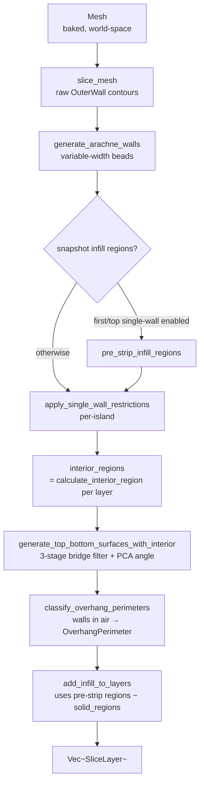
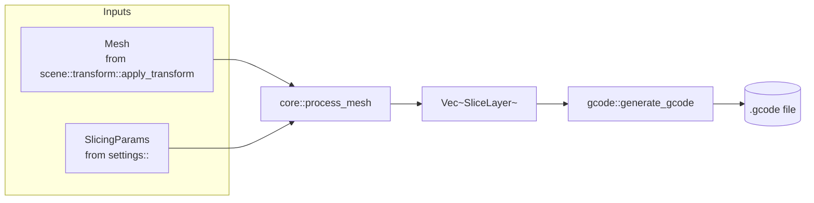

# Core — The Slicing Pipeline

This module turns a baked, world-space `Mesh` into a stack of `SliceLayer`s
ready for G-code emission. It is the engine's main loop.

> _Triangles in. Layers out. Order of operations matters._

---

## Why it exists

Slicing is not a single algorithm — it's six of them, glued together in a
specific order, each consuming what the previous one produced:

1. Cut the mesh into 2D contours (one set per Z plane).
2. Replace those contours with variable-width wall beads (Arachne).
3. Snapshot the infill region _before_ any walls get stripped.
4. Strip inner walls from first-layer / top-surface islands when configured.
5. Detect and fill top / bottom solid surfaces.
6. Add sparse infill to whatever is left.

Each step depends on the geometric output of the one before. Putting them in
the wrong order — or running surface detection on the original contours
instead of the post-Arachne ones — produces visibly wrong G-code. The
pipeline lives here, in [`pipeline::process_mesh`](pipeline.rs), as one
function so the order is impossible to misread.

---

## The contract

1. **`process_mesh` is the only public entry point** for the full pipeline.
   The CLI, the WS server, and the wasm preview all call it. There is no
   "subset" pipeline; partial slicing is achieved by feeding fewer params,
   not by skipping steps.
2. **All progress is reported through `ProcessLogger`.** No `eprintln!`,
   no `println!`. CLI verbosity and WS log streaming are then identical
   by construction.
3. **Order of operations is fixed.** The comments in
   [`pipeline.rs`](pipeline.rs) explain _why_ each step sits where it does;
   re-ordering is a behaviour change, not a refactor.
4. **`SliceLayer` is the sole carrier between phases.** Each phase reads from
   and writes back into the same `Vec<SliceLayer>`; nothing escapes to
   global state.

---

## Anatomy

`paths`, `path_roles`, and `path_widths` are parallel arrays — index `i`
identifies the same emitted contour across all three. `solid_regions` is a
union of every top / bottom surface area on this layer; sparse infill
subtracts from it to avoid double-printing. `unsupported_regions` is the raw
layer footprint that has nothing solid in the layer below; the wall-
classification post-pass uses it to flag walls printed in air as
`OverhangPerimeter`.

---

## Pipeline order

### Bridge & overhang quality

Bridge detection lives inside `generate_top_bottom_surfaces_with_interior`
and runs a three-stage filter on the raw "footprint with no support below"
region (matching OrcaSlicer / PrusaSlicer behaviour):

1. **Morphological opening** (`bridge_noise_filter_mm`, default 0.15 mm) —
   erode then dilate to wipe out thin slivers and hair-fine connecting
   strands caused by sub-pixel layer-to-layer geometry differences (the
   "Benchy embossed text" stippling pattern).
2. **Minimum-area filter** (`bridge_min_area_mm2`, default 1.0 mm²) — drop
   surviving islands smaller than the threshold; they get reclassified as
   ordinary `BottomSurface` so the layer remains fully solid below the gap.
3. **Anchor expansion** (`bridge_anchor_mm`, default 2.0 mm) — dilate the
   surviving regions outward and clip back to the layer's full footprint
   so each strand bites into the supported solid material on either side
   of the gap instead of ending mid-air.

Bridge **direction** uses principal-axis analysis (PCA) of the unsupported
region. Strands print perpendicular to the dominant axis so the shortest
possible span is bridged, even when the gap is rotated relative to the
print bed. Falls back to bounding-box short-axis when the region is
square / circular.

After surfaces are assigned, `classify_overhang_perimeters` re-tags each
`OuterWall` / `InnerWall` whose centerline is ≥ 50% inside the layer's
`unsupported_regions` as `OverhangPerimeter`. Those paths inherit the
bridge speed (`bridge_speed`) and reduced-flow width
(`nozzle_diameter_mm × bridge_flow_ratio`) in the G-code generator and
trigger the bridge fan boost via `has_bridges`. This eliminates sagging
walls printed across windows, slots, and similar mid-air features.

Two things to note:

- **Snapshot before strip.** The single-wall-strip step (step 4) removes
  walls _per island_, but `calculate_interior_region` would still
  miscount islands on the same layer if the strip happened first.
  Snapshotting the infill region while all walls are present prevents the
  sparse-infill boundary from ballooning into the wall zone on unaffected
  islands.
- **Surfaces use post-Arachne geometry.** Top/bottom detection compares
  `OuterWall` paths between adjacent layers. Running it before Arachne
  would compare raw mesh contours instead — same shape, but with
  inconsistent winding from the slicer.

---

## Phase catalog

| Phase                         | Function                                                              | Reads                                       | Writes                                       |
| ----------------------------- | --------------------------------------------------------------------- | ------------------------------------------- | -------------------------------------------- |
| Slice                         | [`slice_mesh`](slicer.rs)                                             | `Mesh`                                      | `paths` (OuterWall)                          |
| Arachne walls                 | [`arachne::generate_arachne_walls`](../arachne/mod.rs)                | `paths`                                     | `paths`, `path_roles`, `path_widths`         |
| Infill snapshot               | [`infill::calculate_interior_region`](infill.rs)                      | `paths` (all walls)                         | `pre_strip_infill_regions` local             |
| Single-wall strip             | [`walls::apply_single_wall_restrictions`](walls.rs)                   | `paths`, `path_roles`                       | `paths`, `path_roles` (some islands shorter) |
| Interior regions for surfaces | [`infill::calculate_interior_region`](infill.rs)                      | `paths` (post-strip)                        | `interior_regions` local                     |
| Top / bottom surfaces         | [`surfaces::generate_top_bottom_surfaces_with_interior`](surfaces.rs) | `paths`, `interior_regions`                 | `paths`, `path_roles`, `solid_regions`       |
| Sparse infill                 | [`infill::add_infill_to_layers`](infill.rs)                           | `pre_strip_infill_regions`, `solid_regions` | `paths`, `path_roles`                        |

`pre_strip_infill_regions` is computed only when at least one of
`only_one_wall_first_layer` / `only_one_wall_top` is enabled; otherwise the
post-strip and pre-strip regions are identical and the snapshot would be
wasted work.

---

## Role in the wider system

The pipeline does not load files, does not write G-code, and does not know
about printer profiles. It is a pure function from `(Mesh, SlicingParams)`
to `Vec<SliceLayer>`, with logging as a side channel.

---

## Performance

On native targets the per-layer phases (interior region computation,
infill snapshot) parallelise via `rayon`. On `wasm32-unknown-unknown` the
same code falls back to sequential iteration via `cfg` gates — no rayon
dependency reaches the wasm build.

Per-phase timings are reported through the `ProcessLogger::log_phase_*`
hooks. Sub-timings for Arachne (`collapse_depth_ms`, `bead_shrink_ms`) and
surface generation (`perimeter_snapshot_ms`, `detection_ms`,
`infill_gen_ms`) are summed across worker threads, so they can exceed the
wall-clock duration of the phase.

---

## Critical invariants

These have all been hit as bugs at least once. Read before changing
[`pipeline.rs`](pipeline.rs).

### 1. Snapshot infill regions _before_ wall stripping

Even though the strip is per-island, the snapshot is the safety net that
keeps `calculate_interior_region` honest if the strip ever changes again.
Computing `pre_strip_infill_regions` after the strip would cause sparse
infill to expand into the (now wall-less) zone on stripped islands.

### 2. Surfaces depend on Arachne `OuterWall` paths only

[`surfaces`](surfaces.rs) calls `perimeter_paths_of()`, which intentionally
returns only `OuterWall` paths. Including `InnerWall` beads makes the
EvenOdd fill rule see alternating in/out bands between concentric beads —
phantom "exposed" strips appear and get tagged as top/bottom surfaces.

### 3. `calculate_interior_region` preserves winding

`OuterWall` paths from holes are legitimately CW. Normalising them to CCW
before the inward inflate makes Clipper2 treat hole interiors as solid —
infill is then generated through the void. The `−0.5 × d` correction in
the inflate accounts for the fact that `OuterWall` centerlines are already
inset half a bead width from the model surface.

See [`../arachne/README.md`](../arachne/README.md) for the wall-side
implications and [`../../AGENTS.md`](../../AGENTS.md) for fill-rule
guidance across the whole engine.

---

## What this module deliberately does _not_ do

- **No mesh placement.** Transforms are baked into the mesh by
  [`scene::transform::apply_transform`](../scene/transform.rs) before
  `process_mesh` runs.
- **No G-code emission.** `Vec<SliceLayer>` goes to [`gcode::`](../gcode/),
  not to disk.
- **No file I/O.** The CLI loads the mesh; the pipeline doesn't know paths
  exist.
- **No profile validation.** `SlicingParams` arrives already validated by
  [`settings::validator`](../settings/validator.rs).

---

## See also

- [pipeline.rs](pipeline.rs) — `process_mesh` orchestrator
- [slicer.rs](slicer.rs) — triangle-plane intersection, segment chaining
- [walls.rs](walls.rs) — per-island first/top single-wall restriction
- [surfaces.rs](surfaces.rs) — top / bottom solid surface detection and infill
- [infill.rs](infill.rs) — `calculate_interior_region`, sparse infill driver
- [types.rs](types.rs) — `SliceLayer`, `ExtrusionRole`
- [../arachne/README.md](../arachne/README.md) — variable-width wall generation
- [../infill/README.md](../infill/README.md) — sparse infill pattern catalog
- [../SLICING.md](../SLICING.md) — slicing-algorithm walkthrough
- [../../AGENTS.md](../../AGENTS.md) — pipeline-wide invariants and fill-rule guidance
