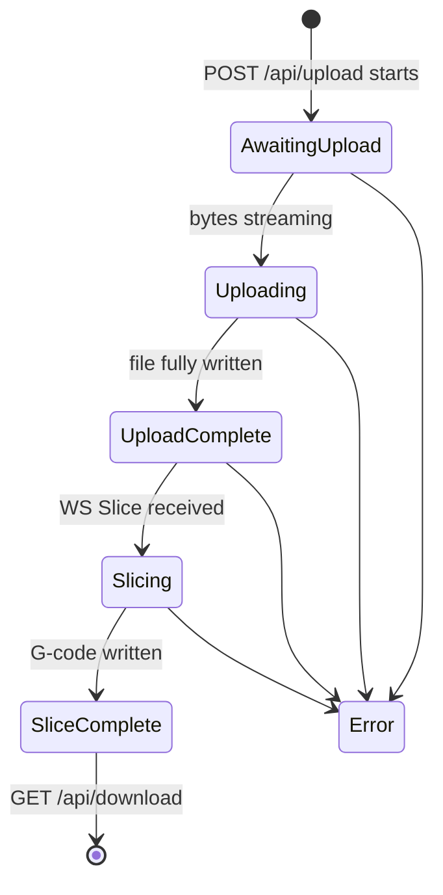
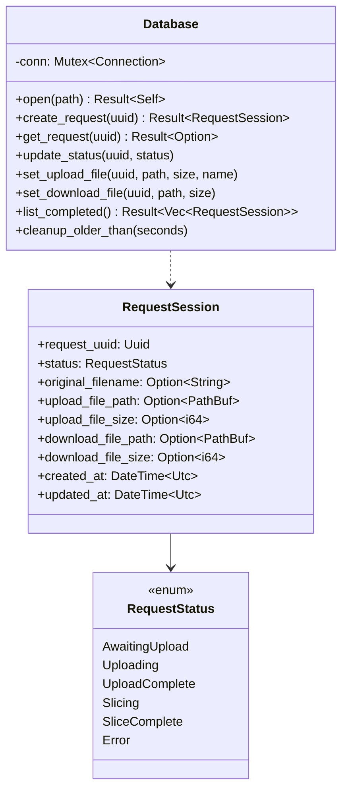
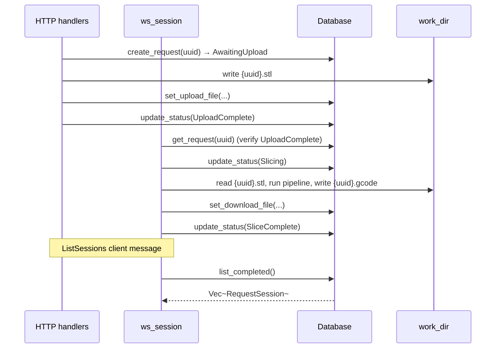
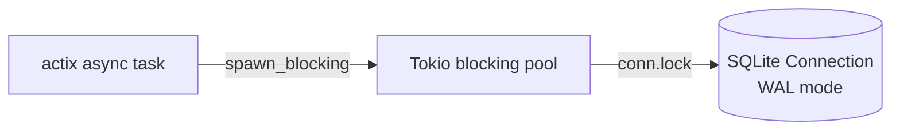

# Db — SQLite Tracking for Upload / Slice / Download

This module is the persistent ledger of "which file the browser uploaded,
which G-code file we produced for it, and where each one lives on disk."
That's it. One table, one purpose.

> _Track sessions, never copy bytes. The filesystem is the storage; SQLite is the index._

---

## Why it exists

The server's upload / slice / download lifecycle spans three independent
HTTP and WebSocket round-trips:

1. `POST /api/upload` writes `{uuid}.stl` to the work dir.
2. `WS Slice` reads it, runs the pipeline, writes `{uuid}.gcode`.
3. `GET /api/download/:uuid` streams the G-code back.

In between those, the server may restart, the browser may reconnect, or
the user may revisit a session days later via `ListSessions`. SQLite gives
us a single source of truth for "does this UUID still have a result on
disk, and if so, where?" — without copying the actual mesh or G-code into
a database row.

---

## The contract

1. **The DB stores paths and metadata, never file contents.** Files live
   in the server's `work_dir`; the DB stores the path and size.
2. **One row per `request_uuid`.** UUIDs are generated by the upload
   handler; the DB enforces uniqueness.
3. **Status is a finite-state machine.** Transitions go forward only:
   `AwaitingUpload → Uploading → UploadComplete → Slicing → SliceComplete`,
   with `Error` reachable from any state.
4. **`Mutex<Connection>` serialises all writes.** `rusqlite` is sync;
   the server reaches the DB exclusively through `tokio::task::spawn_blocking`.

---

## Schema

```sql
CREATE TABLE requests (
    request_uuid        TEXT PRIMARY KEY,
    status              TEXT NOT NULL,
    original_filename   TEXT,
    upload_file_path    TEXT,
    upload_file_size    INTEGER,
    download_file_path  TEXT,
    download_file_size  INTEGER,
    created_at          TEXT NOT NULL,  -- RFC 3339
    updated_at          TEXT NOT NULL   -- RFC 3339
);

CREATE INDEX idx_requests_status         ON requests(status);
CREATE INDEX idx_requests_updated_at     ON requests(updated_at);
CREATE INDEX idx_requests_status_updated ON requests(status, updated_at);

PRAGMA journal_mode = WAL;
```

Indices target the two query patterns we actually run: status-based cleanup
(`Error`, abandoned `AwaitingUpload`) and time-based cleanup (rows older
than _N_ days).

---

## Status state machine



Error rows are kept (they show up in `ListSessions`) so the user can see
what failed; the cleanup pass deletes them on a TTL.

---

## Anatomy



---

## Role in the wider system



The DB is only ever touched by the server. The CLI and the wasm build
exclude it via `#[cfg(not(target_arch = "wasm32"))]` in
[`crate::lib.rs`](../lib.rs).

---

## Threading



Every DB call inside an async handler is wrapped in
`tokio::task::spawn_blocking`. The `Mutex<Connection>` then serialises
queries on top of WAL, which lets readers proceed during writes — the only
contention is between concurrent writers, which the mutex resolves.

---

## What this module deliberately does _not_ do

- **No mesh storage.** STL bytes go to disk under
  `{work_dir}/{uuid}.stl`. The DB has the path, not the bytes.
- **No G-code storage.** Same arrangement: `{work_dir}/{uuid}.gcode`.
- **No scene state.** The server's per-WS-connection scene lives in
  memory; if the connection drops, it's gone (see
  [`../scene/README.md`](../scene/README.md)).
- **No history of slicing _parameters_.** Only the input/output files are
  tracked; rerunning a session means re-sending settings.
- **No multi-process safety beyond WAL.** A single `slicer-engine serve`
  process per `db_path`. Don't point two servers at the same SQLite file.

---

## See also

- [mod.rs](mod.rs) — `Database`, `RequestSession`, `RequestStatus`, queries
- [history_tests.rs](history_tests.rs) — round-trip and cleanup tests
- [../server/README.md](../server/README.md) — how the server uses this
- [../server/handlers.rs](../server/handlers.rs) — upload / download paths
- [../server/ws_session.rs](../server/ws_session.rs) — slice-side updates
