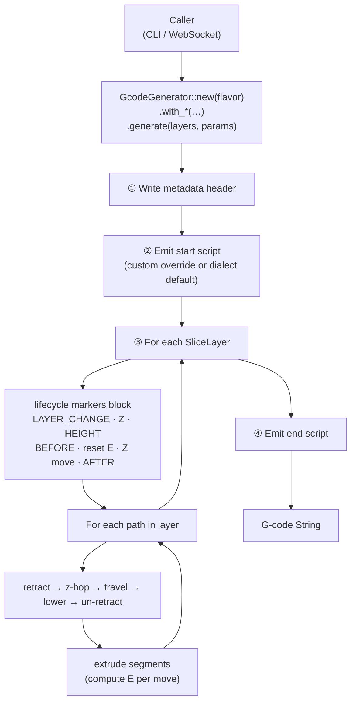
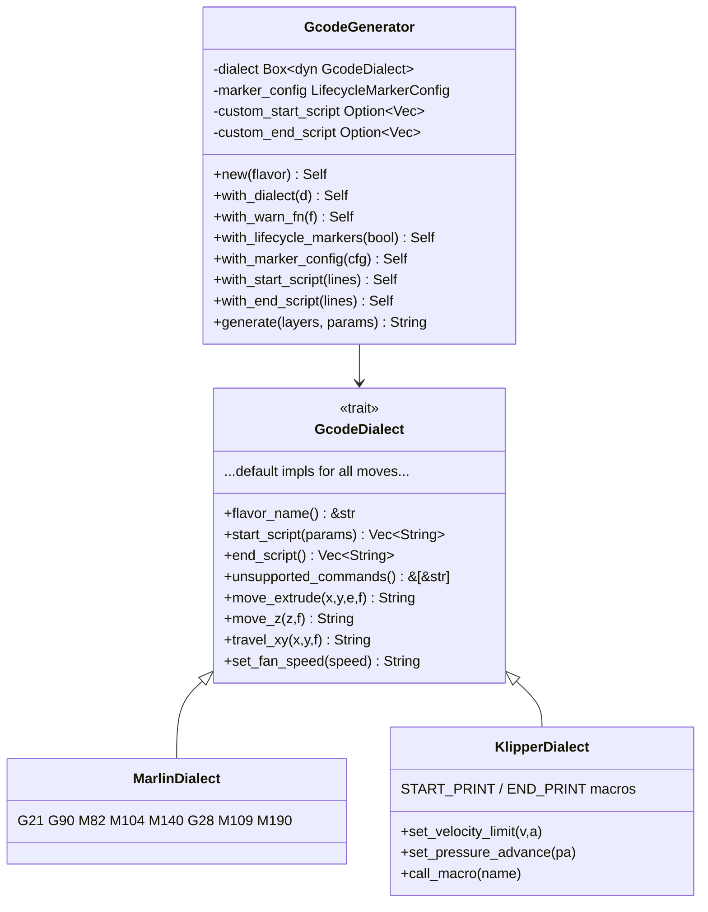
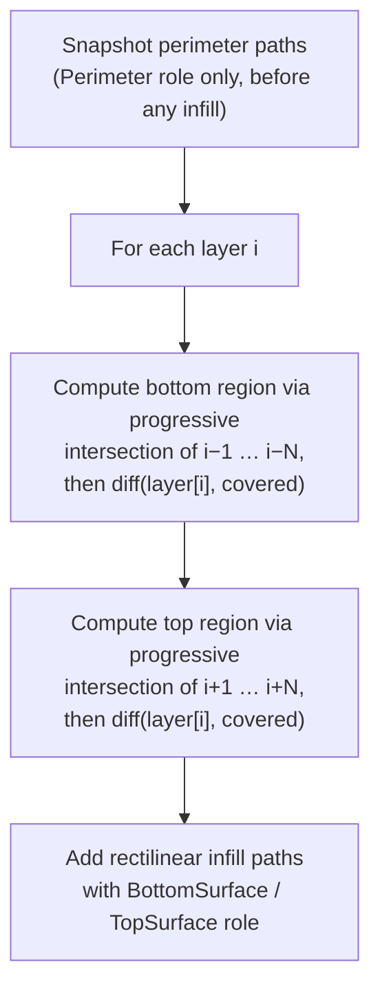
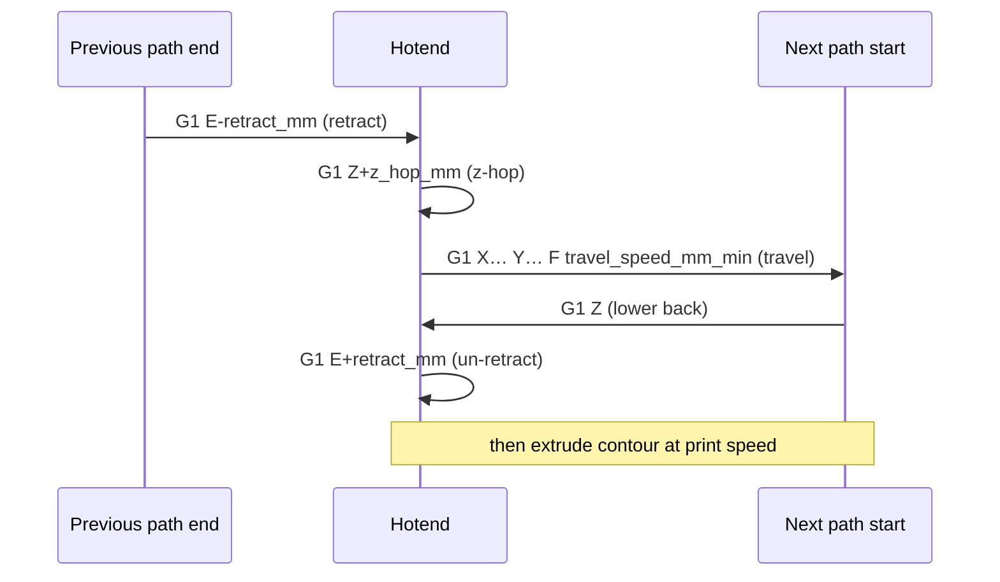
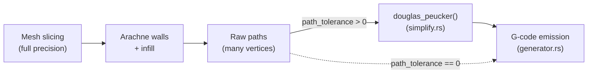

# `gcode` — G-code generation

Converts `Vec<SliceLayer>` → a firmware-ready G-code `String`.

---

## Module layout

```
gcode/
├── mod.rs          re-exports; module-level docs
├── flavor.rs       GcodeFlavor enum (Marlin | Klipper)
├── dialect.rs      GcodeDialect trait + WarnFn
├── generator.rs    GcodeGenerator façade + generate_gcode()
├── simplify.rs     Ramer-Douglas-Peucker polyline simplification
├── source.rs       resolve_gcode_source() file/string resolver
└── dialects/
    ├── mod.rs      re-exports
    ├── marlin.rs   MarlinDialect  (M104/M109/M140/M190 etc.)
    └── klipper.rs  KlipperDialect (START_PRINT / END_PRINT macros)
```

---

## Call flow



---

## Dialect abstraction



---

## Extrusion math

For each XY segment of length _L_ the required filament advance is:

```
E = L × (layer_height × nozzle_ø) / (π × (filament_ø/2)²)
```

This is the **volumetric flow balance**: the rectangular cross-section of the
deposited bead `(layer_height × nozzle_ø)` must equal the volume of filament
pushed through `(π r² × E)`.

Both diameters are configurable via `SlicingParams` (fields `nozzle_diameter_mm`
and `filament_diameter_mm`). Typical defaults: filament ø = 1.75 mm,
nozzle ø = 0.40 mm.

---

## Surface generation

Top and bottom surfaces are generated by `generate_top_bottom_surfaces()` in
`src/core.rs`. They use solid rectilinear infill at a configurable angle
(`SlicingParams::surface_infill_angle`, default 45°).

### Detection algorithm

A region of layer `i` is treated as a **top surface** when it is not covered
by every one of the `top_layers` layers above it simultaneously. Formally,
the surface region is computed by progressive intersection:

```
covered = perimeters[i]
for j in 1..=top_layers:
    if layer[i+j] does not exist or is empty:
        covered = ∅          ← model ends here; whole remaining region is exposed
        break
    covered = intersect(covered, perimeters[i+j])
    if covered = ∅: break

top_region[i] = diff(perimeters[i], covered)
```

`top_region[i]` is the area of layer `i` that is **not** enclosed by all
`top_layers` consecutive layers above it. Bottom surfaces follow the same
logic looking downward.



**Key behaviours:**

- **Model top/bottom** — when fewer than `N` layers exist above/below, the
  intersection yields `∅`, so the entire current slice becomes a surface.
- **Mid-model surfaces** — ledges, internal floors, cabin roofs, etc. are
  detected because the layers above/below do not fully cover the current
  footprint.
- **Non-monotonic shapes** — a region that is exposed at _any_ of the `N`
  successor layers (even if the `N`-th successor covers it) is correctly
  flagged as a top surface, because the progressive intersection narrows to
  the _smallest_ coverage found in the window. The old single-comparison
  approach (`diff(layer[i], layer[i+N])`) could silently miss such regions.

### Infill spacing

Line spacing for solid surface infill is derived from `layer_height`:

```
line_spacing = layer_height × SOLID_INFILL_EXTRUSION_WIDTH_MULTIPLIER  (= 1.2)
```

### Configurable parameters

| `SlicingParams` field  | Default | Description                                |
| ---------------------- | ------- | ------------------------------------------ |
| `top_layers`           | 3       | Number of solid layers above a top face    |
| `bottom_layers`        | 3       | Number of solid layers below a bottom face |
| `surface_infill_angle` | 45.0°   | Angle of rectilinear infill lines          |

---

## Travel sequence per path

Every path (closed contour or infill line) is preceded by a travel move from
the previous path's end. Whether that travel is wrapped in the
**retract / z-hop / travel / lower / un-retract** guard depends on a
_smart retract_ policy that mirrors PrusaSlicer / OrcaSlicer / Cura:

| Travel distance | Role change? | Retract? | Why                                                                             |
| --------------- | ------------ | -------- | ------------------------------------------------------------------------------- |
| `> 2.0 mm`      | any          | **yes**  | Long hops always ooze enough to need a retract                                  |
| `1.0 – 2.0 mm`  | yes          | **yes**  | Crossing role boundaries (e.g. infill → outer wall) shows seams without retract |
| `1.0 – 2.0 mm`  | no           | no       | Same-role short hops oozing is invisible inside infill                          |
| `< 1.0 mm`      | any          | no       | Retract ceremony costs more time than the hop itself                            |

The cutoff is `MIN_TRAVEL_FOR_RETRACT_MM = 1.0` (hard-coded in
[`generator.rs`](generator.rs)). The role-aware branch eliminates the
99 %+ of pointless retracts that occurred on every wall-loop end on dense
benchmarks, while still protecting the visible outer surface from oozing.

When a retract _is_ emitted, the sequence is:



Otherwise a single bare `G1 X… Y… F travel_speed_mm_min` move is emitted.

All three distances and the travel speed are configurable via `SlicingParams`
fields `retract_mm` (default 1.0 mm), `z_hop_mm` (default 0.2 mm), and
`travel_speed_mm_min` (default 9000 mm/min = 150 mm/s).

---

## Path simplification (Ramer-Douglas-Peucker)

Sliced contours and infill paths often contain many near-collinear vertices.
Streaming every one of them as a `G1` move overwhelms firmware buffers
(OctoPrint, Klipper) and bloats `.gcode` files. To address this, every path is
thinned just before emission using the [Ramer-Douglas-Peucker][rdp] (RDP)
algorithm.

[rdp]: https://en.wikipedia.org/wiki/Ramer%E2%80%93Douglas%E2%80%93Peucker_algorithm

### Where it sits in the pipeline



**Geometry calculations always use full mesh precision** — simplification
happens _only_ at the output stage, so wall offsets, infill clipping, and
surface detection are never degraded.

### Algorithm

For each polyline, recursively find the vertex with the greatest perpendicular
distance from the chord between the segment's endpoints. If that distance
exceeds `tolerance`, split there and recurse on both halves; otherwise discard
all interior vertices. The first and last point are always preserved.

### Configuration — `SlicingParams::path_tolerance`

| Value     | Effect                                                       |
| --------- | ------------------------------------------------------------ |
| `0.0`     | Disabled — all vertices preserved                            |
| `0.01`    | Conservative — high-quality printers, minimal visible impact |
| `0.05` ⭐ | Default — good balance of fidelity and move-count reduction  |
| `0.1+`    | Aggressive — best for slow firmware (legacy OctoPrint)       |

### Future-feature checklist

When adding a new feature that emits paths through `GcodeGenerator`:

- ✅ **Nothing to do.** Simplification is applied inside the generator's
  per-path loop, so any new path source (new infill pattern, support, brim,
  ironing pass, …) automatically benefits.
- ⚠️ **Bypass deliberately when curvature must be preserved point-for-point**
  (e.g. arc-fitting / `G2`/`G3` emission, exact-position commands). Either set
  `path_tolerance = 0.0` for that pass or perform the special-case emission
  before the generic generator loop.
- ⚠️ **Don't simplify upstream of geometry ops.** Calling `douglas_peucker`
  on Clipper2 paths _before_ offset/clip/intersect operations will cascade
  precision loss into walls and infill. Keep it strictly at the output layer.

---

## Lifecycle markers

When `LifecycleMarkerConfig::enabled` is `true` (default), each layer emits a
structured block compatible with OrcaSlicer / PrusaSlicer post-processors:

```
;LAYER_CHANGE
;Z:{z}
;HEIGHT:{height}
;BEFORE_LAYER_CHANGE
;{z}            ← bare numeric marker for post-processing scripts
G92 E0          ← extruder reset (E tracking restarts each layer)
G1 Z{z} F9000
;AFTER_LAYER_CHANGE
;{z}

;TYPE:{role}    ← emitted once per extrusion-role transition
;WIDTH:{w}mm
```

All marker strings are **templates**: `{z}`, `{height}`, `{type}`, `{width}`
are substituted at render time via `render_marker()`. Per-flavor overrides
are stored in `GlobalSettings::lifecycle_markers` (keyed by flavor name).

---

## Script priority chain

```
CLI --start-gcode argument
        ↓  (overrides)
GlobalSettings.start_print_gcode
        ↓  (overrides)
GcodeDialect::start_script()  ← firmware default
```

`resolve_gcode_source(input)` auto-detects whether `input` is a file path or
an inline G-code string (1 MiB file size limit enforced).
