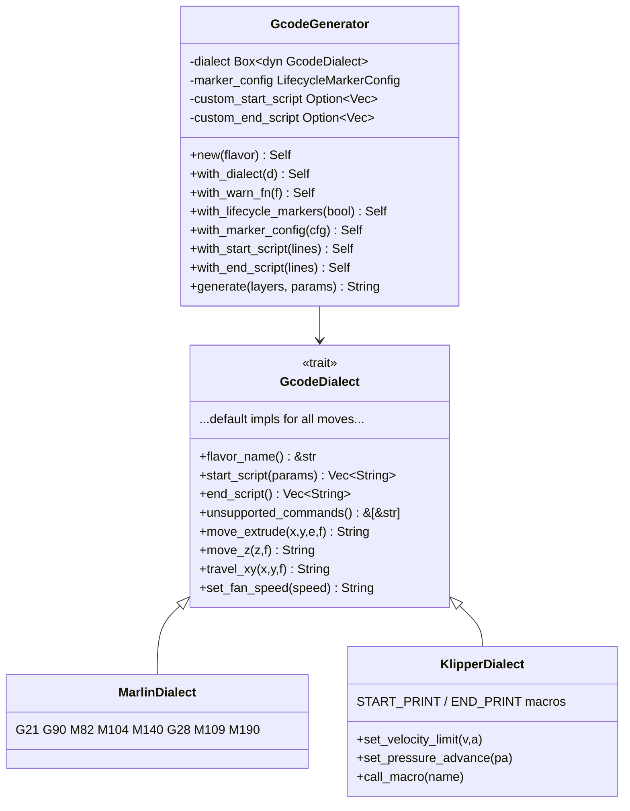
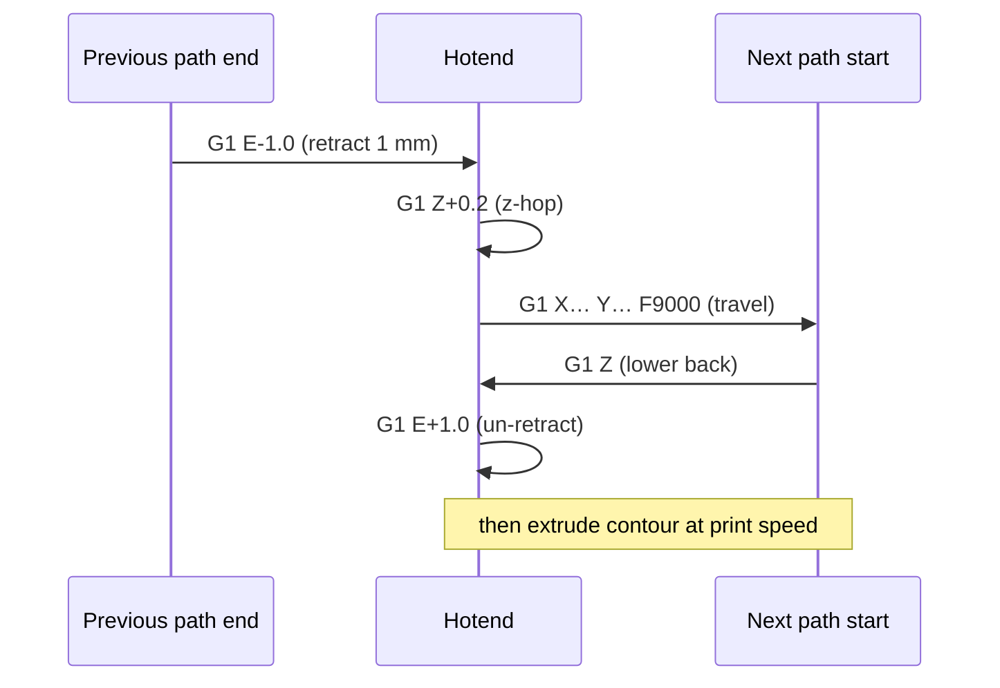

# `gcode` — G-code generation

Converts `Vec<SliceLayer>` → a firmware-ready G-code `String`.

---

## Module layout

```
gcode/
├── mod.rs          re-exports; module-level docs
├── flavor.rs       GcodeFlavor enum (Marlin | Klipper)
├── dialect.rs      GcodeDialect trait + WarnFn
├── generator.rs    GcodeGenerator façade + generate_gcode()
├── source.rs       resolve_gcode_source() file/string resolver
└── dialects/
    ├── mod.rs      re-exports
    ├── marlin.rs   MarlinDialect  (M104/M109/M140/M190 etc.)
    └── klipper.rs  KlipperDialect (START_PRINT / END_PRINT macros)
```

---

## Call flow

```mermaid
flowchart TD
    caller["Caller\n(CLI / WebSocket)"]
    gen["GcodeGenerator::new(flavor)\n.with_*(…)\n.generate(layers, params)"]
    header["① Write metadata header"]
    start["② Emit start script\n(custom override or dialect default)"]
    layers["③ For each SliceLayer"]
    markers["lifecycle markers block\nLAYER_CHANGE · Z · HEIGHT\nBEFORE · reset E · Z move · AFTER"]
    paths["For each path in layer"]
    retract["retract → z-hop → travel → lower → un-retract"]
    extrude["extrude segments\n(compute E per move)"]
    end["④ Emit end script"]
    out["G-code String"]

    caller --> gen --> header --> start --> layers
    layers --> markers --> paths --> retract --> extrude
    extrude --> paths
    paths --> layers
    layers --> end --> out
```

---

## Dialect abstraction



---

## Extrusion math

For each XY segment of length *L* the required filament advance is:

```
E = L × (layer_height × nozzle_ø) / (π × (filament_ø/2)²)
```

This is the **volumetric flow balance**: the rectangular cross-section of the
deposited bead `(layer_height × nozzle_ø)` must equal the volume of filament
pushed through `(π r² × E)`.

Defaults: filament ø = 1.75 mm, nozzle ø = 0.40 mm.

---

## Travel sequence per path

Every path (closed contour or infill line) is surrounded by a
**retract / z-hop / travel / lower / un-retract** guard to prevent stringing:



---

## Lifecycle markers

When `LifecycleMarkerConfig::enabled` is `true` (default), each layer emits a
structured block compatible with OrcaSlicer / PrusaSlicer post-processors:

```
;LAYER_CHANGE
;Z:{z}
;HEIGHT:{height}
;BEFORE_LAYER_CHANGE
;{z}            ← bare numeric marker for post-processing scripts
G92 E0          ← extruder reset (E tracking restarts each layer)
G1 Z{z} F9000
;AFTER_LAYER_CHANGE
;{z}

;TYPE:{role}    ← emitted once per extrusion-role transition
;WIDTH:{w}mm
```

All marker strings are **templates**: `{z}`, `{height}`, `{type}`, `{width}`
are substituted at render time via `render_marker()`.  Per-flavor overrides
are stored in `GlobalSettings::lifecycle_markers` (keyed by flavor name).

---

## Script priority chain

```
CLI --start-gcode argument
        ↓  (overrides)
GlobalSettings.start_print_gcode
        ↓  (overrides)
GcodeDialect::start_script()  ← firmware default
```

`resolve_gcode_source(input)` auto-detects whether `input` is a file path or
an inline G-code string (1 MiB file size limit enforced).
