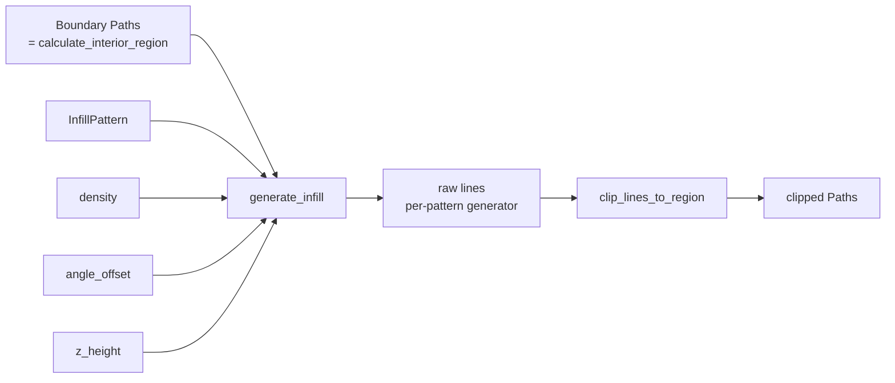
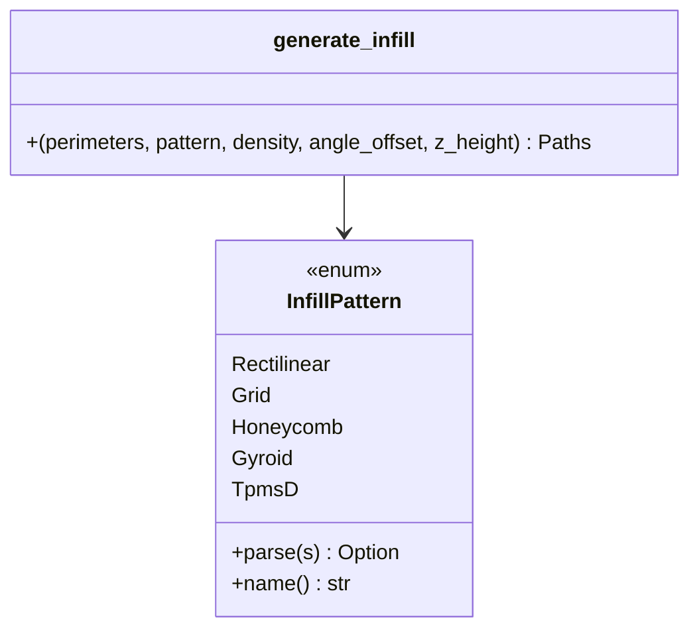
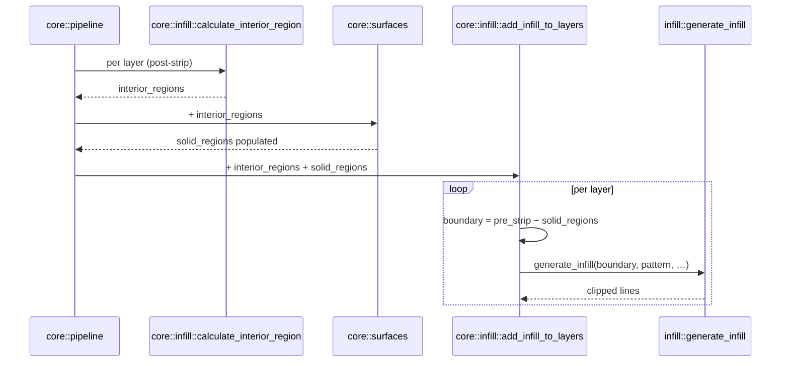

# Infill — Pattern Generation Inside a Boundary

This module turns a closed boundary `Paths` into a `Paths` of infill line
segments. It is pure 2D geometry: no slicing, no G-code, no per-layer
bookkeeping.

> _Boundary in. Lines out. The boundary is sacred — never inflate it again._

---

## Why it exists

Sparse infill is what fills the inside of a print so it isn't a pile of
loose walls. There are several established patterns, each a tradeoff
between print speed, strength, and isotropy. Rather than scatter that
geometry across the slicing pipeline, all of it lives behind one entry
point — [`generate_infill`](mod.rs) — that takes a pattern enum and
produces line segments. The slicer doesn't know how a gyroid is computed;
the gyroid doesn't know what a `SliceLayer` is.

The boundary handed in is the _final_ infill region: it has already been
inset to account for every wall bead and the configured infill overlap.
The infill generators must fill it as-is, with no further offsetting.

---

## The contract

1. **Boundaries are not inflated.** [`core::infill::calculate_interior_region`](../core/infill.rs)
   has already done that work. A second inward inflate inside this module
   was the cause of the "missing infill on cabin transition layers" bug —
   features narrower than ~2× the extra offset collapsed entirely.
2. **Output is line segments, not closed contours.** Each emitted `Path` is
   a polyline that the G-code generator strokes once. They are clipped to
   the boundary by [`utils::clip_lines_to_region`](utils.rs); patterns
   themselves emit the raw, unclipped pattern across the boundary's bounding
   box.
3. **Density is a fraction in `[0.0, 1.0]`.** `0.0` returns empty paths;
   values outside the range are clamped. The mapping from density to line
   spacing is pattern-specific.
4. **Layer rotation comes in as `angle_offset` (radians).** Callers
   alternate this per layer so rectilinear / grid lines cross between
   layers. 3D patterns (gyroid, TPMS-D) ignore it and use `z_height`
   instead.

---

## Pattern catalog

| Pattern       | File                             | Dimensionality | Strengths                                  |
| ------------- | -------------------------------- | -------------- | ------------------------------------------ |
| `Rectilinear` | [rectilinear.rs](rectilinear.rs) | 2D, per layer  | Fastest; default                           |
| `Grid`        | [grid.rs](grid.rs)               | 2D, per layer  | Stronger than rectilinear; same layer cost |
| `Honeycomb`   | [honeycomb.rs](honeycomb.rs)     | 2D, per layer  | Best 2D strength-to-weight                 |
| `Gyroid`      | [gyroid.rs](gyroid.rs)           | 3D, uses `z`   | Isotropic; experimental                    |
| `TpmsD`       | [tpms_d.rs](tpms_d.rs)           | 3D, uses `z`   | Triply-Periodic Minimal Surface (diamond)  |

`InfillPattern::parse` accepts a few aliases (`linear` → `Rectilinear`,
`hexagonal` → `Honeycomb`, `tpmsd` / `tpms_d` → `TpmsD`) for CLI ergonomics.

---

## Anatomy

---

## Role in the wider system

The `infill` module sits at the leaves of the pipeline. Everything
upstream — surface detection, wall stripping, region calculation — exists
so the boundary handed to `generate_infill` is exactly right.

---

## Critical invariants

### 1. Do not inflate the input boundary

The block comment in [`generate_infill`](mod.rs) calls this out explicitly.
A second inward offset inside this module collapses thin features and
silently loses infill. If a pattern needs internal padding, it must do so
in its own coordinate space, not by shrinking the boundary.

### 2. Pattern outputs are unclipped polylines

Per-pattern generators (`generate_rectilinear`, `generate_grid`, …) emit
straight line segments across the boundary's bounding box without any
clipping. `clip_lines_to_region` does the boolean intersection at the
end. This keeps each pattern simple and pushes the Clipper2 dependency to
one shared utility.

### 3. Scanline fill correctly handles holes

For boundaries containing CW hole sub-paths (annular cross-sections like a
hollow box), the scanline algorithm in
[`rectilinear`](rectilinear.rs) relies on Clipper2's standard winding to
produce the right parity of crossings — solid CCW outer ring + CW hole
naturally toggles the even-odd count to skip the void. No special-casing
is needed as long as the input is canonical Clipper2 output.

---

## What this module deliberately does _not_ do

- **No slicing.** It doesn't know what a layer is; it operates on a single
  boundary at a time.
- **No solid-surface infill.** Top/bottom solid lines are generated by
  [`core::surfaces`](../core/surfaces.rs) using a dedicated rectilinear
  fill. They live there because the boundary calculation is different
  (per-region, with overlap).
- **No G-code.** Output is `Paths`. The G-code generator strokes them.
- **No path optimisation.** Travel ordering, line connecting, infill
  combing — all out of scope. The G-code generator does what little
  ordering exists today.

---

## See also

- [mod.rs](mod.rs) — `InfillPattern`, `generate_infill`
- [utils.rs](utils.rs) — `clip_lines_to_region`
- [rectilinear.rs](rectilinear.rs) — alternating-line scanline fill
- [grid.rs](grid.rs), [honeycomb.rs](honeycomb.rs) — 2D patterns
- [gyroid.rs](gyroid.rs), [tpms_d.rs](tpms_d.rs) — 3D patterns
- [../core/README.md](../core/README.md) — how the boundary is computed
- [../core/infill.rs](../core/infill.rs) — `calculate_interior_region`,
  `add_infill_to_layers` (per-layer driver)
