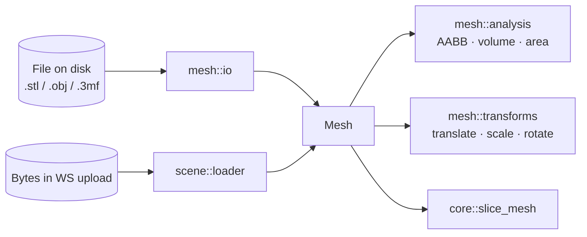
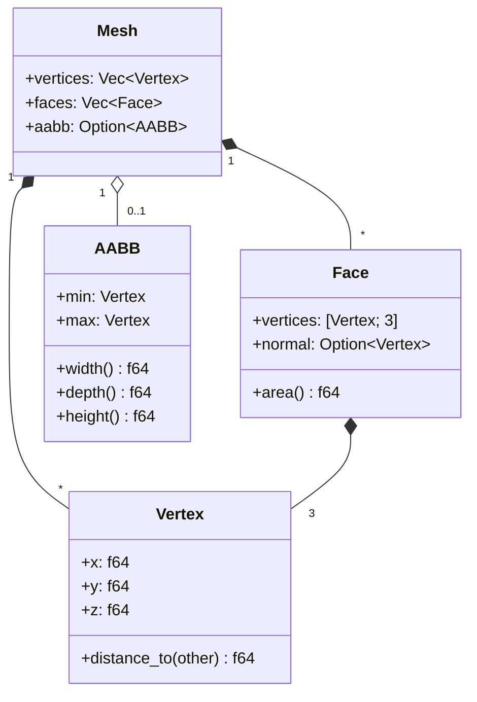
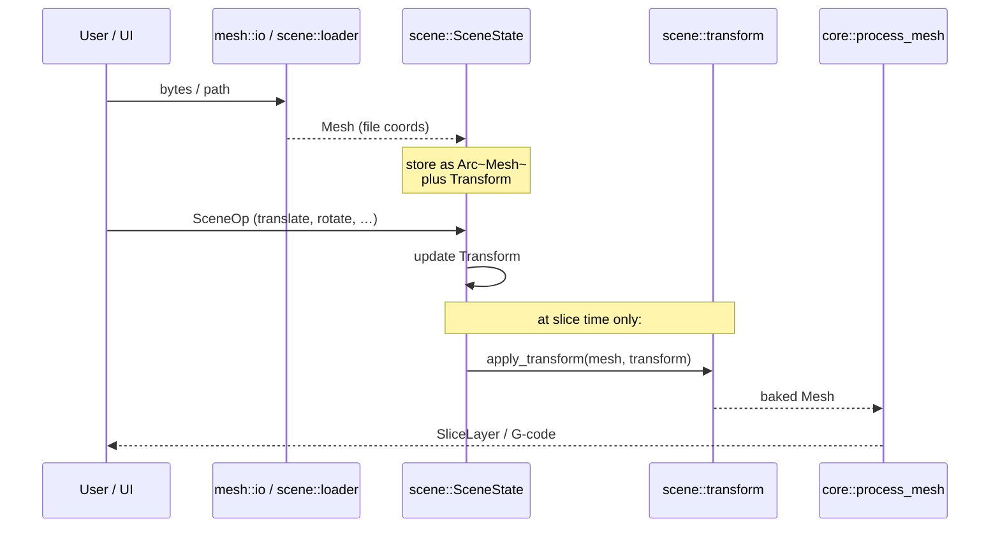

# Mesh — Triangle Geometry, Loaded and Inspected

This module owns one thing: the in-memory triangle mesh that the rest of the
engine slices. Everything starts with a `Mesh`, and every byte that comes in
from disk — STL, OBJ, 3MF — funnels through here on the way to becoming one.

> _All coordinates are in millimeters. Z is up. There is no other convention._

---

## Why it exists

Three distinct concerns share one truth: a soup of triangles with a bounding
box.

- **The slicer** wants a flat list of triangles to intersect with horizontal
  planes — it doesn't care how they got there.
- **The scene engine** ([../scene/](../scene/)) wants to clone meshes cheaply
  (via `Arc<Mesh>`) and bake transforms once before slicing.
- **The loaders** want a single target type to convert into, regardless of
  whether the source is binary STL, ASCII STL, OBJ, or a ZIP-wrapped 3MF.

`mesh::types::Mesh` is that single target. Loaders fill it; analysis reads it;
transforms produce new copies of it; the slicer consumes it.

---

## The contract

1. **Coordinates are mm; Z is up.** Loaders convert from whatever the source
   uses (STL `f32`, OBJ unspecified) to `f64` in this convention. Slicing,
   G-code, and the scene engine all assume it.
2. **Transforms are pure.** `translate_mesh`, `scale_mesh`, and friends return
   a new `Mesh`; the input is never mutated. The new mesh's cached `aabb` is
   cleared so it is recomputed on next access.
3. **`Face` carries its own vertex copies.** The triangles are denormalised
   for slicing speed: each `Face` stores its three `Vertex` values inline,
   not indices into `Mesh::vertices`. The `vertices` array exists for AABB
   computation; the slicer reads `faces`.
4. **Loaders never apply transforms.** A loaded mesh is in the file's native
   coordinates. Centering, dropping to floor, rotating — all of that is the
   scene engine's job ([../scene/ops.rs](../scene/ops.rs)).

---

## Anatomy

A few things worth knowing:

- **`aabb` is a cache.** It is `None` after construction or after a transform,
  and gets populated lazily by [`analysis::calculate_aabb`](analysis.rs).
- **`Face::normal` is what the file said.** STL ASCII files often record zero
  vectors as normals; in those cases the field is `None` and the slicer
  recomputes orientation from the triangle winding when it needs to.
- **No half-edge / connectivity structure.** This is deliberate — the slicer
  uses Clipper2 to chain segments after intersection, so we never need to
  know which triangles share which edges.

---

## File-format catalog

| Format | Variant    | Loader                  | Notes                                                 |
| ------ | ---------- | ----------------------- | ----------------------------------------------------- |
| STL    | Binary     | [`io::read_stl`](io.rs) | Via `stl_io`; fastest path, normals usually present   |
| STL    | ASCII      | [`io::read_stl`](io.rs) | Same entry point; `stl_io` auto-detects               |
| OBJ    | Wavefront  | [`io::read_obj`](io.rs) | Via `tobj`; vertex positions only, materials ignored  |
| 3MF    | XML-in-ZIP | [`io::read_3mf`](io.rs) | Custom parse (`zip` + `quick-xml`); first object only |

`SUPPORTED_EXTENSIONS` lists the recognised file extensions for CLI / WS
validation. The scene loader ([../scene/loader.rs](../scene/loader.rs))
dispatches on `MeshFormat` rather than re-sniffing extensions.

---

## Role in the wider system

The mesh module never knows about scenes, but the scene module relies on this
contract: cheap `Arc<Mesh>` clones, pure transforms, and a single AABB cache
slot that transforms invalidate.

---

## Lifecycle of a single mesh

1. **Load.** `io::read_*` (or `scene::loader::load_bytes`) parses the file
   into a `Mesh` with `aabb: None`.
2. **Inspect.** `analysis::calculate_aabb`, `calculate_volume`,
   `calculate_surface_area` populate / report basic geometry. The first AABB
   call fills the cache.
3. **Place.** The scene engine wraps the mesh in `Arc<Mesh>` and tracks a
   `Transform` alongside it. The mesh itself is _not_ mutated by scene ops.
4. **Bake.** Just before `core::process_mesh`, `scene::transform::apply_transform`
   produces a new `Mesh` with the transform baked into the vertices, AABB
   cleared.
5. **Slice.** `core::slice_mesh` walks the (now world-space) faces and emits
   `SliceLayer`s.

After step 5 the original `Arc<Mesh>` is still alive and unchanged in
`SceneState` — re-slicing with a different transform reuses it.

---

## What this module deliberately does _not_ do

- **No placement logic.** Centering, dropping to floor, face alignment — all
  in [../scene/](../scene/). The scene engine is the SSOT for "where is it";
  this module is the SSOT for "what is it".
- **No mesh repair.** Holes, non-manifold edges, flipped normals — out of
  scope. The slicer assumes a watertight, consistently-wound mesh and the
  loaders pass through whatever the file contains.
- **No format conversion.** `read_stl` produces a `Mesh`; there is no
  `write_stl`. Outputs are G-code, not meshes.
- **No connectivity graph.** The slicer doesn't need it; building one would
  cost memory we don't have on wasm32.

---

## See also

- [types.rs](types.rs) — `Mesh`, `Face`, `Vertex`, `AABB`
- [io.rs](io.rs) — STL / OBJ / 3MF loaders, `SUPPORTED_EXTENSIONS`
- [analysis.rs](analysis.rs) — AABB, volume, surface area
- [transforms.rs](transforms.rs) — pure translate / scale / rotate helpers
- [../scene/README.md](../scene/README.md) — how meshes are placed in a scene
- [../SLICING.md](../SLICING.md) — the triangle-plane intersection algorithm
