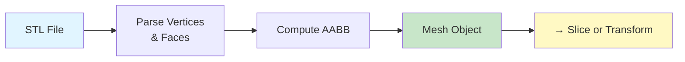
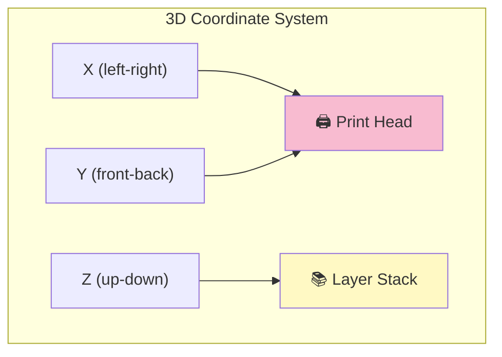

# Mesh Operations

Loading and manipulating 3D triangle meshes. All coordinates in **millimeters**, **Z = vertical**.

## Quick Diagram



## Data Types

| Type | Purpose | Example |
|------|---------|---------|
| **Vertex** | 3D point (x, y, z) | `{0, 0, 0}` |
| **Face** | Triangle with 3 vertices + optional normal | `[v1, v2, v3]` |
| **AABB** | Bounding box (min/max corners) | `min: (0,0,0), max: (100,100,50)` |
| **Mesh** | Collection of vertices + faces + AABB | Collection ready for slicing |

## Coordinate System



- **X, Y:** Horizontal plane (print bed movement)
- **Z:** Vertical axis (layer height)

## File I/O

### Loading STL

```bash
cargo run --release -- slice --input model.stl --output output.gcode
```

**Supported:**
- ASCII STL (readable text)
- Binary STL (compact format)

The loader computes the **AABB** (bounding box) automatically.

## See Also

- [Slicing Algorithm](../SLICING.md) – How meshes are sliced
- [CLI](../cli/README.md) – End-to-end workflow
- [Root](../../README.md) – Overview
