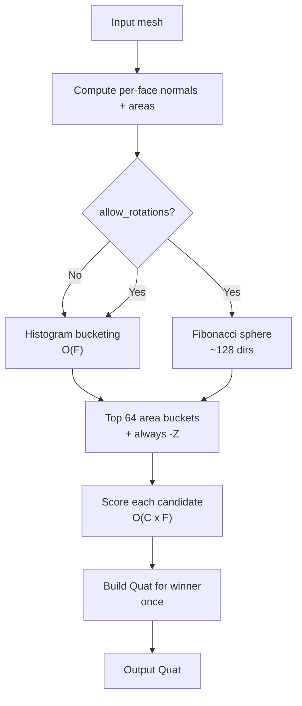
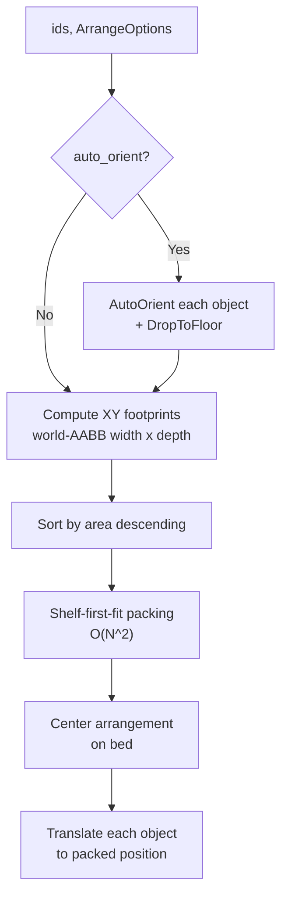

# Orient — Auto-Orient and Arrange

This module answers one question:

> What object orientation and bed placement should be used before slicing?

It computes print-friendly rotations (low overhang, high contact, low height)
and, for multi-object scenes, packs footprints on the bed without overlap.

---

## Why it exists

Orientation and placement are part of slicing correctness, not just UI polish.
If these decisions drift across entry points, preview and final G-code can
disagree. Keeping orientation and arrange behavior documented in one module
keeps CLI, server, and WASM behavior aligned.

---

## The contract

1. `auto_orient(mesh, opts)` returns one best-fit quaternion for a single mesh.
2. `SceneOp::AutoOrient` applies that orientation to one scene object and recenters it.
3. `SceneOp::ArrangeOnBed` optionally auto-orients multiple objects, packs them, and centers the arrangement.

User-facing entry points:

| Function / Op | Purpose |
|---|---|
| `auto_orient(mesh, opts) → Quat` | Best rotation for **one** object. |
| `SceneOp::AutoOrient { id, options }` | Orient one scene object and center it on the bed. |
| `SceneOp::ArrangeOnBed { ids, options }` | Orient **and** arrange multiple objects; no overlap. |

---

## `auto_orient` — Single-object orientation

### Why this phase exists

FDM prints favor three properties:
- A **flat face on the bed** (maximises first-layer adhesion, minimises the need
  for supports on the contact surface).
- **Minimal overhangs** (faces tilted more than ~45° past horizontal require
  support material and leave surface marks when it is removed).
- A **short print height** as a tiebreaker (less time, less wobble on tall
  prints).

### Algorithm overview



#### Step 1: Candidate generation (`candidates.rs`)

All face normals are snapped to a coarse ≈6° grid and their areas are
accumulated per bucket.  The top 64 buckets (by total area) become candidates.

**Why histograms instead of coplanar groups?**
`compute_coplanar_groups` was O(F log F) and emitted one candidate per
triangulated patch — producing hundreds of near-identical directions for any
slightly-curved hull (e.g. a Benchy's rounded bow).  The histogram collapses
all near-duplicate normals into a single representative direction in O(F), then
only scores the top 64 — roughly a **40× speedup** on a 200K-face mesh.

`NEG_Z` is always included so an already-well-oriented model stays put rather
than being needlessly rotated.

If `allow_rotations = true`, ~128 uniformly-distributed directions from a
Fibonacci sphere are added.  Use this for organic shapes (figurines, animals)
that have no prominent flat regions.

#### Step 2: Scoring

For each candidate direction `c`:

```
score = OVERHANG_W × net_overhang_area
      − CONTACT_W  × contact_area
      + HEIGHT_W   × height
```

Lower is better.

- **`net_overhang_area`** = area of faces pointing more than `overhang_threshold_deg`
  below horizontal **minus** area of faces essentially flat on the bed (within
  10° of −Z).  Bed-contact faces are supported, so they must not be penalised.
- **`contact_area`** rewards large flat bed-contact regions (OrcaSlicer heuristic).
- **`height`** is a small tiebreaker favouring shorter prints.

The key optimisation: `rz = −dot(c, n)` replaces `(q * n).z` where
`q = Quat::from_rotation_arc(c, −Z)`.  This is mathematically identical but
avoids a quaternion construction + multiplication per face — a dot product per
face instead.

#### Step 3: Result

`Quat::from_rotation_arc(best_candidate, −Z)` is built **exactly once** for the
winner.  An optional Z-rotation (`preferred_z_rotation_deg`) is then composed
in — useful for CoreXY printers that want seam lines at 45°.

---

## `ArrangeOnBed` — Multi-object packing

### Why this phase exists

For multi-object jobs, the system must ensure that objects are:
1. Oriented optimally for printing.
2. Placed on the bed without overlap.
3. Centered as a group for predictable inspection and slicing.

`SceneOp::AutoOrient` operates on a single object and always centers it at the
bed origin. Applying it to N objects in sequence would stack them all on top of
each other.  `ArrangeOnBed` solves the whole-group placement problem.

### Algorithm overview (`pack.rs`)



#### Shelf-first-fit

1. Maintain a list of **shelves** — horizontal strips of the bed, each tracking
   its bottom-Y coordinate and an X cursor pointing to where the next object
   starts.
2. For each object (sorted by area descending):
   - Scan shelves bottom-to-top.  Place the object on the first shelf where it
     fits (`x_cursor + spacing + width ≤ bed.width`).
   - If no shelf fits, open a new shelf above the previous highest one.
3. After all objects are placed, compute the arrangement's bounding box and
   shift every object so the center matches the bed center.

**Spacing** between objects defaults to 2 mm and is controlled by
`ArrangeOptions::spacing_mm`.

Objects wider than the bed are placed anyway (extending past the right edge);
the caller should surface a warning to the user.

### Undo

`ArrangeOnBed`'s inverse is `BatchSetTransform` — a single op that atomically
restores every affected object to its pre-arrange transform.  This keeps the
undo history clean: one `Ctrl-Z` undoes the entire arrange, not one object at a
time.

---

## Options reference

### `AutoOrientOptions`

| Field | Default | Meaning |
|---|---|---|
| `allow_rotations` | `false` | Add Fibonacci-sphere candidates (organic shapes). |
| `preferred_z_rotation_deg` | `0.0` | Extra Z-rotation after orienting (e.g. 45° for CoreXY). |
| `overhang_threshold_deg` | `45.0` | Overhang angle that triggers a penalty. |

### `ArrangeOptions`

| Field | Default | Meaning |
|---|---|---|
| `spacing_mm` | `2.0` | Gap between objects on the bed (mm). |
| `auto_orient` | `true` | Orient each object before packing. |
| `orient_options` | (defaults) | Passed through to `auto_orient` per object. |

---

## TypeScript / WASM usage

```ts
// Arrange all objects on the bed (orient + pack + center):
sceneEngine.arrangeOnBed(objectIds, {
  spacing_mm: 5,
  auto_orient: true,
  orient_options: { allow_rotations: false },
});

// Orient a single object (no packing):
sceneEngine.autoOrientObject(id, { allow_rotations: true });

// Low-level op dispatch (same as above):
sceneEngine.apply({
  op: 'arrange_on_bed',
  args: {
    ids: [id1, id2, id3],
    options: { spacing_mm: 3 },
  },
});
```

---

## Non-goals

- **Collision detection** with arbitrary rotations.  The packing is 2-D
  (XY footprint only); it does not account for objects that overhang their
  footprint after orientation.  This is correct for the vast majority of FDM
  models but may produce visual overlaps for extremely concave geometry.
- **Optimal bin-packing.**  Shelf-first-fit is a fast approximation.  True
  optimal packing (nesting / polygon decomposition) is out of scope.
- **Persistence.**  Scene state is ephemeral per WS connection / WASM instance.
  `ArrangeOnBed` does not save its results to a database.

---

## See also

- [`src/orient/mod.rs`](mod.rs) — `auto_orient` entry point + scoring constants
- [`src/orient/candidates.rs`](candidates.rs) — histogram bucketing + Fibonacci sphere
- [`src/orient/geometry.rs`](geometry.rs) — face normal helpers
- [`src/orient/pack.rs`](pack.rs) — shelf-first-fit packing algorithm
- [`src/orient/types.rs`](types.rs) — `AutoOrientOptions`, `ArrangeOptions`
- [`src/scene/ops.rs`](../scene/ops.rs) — `SceneOp::AutoOrient`, `SceneOp::ArrangeOnBed`
- Issue [#51](https://github.com/max-scopp/slicer-engine/issues/51) — scene SSOT
