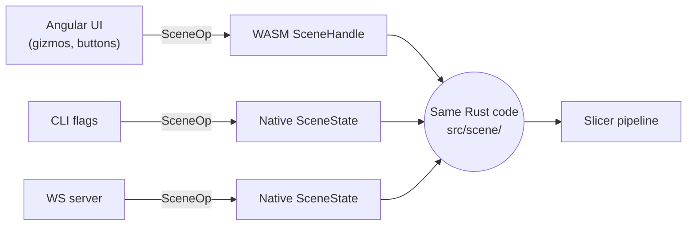
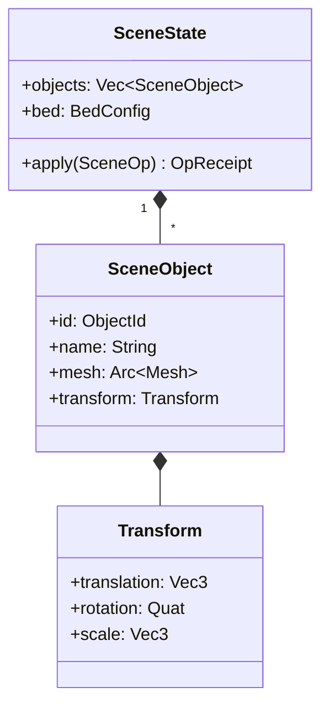
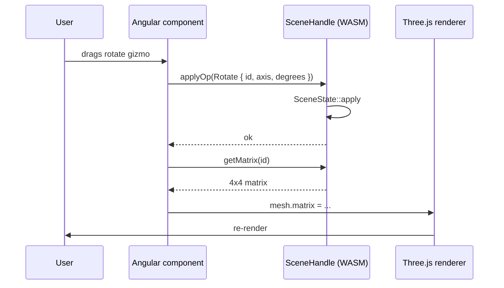
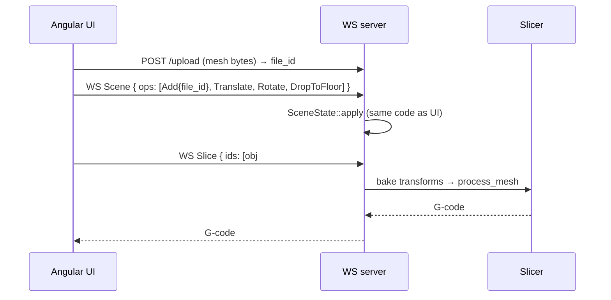
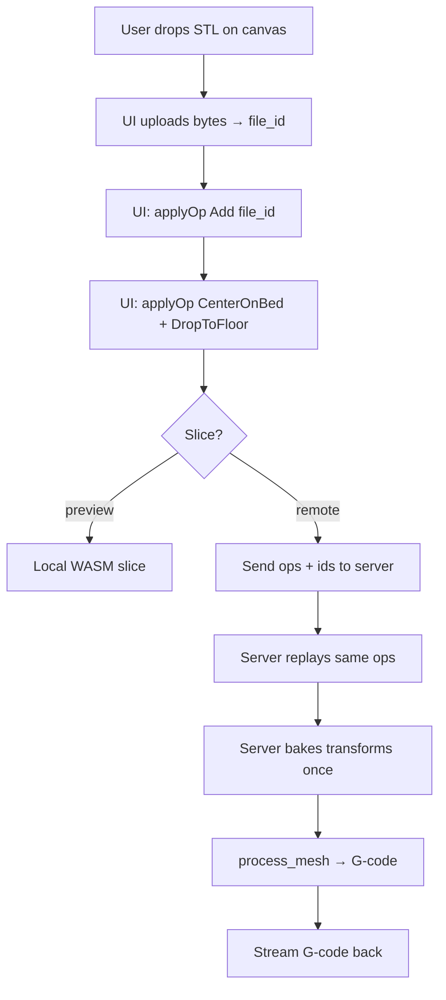

# Scene Engine — The Single Source of Truth for Object Placement

The scene engine answers one question, and one question only:

> _Where is each mesh, rotated how, scaled how — right now?_

The same answer is owned, byte-for-byte, by the CLI, the WS server, and the
Angular UI (via WASM). There is no second copy.

---

## Why it exists

Before issue #51, "just translate this mesh real quick" lived in three places:
the CLI flag handler baked transforms into mesh vertices, the UI tracked its
own Three.js matrices, and the WS server… kind of guessed. Three placement
paths meant three sets of bugs and three subtly different answers to "what
will actually get sliced?".

The scene engine collapses all of that into one Rust module compiled twice —
once natively (CLI / WS server) and once to WebAssembly (UI). One mental
model, one undo log, one source of truth.

---

## The SSOT contract

Three rules, no exceptions:

1. **`SceneState` is the only state.** No parallel `Map<id, matrix>` in
   TypeScript, no shadow transforms in `mesh::transforms`.
2. **`SceneOp` is the only mutation.** Every CLI flag and every UI gesture
   becomes a `SceneOp` before anything moves.
3. **Bake once, at the slicer boundary.** `apply_transform(&Mesh, &Transform)`
   runs exactly once per object, immediately before `process_mesh`. Never
   mid-pipeline, never on the way into the renderer.

---

## Anatomy of a scene

A few things worth knowing:

- **`ObjectId` is monotonic and never reused.** Once `obj#7` is removed,
  nothing else will ever be `obj#7`. This is what makes IDs safe to send over
  the wire — a stale reference is always a clear "not found", never an
  accidental hit on a new object.
- **`Transform` uses `Quat` internally.** Euler-XYZ degrees only appear at
  protocol and CLI boundaries (`Transform::from_euler_xyz_deg` /
  `to_euler_xyz_deg`). Quaternions everywhere else means no gimbal lock and
  no surprises when ops compose.
- **Meshes are `Arc<Mesh>`.** Cloning a `SceneObject` is cheap; transforming
  it doesn't copy a single vertex.

---

## The op catalog

| Op                 | Does                                                      | Inverse stored in receipt        |
| ------------------ | --------------------------------------------------------- | -------------------------------- |
| `Add`              | Loads bytes, assigns a new `ObjectId`, identity transform | `Remove`                         |
| `Remove`           | Drops the object                                          | `SetTransform` stub _(see note)_ |
| `Translate`        | Adds delta to `translation`                               | `SetTransform` to previous       |
| `SetTransform`     | Replaces the entire transform                             | `SetTransform` to previous       |
| `Rotate`           | Composes `Quat::from_axis_angle` onto current rotation    | `SetTransform` to previous       |
| `Scale`            | Multiplies per-axis `scale` factors                       | `SetTransform` to previous       |
| `CenterOnBed`      | XY-centers the world AABB on the bed; preserves Z         | `SetTransform` to previous       |
| `DropToFloor`      | Translates so world AABB `min.z = 0`                      | `SetTransform` to previous       |
| `AlignFaceToFloor` | Rotates picked face's normal to `-Z`, then drops          | `SetTransform` to previous       |

> **Note on `Remove`:** the inverse can't fully restore the mesh bytes from
> the current state alone. The receipt records the last transform so a
> future history layer can re-`Add` the bytes and replay the transform.

---

## Role in the UI layer

Angular owns _interaction_. The WASM `SceneHandle` owns _truth_.

Three.js never invents transforms. It reads `getMatrix(id)` after every op
and copies the result onto its own `Object3D`. The renderer is a _view_ of
the scene; it isn't allowed to mutate it.

---

## Why both ends _must_ agree on the scene

This is the part that justifies the whole module. When slicing happens
remotely, the only thing the UI sends to the server is a list of ops:

Notice what crosses the network:

- **Once:** raw mesh bytes.
- **Per edit:** a tiny JSON op.
- **Per slice:** a list of `ObjectId`s.

If the UI's idea of `Rotate` and the server's idea of `Rotate` ever drifted
— different axis convention, different composition order, anything — the
preview and the sliced result would silently disagree. That's why the
TypeScript side **never** reimplements scene math. Both ends import the
exact same Rust functions; one as a static lib, one as `.wasm`.

---

## Lifecycle of a remote slice (end to end)

The local preview path and the remote slice path differ only in _where_
`process_mesh` runs. The scene state going into it is, by construction,
identical.

---

## What this module deliberately does _not_ do

- **No persistence.** Server scenes are ephemeral per WS connection. Anything
  long-lived is the UI's problem (or a future history layer).
- **No undo stack.** `OpReceipt::inverse` is the building block; the stack
  itself isn't here yet.
- **No mesh editing.** The scene engine moves meshes around. Editing
  geometry is `mesh::*`'s job.
- **No protocol concerns.** Wire framing, auth, upload tokens — all of that
  lives in `server::` and `ws_protocol`. The scene only knows `SceneOp`.

---

## See also

- [ops.rs](ops.rs) — `SceneOp`, `OpReceipt`, `SceneError`, the `apply` match arm
- [state.rs](state.rs) — `SceneState`, `SceneObject`, `ObjectId`
- [transform.rs](transform.rs) — `Transform`, `apply_transform`, Euler helpers
- [wasm.rs](wasm.rs) — `SceneHandle` exposed to the Angular UI
- [../../AGENTS.md](../../AGENTS.md) — "Scene Engine — SSOT Contract" section
- [issue #51](https://github.com/max-scopp/slicer-engine/issues/51) — original
  motivation and design discussion
