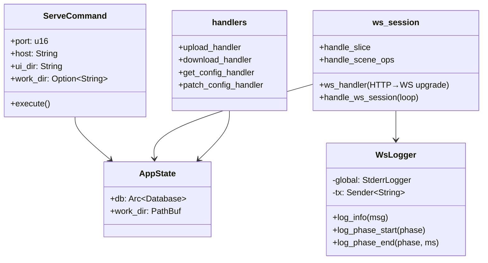
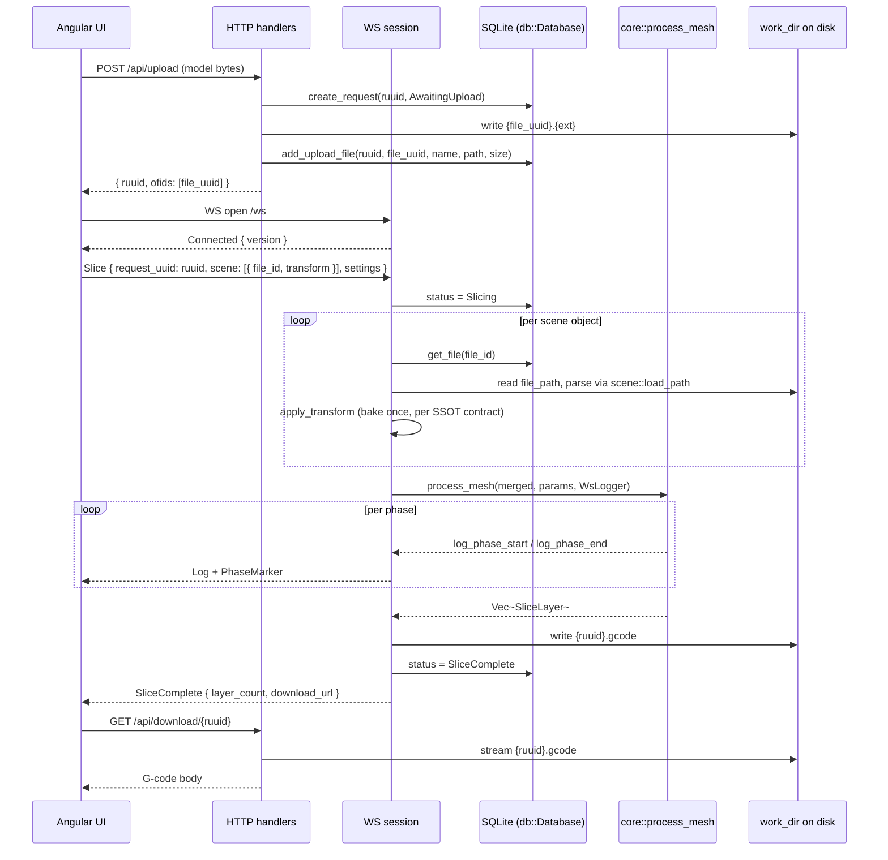

# Server — HTTP + WebSocket Host for the UI

The server is the network shell that lets the Angular UI use the slicer
without bundling it into the browser. Two transports, one purpose.

> _HTTP for the bytes that don't fit in JSON; WebSocket for everything else._

---

## Why two transports

A slicing job has two very different kinds of payload:

- **The mesh.** Tens of MB of binary data, occasional, streamable.
- **The control flow.** Small JSON messages (scene ops, slice requests,
  log lines, progress markers) — frequent, bidirectional, low-latency.

Trying to push 50 MB of STL through a WebSocket frame is fighting the
medium. Trying to relay layer-by-layer progress over HTTP polling is
fighting it the other way. The server uses each for what it's good at:

```mermaid
flowchart LR
    UI[Angular UI] -- POST /api/upload (multipart) --> H[handlers::upload_handler]
    H -- &#123; ruuid, ofids &#125; --> UI
    UI <-- WebSocket /ws --> WS[ws_session::handle_ws_session]
    WS -- ServerMessage --> UI
    UI -- ClientMessage<br/>(Scene, Slice, …) --> WS
    UI -- GET /api/file/:file_uuid --> H3[handlers::file_handler]
    UI -- GET /api/request/:ruuid --> H4[handlers::request_meta_handler]
    UI -- GET /api/download/:ruuid --> H2[handlers::download_handler]
    H2 -- G-code stream --> UI
    H3 -- model bytes --> UI
```

---

## The contract

1. **One WebSocket per session, ephemeral state.** The scene engine state
   lives in `ws_session::handle_ws_session`'s stack. Disconnect = scene
   gone. Persistence is the UI's problem.
2. **All bytes go via HTTP.** Mesh uploads are multipart POSTs; G-code
   downloads are streamed responses. The WebSocket carries only JSON.
3. **Workplate UUID and file UUID are distinct.** `POST /api/upload`
   returns `{ ruuid, ofids: [file_uuid, ...] }`. The workplate `ruuid`
   is the slicing job key; each `file_uuid` in `ofids` is one uploaded
   model the user can place in the scene. Slicing references files by
   `file_uuid` exclusively — there is no "request UUID is also the file
   ID" shortcut.
4. **The on-disk extension is the format hint.** Uploads are stored as
   `{file_uuid}.{ext}` (e.g. `.stl`, `.obj`, `.3mf`); the slicer
   dispatches to the right loader from the extension. The wire protocol
   carries no `format` field.
5. **Every log line and phase timing is mirrored to the WS client.** The
   `WsLogger` plugs into the same `ProcessLogger` interface the CLI uses,
   so verbose output is identical across both transports.
6. **The protocol is the source of truth, not the transport.** Message
   shapes live in [`crate::ws_protocol`](../ws_protocol.rs) with `JsonSchema`
   derives so the UI generates types from them.

---

## Anatomy

---

## Endpoint catalog

### HTTP

| Route                  | Method | Purpose                                                                       |
| ---------------------- | ------ | ----------------------------------------------------------------------------- |
| `/api/upload`          | POST   | Multipart `STL` / `OBJ` / `3MF` upload → `{ ruuid, ofids: [file_uuid, ...] }` |
| `/api/file/:file_uuid` | GET    | Stream an uploaded model back (used by the viewer on cold reload)             |
| `/api/request/:ruuid`  | GET    | Workplate metadata: `{ ruuid, status, has_gcode, ofids: [{file_uuid, name}] }` |
| `/api/download/:ruuid` | GET    | Stream the G-code produced for that workplate                                 |
| `/api/config`          | GET    | Return the fully-merged `AppConfig`                                           |
| `/api/config`          | PATCH  | Update one config key, persist to `slicer.toml`                               |
| `/*` (anything else)   | GET    | Serve the Angular bundle from `ui_dir`                                        |

`POST /api/upload` enforces a 500 MB file-size cap, only reads the
field named `"file"` from the multipart payload, and preserves the
original extension on disk so the slicer can pick the right loader
without anyone having to re-encode the format hint.

### WebSocket (`/ws`)

`ClientMessage` (browser → server):

| `type`          | Purpose                                                                           |
| --------------- | --------------------------------------------------------------------------------- |
| `Slice`         | Slice a workplate: `request_uuid` + `scene: [SceneObjectSliceDto]` + `settings`   |
| `ListSessions`  | Replay history from the SQLite database                                           |
| `Reset`         | Acknowledge / clear current state                                                 |
| `Scene`         | Apply a list of `SceneOpDto`s to the session's `SceneState`                       |
| `SceneSnapshot` | Request the current scene state                                                   |

`ServerMessage` (server → browser):

| `type`          | Purpose                                                |
| --------------- | ------------------------------------------------------ |
| `Connected`     | Sent once after handshake; carries `CARGO_PKG_VERSION` |
| `Log`           | Mirrored `info` / `debug` / `warn` log line            |
| `PhaseMarker`   | Pipeline phase `start` / `end` with elapsed time       |
| `Progress`      | `current_layer` / `total_layers` during slicing        |
| `SliceComplete` | Layer count + `download_url`                           |
| `SessionsList`  | Result of `ListSessions`                               |
| `SceneState`    | Snapshot reply for `Scene` / `SceneSnapshot`           |
| `Error`         | Fatal error during processing                          |

Full schemas: [src/ws_protocol.rs](../ws_protocol.rs).

---

## Lifecycle of one slice job

---

## Threading model

- **Actix-web** drives the HTTP and WebSocket I/O on its async runtime.
- **Slicing is CPU-bound**, so `handle_slice` dispatches the actual work
  to `tokio::task::spawn_blocking`. `WsLogger::send_log` uses
  `Sender::blocking_send` for that reason — it would deadlock on an
  async runtime thread.
- **Database access** also goes through `spawn_blocking` because
  `rusqlite` is synchronous. The `Mutex<Connection>` inside
  [`Database`](../db/mod.rs) serialises all writes.

---

## Configuration

The serve command's flags map onto `[server]` keys in `slicer.toml`:

| Flag         | TOML key          | Default                       |
| ------------ | ----------------- | ----------------------------- |
| `--port`     | `server.port`     | `5201`                        |
| `--host`     | `server.host`     | `0.0.0.0`                     |
| `--ui-dir`   | `server.ui_dir`   | `./ui/dist/slicer-ui/browser` |
| `--work-dir` | `server.work_dir` | system temp directory         |

The serve command writes a default `slicer.toml` to the user config
directory if none exists, then loads it via
[`config::load_and_merge_config`](../config/mod.rs).

---

## What this module deliberately does _not_ do

- **No authentication.** This is a localhost-only dev tool. Binding to
  `0.0.0.0` is opt-in and intended for LAN testing.
- **No multi-tenant scenes.** Each WS connection has its own scene
  state; there is no shared workspace.
- **No persistence of scene state.** The SQLite DB tracks _completed
  jobs_ for re-download, not in-flight scenes.
- **No slicing logic.** The server is a transport adapter around
  [`core::process_mesh`](../core/README.md) and
  [`scene::SceneState`](../scene/README.md).

---

## See also

- [mod.rs](mod.rs) — `ServeCommand`, app wiring, route registration
- [handlers.rs](handlers.rs) — HTTP upload / download / config handlers
- [ws_session.rs](ws_session.rs) — WebSocket loop, `WsLogger`, slice driver
- [../ws_protocol.rs](../ws_protocol.rs) — `ClientMessage`, `ServerMessage`,
  `SceneOpDto`, schema-derived UI types
- [../db/README.md](../db/README.md) — SQLite session tracking
- [../scene/README.md](../scene/README.md) — `SceneState` lifecycle
- [../config/README.md](../config/README.md) — TOML config loading
