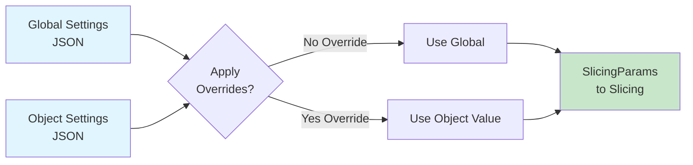
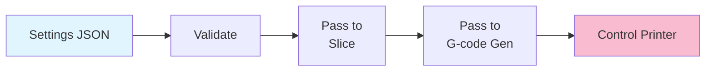

# Slicing Parameters & Settings

Configuration for slicing behavior and printer control. All values stored as JSON.

## Quick Reference

| Parameter | Type | Default | Range | Effect |
|-----------|------|---------|-------|--------|
| `layer_height` | mm | 0.2 | 0.1–0.4 | Distance between layers |
| `wall_thickness` | mm | 1.2 | 0.8–2.0 | Perimeter width |
| `infill_density` | 0–1 | 0.2 | 0.0–1.0 | 0=hollow, 1=solid |
| `print_speed` | mm/s | 60 | 20–100 | Nozzle movement speed |
| `nozzle_temp` | °C | 210 | 180–250 | Heat level (material-dependent) |
| `bed_temp` | °C | 60 | 20–100 | Bed heat (material-dependent) |

## Configuration Flow



## JSON Structure

### Global (Baseline)

```json
{
  "params": {
    "layer_height": 0.2,
    "wall_thickness": 1.2,
    "infill_density": 0.2,
    "print_speed": 60.0,
    "nozzle_temp": 210.0,
    "bed_temp": 60.0
  }
}
```

### Object (Selective Override)

```json
{
  "object_name": "detail_part",
  "overrides": {
    "layer_height": 0.1,
    "print_speed": 40.0
  }
}
```

When `overrides` is `null`, object inherits all global settings.

## CLI Commands

### Validate

```bash
cargo run --release -- settings validate \
  --global global.json --object object.json
```

Checks constraints and ranges. Output: ✓ valid or error messages.

### Diff

```bash
cargo run --release -- settings diff \
  --global global.json --object object.json
```

Show which parameters are overridden:

```
layer_height    0.2 → 0.1    ✓ Override
print_speed     60  → 40     ✓ Override
nozzle_temp     210 → 210    (no change)
```

### Show All

```bash
cargo run --release -- settings show
```

### Get/Set Individual Values

```bash
cargo run --release -- settings get layer_height
cargo run --release -- settings set layer_height 0.15
```

## Validation Rules

| Parameter | Constraint | Notes |
|-----------|-----------|-------|
| `layer_height` | > 0 | Typically ≤ nozzle diameter (0.4 mm) |
| `wall_thickness` | ≥ 0.4 mm | At least one nozzle width |
| `infill_density` | 0.0 ≤ x ≤ 1.0 | Strict bounds |
| `print_speed` | > 0 | Higher = faster but lower quality |
| `nozzle_temp` | 180–250°C | Material-dependent (PLA≈210, PETG≈230) |
| `bed_temp` | 20–120°C | Material-dependent (PLA≈60, PETG≈100) |

## Common Profiles

```json
{
  "pla": {
    "layer_height": 0.2,
    "nozzle_temp": 210,
    "bed_temp": 60
  },
  "petg": {
    "layer_height": 0.2,
    "nozzle_temp": 230,
    "bed_temp": 85
  },
  "high_detail": {
    "layer_height": 0.1,
    "print_speed": 30,
    "wall_thickness": 1.6
  }
}
```

## Integration



## See Also

- [CLI Commands](../cli/README.md) – Full command reference
- [Slicing](../SLICING.md) – How layer_height affects slicing
- [Root](../../README.md) – Overview
