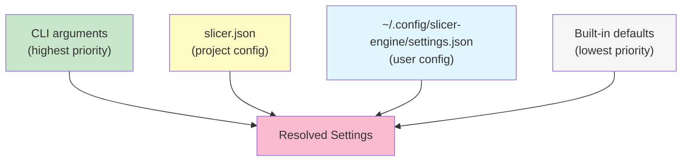
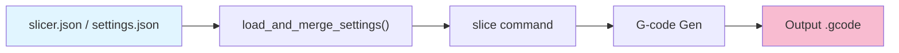

# Slicing Parameters & Settings

Configuration for slicing behavior and printer control. All values stored as JSON.

## Quick Reference

### Slicing Parameters (`params.*`)

| Parameter                 | Type | Default   | Range                               | Effect                                                        |
| ------------------------- | ---- | --------- | ----------------------------------- | ------------------------------------------------------------- |
| `layer_height`            | mm   | 0.2       | 0.1–0.4                             | Distance between layers                                       |
| `wall_thickness`          | mm   | 1.2       | 0.8–2.0                             | Perimeter width                                               |
| `infill_density`          | 0–1  | 0.2       | 0.0–1.0                             | 0=hollow, 1=solid                                             |
| `print_speed`             | mm/s | 60        | 20–100                              | Nozzle movement speed                                         |
| `nozzle_temp`             | °C   | 210       | 180–250                             | Heat level (material-dependent)                               |
| `bed_temp`                | °C   | 60        | 20–100                              | Bed heat (material-dependent)                                 |
| `seam_position`           | enum | `nearest` | see [Seam Position](#seam-position) | Where each closed-loop seam sits                              |
| `min_infill_extrusion_mm` | mm   | 0.4       | 0.0–nozzle                          | Drops sub-threshold solid-infill segments to cut tiny travels |
| `coasting_distance_mm`    | mm   | 0.2       | 0.0–1.0                             | Length of un-extruded tail at the end of each path            |

### Bridge & overhang (`params.*`)

| Parameter                | Type | Default | Effect                                                                      |
| ------------------------ | ---- | ------- | --------------------------------------------------------------------------- |
| `bridge_speed`           | mm/s | 25      | Print speed for bridge / overhang-perimeter extrusions                      |
| `bridge_flow_ratio`      | 0–1  | 0.8     | Flow multiplier for bridge lines (less material = less sag)                 |
| `bridge_anchor_mm`       | mm   | 0.4     | Inflate the bridge region outward to anchor strands into solid material     |
| `bridge_min_area_mm2`    | mm²  | 0.5     | Drop bridge candidates smaller than this; reclassified as `BottomSurface`   |
| `bridge_noise_filter_mm` | mm   | 0.05    | Morphological-open radius to wipe sub-pixel slivers before bridge detection |
| `bridge_fan_speed`       | 0–1  | 1.0     | Cooling fan duty for layers that contain bridges                            |

### Global Settings (top-level)

| Field               | Type           | Default    | Description                                          |
| ------------------- | -------------- | ---------- | ---------------------------------------------------- |
| `gcode_flavor`      | string         | `"marlin"` | Firmware dialect (`"marlin"` or `"klipper"`)         |
| `start_print_gcode` | string \| null | `null`     | Custom start G-code block or file path               |
| `end_print_gcode`   | string \| null | `null`     | Custom end G-code block or file path                 |
| `lifecycle_markers` | object         | `{}`       | Per-flavor layer lifecycle marker config (see below) |

## Config Priority

Settings are resolved in this order (highest priority first):

```
1. CLI arguments          (--layer-height, --gcode-flavor, --start-print-gcode, …)
2. slicer.json            (project config in CWD, or --config FILE)
3. ~/.config/slicer-engine/settings.json  (user config)
4. Built-in defaults
```



Each layer overrides only the keys it specifies; unset keys fall through to the next layer.

## Project Config (`slicer.json`)

Place a `slicer.json` file in your project directory to set per-project defaults that override
the user config without touching it. Only the keys you include are overridden.

```json
{
  "params": {
    "layer_height": 0.15,
    "nozzle_temp": 215
  },
  "gcode_flavor": "klipper"
}
```

The file is **auto-discovered** when you run any `slice` command from the same directory.
You can also point to it explicitly:

```bash
slicer-engine slice --input model.stl --config ./path/to/slicer.json
```

## User Config (`settings.json`)

The persistent user-level config lives at:

| Platform | Path                                                        |
| -------- | ----------------------------------------------------------- |
| Linux    | `~/.config/slicer-engine/settings.json`                     |
| macOS    | `~/Library/Application Support/slicer-engine/settings.json` |
| Windows  | `%APPDATA%\slicer-engine\settings.json`                     |

Managed via the `settings set` / `settings get` subcommands (see below).

## JSON Structure

### Global settings file (`settings.json` or `slicer.json`)

```json
{
  "params": {
    "layer_height": 0.2,
    "wall_thickness": 1.2,
    "infill_density": 0.2,
    "print_speed": 60.0,
    "nozzle_temp": 210.0,
    "bed_temp": 60.0
  },
  "gcode_flavor": "marlin",
  "lifecycle_markers": {
    "klipper": {
      "enabled": true,
      "layer_change": ";LAYER_CHANGE",
      "z_marker": ";Z:{z}",
      "height_marker": ";HEIGHT:{height}",
      "before_layer_change": ";BEFORE_LAYER_CHANGE",
      "after_layer_change": ";AFTER_LAYER_CHANGE",
      "type_annotation": ";TYPE:{type}",
      "width_annotation": ";WIDTH:{width}mm"
    }
  }
}
```

`start_print_gcode` and `end_print_gcode` are omitted from the file when `null`.
`lifecycle_markers` is omitted entirely when the map is empty (i.e. all defaults are in effect).

## Lifecycle Markers

Layer lifecycle markers are comments that slicer-aware firmware and post-processing scripts
use to track progress, drive LED effects, pause at layers, etc.

### How it works

Each firmware flavor can have its own `LifecycleMarkerConfig` entry in the `lifecycle_markers`
map. Flavors not present in the map use the built-in defaults (enabled, standard
OrcaSlicer/PrusaSlicer comment format).

When `enabled: false`, the generator emits a minimal `; layer z=…` comment instead of the full
lifecycle block.

### Per-flavor configuration (`LifecycleMarkerConfig`)

| Field                 | Default emitted comment | Supported placeholders |
| --------------------- | ----------------------- | ---------------------- |
| `enabled`             | `true`                  | —                      |
| `layer_change`        | `;LAYER_CHANGE`         | `{z}`, `{height}`      |
| `z_marker`            | `;Z:{z}`                | `{z}`                  |
| `height_marker`       | `;HEIGHT:{height}`      | `{height}`             |
| `before_layer_change` | `;BEFORE_LAYER_CHANGE`  | `{z}`                  |
| `after_layer_change`  | `;AFTER_LAYER_CHANGE`   | `{z}`                  |
| `type_annotation`     | `;TYPE:{type}`          | `{type}`               |
| `width_annotation`    | `;WIDTH:{width}mm`      | `{width}`              |

All string fields are optional — omit them to keep the built-in default for that marker.

### Placeholder reference

| Placeholder | Replaced with                         | Example              |
| ----------- | ------------------------------------- | -------------------- |
| `{z}`       | Layer Z coordinate (3 d.p.)           | `0.200`              |
| `{height}`  | Layer height from params (3 d.p.)     | `0.200`              |
| `{type}`    | Extrusion role type name              | `WALL-OUTER`, `FILL` |
| `{width}`   | Extrusion role default width (2 d.p.) | `0.40`               |

### Example: disable markers for Marlin, keep them for Klipper

```json
{
  "lifecycle_markers": {
    "marlin": { "enabled": false },
    "klipper": { "enabled": true }
  }
}
```

### Example: custom marker strings for a Bambu-style slicer

```json
{
  "lifecycle_markers": {
    "marlin": {
      "enabled": true,
      "layer_change": ";BAMBULABS_LAYER_CHANGE",
      "z_marker": ";Z_HEIGHT:{z}"
    }
  }
}
```

### CLI overrides

The `--lifecycle-markers` and `--no-lifecycle-markers` flags on the `slice` command override
the `enabled` field from settings for the current invocation only:

```bash
# Force-enable markers regardless of settings
slicer-engine slice --input model.stl --lifecycle-markers

# Force-disable markers regardless of settings
slicer-engine slice --input model.stl --no-lifecycle-markers
```

### Object settings (per-object override)

```json
{
  "object_name": "detail_part",
  "overrides": {
    "layer_height": 0.1,
    "print_speed": 40.0
  }
}
```

When `overrides` is `null`, the object inherits all global settings.

## CLI Commands

### Get/Set Individual Values

Both flat aliases and full dot-separated paths are accepted:

```bash
# These are equivalent
slicer-engine settings get layer_height
slicer-engine settings get params.layer_height

# Set via flat alias
slicer-engine settings set layer_height 0.15

# Set via full path
slicer-engine settings set params.nozzle_temp 215

# Set top-level fields
slicer-engine settings set gcode_flavor klipper
slicer-engine settings set start_print_gcode "START_PRINT BED_TEMP=60 EXTRUDER_TEMP=210"
slicer-engine settings set end_print_gcode "END_PRINT"

# Clear an optional field
slicer-engine settings set start_print_gcode null

# JSON output
slicer-engine settings get layer_height --output-format json
```

### Show All

```bash
slicer-engine settings show
slicer-engine settings show --output-format json
```

### Validate

```bash
slicer-engine settings validate \
  --global global.json --object object.json
```

Checks constraints and ranges. Output: ✓ valid or error messages.

### Diff

```bash
slicer-engine settings diff \
  --global global.json --object object.json
```

Shows which parameters are overridden:

```
layer_height    0.2 → 0.1    ✓ Override
print_speed     60  → 40     ✓ Override
nozzle_temp     210 → 210    (no change)
```

## Validation Rules

| Parameter        | Constraint                | Notes                                  |
| ---------------- | ------------------------- | -------------------------------------- |
| `layer_height`   | > 0                       | Typically ≤ nozzle diameter (0.4 mm)   |
| `wall_thickness` | ≥ 0.4 mm                  | At least one nozzle width              |
| `infill_density` | 0.0 ≤ x ≤ 1.0             | Strict bounds                          |
| `print_speed`    | > 0                       | Higher = faster but lower quality      |
| `nozzle_temp`    | 180–250°C                 | Material-dependent (PLA≈210, PETG≈230) |
| `bed_temp`       | 20–120°C                  | Material-dependent (PLA≈60, PETG≈100)  |
| `gcode_flavor`   | `"marlin"` \| `"klipper"` | Must be a known firmware dialect       |

## Common Profiles

### PLA

```json
{
  "params": { "layer_height": 0.2, "nozzle_temp": 210, "bed_temp": 60 },
  "gcode_flavor": "marlin"
}
```

### PETG

```json
{
  "params": { "layer_height": 0.2, "nozzle_temp": 230, "bed_temp": 85 }
}
```

### High-detail (Klipper)

```json
{
  "params": { "layer_height": 0.1, "print_speed": 30, "wall_thickness": 1.6 },
  "gcode_flavor": "klipper",
  "start_print_gcode": "START_PRINT BED_TEMP=60 EXTRUDER_TEMP=210",
  "lifecycle_markers": {
    "klipper": { "enabled": true }
  }
}
```

## Seam Position

`params.seam_position` controls where each closed perimeter loop begins and
ends — the spot where the printer pauses, retracts, and lifts. That spot
leaves a small visible blob ("the seam") on the outer wall.

| Value                 | Vertex chosen per loop                                              | Visual result                                   | Best for                               |
| --------------------- | ------------------------------------------------------------------- | ----------------------------------------------- | -------------------------------------- |
| `nearest` _(default)_ | Closest vertex to the previous path's end                           | Scattered seams; minimum travel & print time    | Prototypes, infill-heavy parts         |
| `rear`                | Vertex with the largest Y                                           | Single seam line at the back of the model       | Display pieces (Benchy-style)          |
| `aligned`             | Vertex with the largest projection onto a fixed direction (+Y)      | Consistent vertical seam line across all layers | Parts whose loops shift between layers |
| `sharpest_corner`     | Vertex with the largest convex turn angle (falls back to `nearest`) | Seam hidden in geometry corners                 | Mechanical parts with hard edges       |
| `random`              | Hash of the loop's first-vertex bits (deterministic per loop)       | Seam blobs spread evenly; no visible line       | Cylinders, organic shapes              |

Override per-invocation from the CLI:

```bash
slicer-engine slice --input model.stl --seam-position rear
```

Set persistently in `slicer.json` / `settings.json`:

```json
{ "params": { "seam_position": "sharpest_corner" } }
```

Hyphens and underscores are both accepted (`sharpest-corner` ≡
`sharpest_corner`). See [`core/README.md`](../core/README.md#path-ordering--seam-placement)
for the implementation details and the role-grouped path-ordering pass that
consumes this setting.

## Integration



## See Also

- [CLI Commands](../cli/README.md) – Full command reference
- [Slicing](../SLICING.md) – How layer_height affects slicing
- [Core pipeline](../core/README.md) – Path ordering & seam placement
- [G-code generation](../gcode/README.md) – Smart-retract policy & travel sequence
- [Root](../../README.md) – Overview
