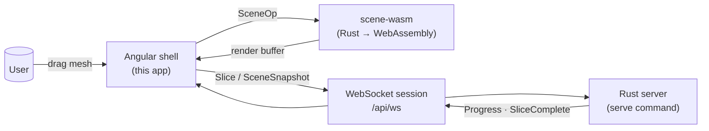
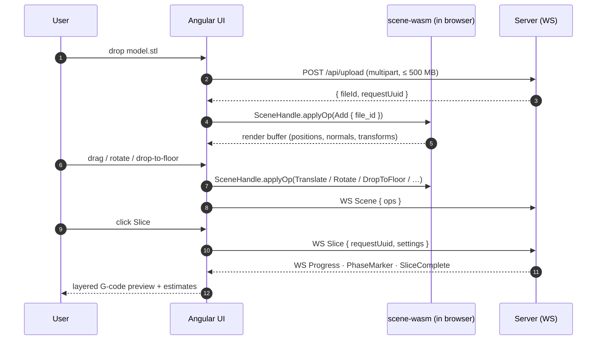

# Slicer Engine — Web UI

The Angular front-end of Slicer Engine. It uploads meshes, drives the slice, renders the live G-code preview, and lets you tweak settings — all against a single Rust core that also powers the CLI.

It exists for one reason: **what you preview in the browser must be exactly what slices on the server.** Both run the same Rust code. The UI compiles part of the engine to WebAssembly so scene placement is computed locally, and delegates the heavy slicing to the server over WebSocket.

---

## The contract



- The Angular app **never reimplements** scene math. Translate, rotate, drop-to-floor, align-face — every gesture becomes a `SceneOp` and is applied by the Rust scene engine compiled to WASM. See [src/scene/README.md](../src/scene/README.md) for the SSOT contract.
- Schemas and TypeScript types are **generated from the Rust definitions**, not hand-written. See "Generated artifacts" below.
- The G-code preview is decoded from the same `SliceResult` produced by the CLI's `slice` command.

---

## Anatomy

```
ui/src/app/
├── app.config.ts          providers (router, http, markdown, input-modality)
├── app-routes.ts          /, /scene-demo, /slice/(new|:requestUuid)
├── pages/
│   ├── home/              landing dashboard
│   ├── scene-demo/        scene-engine playground (manual SceneOp dispatch)
│   ├── slice-new/         upload + initial slice
│   └── slice-viewer/      G-code preview, layer scrubber, history
├── nexus/                 application shell — top bar, sidebar, layout, print-estimates
├── components/            stateless building blocks
│   ├── viewer/            three.js canvas + ViewportCube + 3D-view-toolbar
│   ├── settings-panel/    schema-driven forms
│   ├── file-upload/       drag-and-drop, progress, upload-guard hook
│   ├── history-panel/     past slice runs from the server's SQLite ledger
│   ├── status-panel/ connection-state/ notification-center/ logo/
│   └── …                  card, list-history, viewport-cube
├── services/
│   ├── scene-engine.service.ts   wraps the WASM SceneHandle (single instance)
│   ├── slicer.ts                 high-level slice orchestration
│   ├── slicer-connection.ts      WebSocket transport (typed messages)
│   ├── slicer-file.ts            mesh upload (REST), download
│   ├── upload-guard.ts           CanDeactivate guard for in-flight uploads
│   ├── viewer-control.ts         camera / framing helpers
│   ├── object-tracker/           per-object UI state
│   ├── print-area/               build-volume + bed config from server
│   ├── history.ts                slice history client
│   ├── notifications.ts          toast layer
│   ├── browser-storage.ts        localStorage wrapper
│   ├── logger.service.ts         structured logger (mirrors server logs in console)
│   └── app-theme.ts              light / dark token switcher
├── schema-form/           generic form renderer driven by JSON Schema
├── models/                shared types (mostly re-exports from generated/)
└── shared/                cross-cutting widgets, directives, input-modality
```



---

## Generated artifacts

Anything under `src/generated/` is **regenerated, not edited**. Each file maps 1:1 to a Rust type or wasm-pack output, and any drift is treated as a bug in the generator, not in this folder.

| Path                        | Source of truth                                   | Regenerated by                          |
| --------------------------- | ------------------------------------------------- | --------------------------------------- |
| `src/generated/*.d.ts`      | Rust schemas via `slicer-engine gen-schemas`      | `pnpm run gen` (also runs on `install`) |
| `src/generated/scene-wasm/` | `src/scene/wasm.rs` (`cfg(target_arch="wasm32")`) | `make build-wasm` at the repo root      |
| `src/schemas/*.json`        | JSON Schema emitted by the Rust CLI               | `pnpm run gen-schemas`                  |

The `postinstall` script in [package.json](package.json) wires this up: cloning the repo and running `pnpm install` (with the WASM bundle already built) is enough to get a working dev environment.

---

## Quick start

```bash
# From the repo root, build the WASM scene engine first
make build-wasm                                  # writes ui/src/generated/scene-wasm/

# Then, in this folder:
pnpm install                                     # also runs `pnpm run gen`
pnpm start                                       # ng serve --host 0.0.0.0 → http://localhost:4200

# In a second terminal, run the slicer-engine server (UI talks to this)
cargo run --release -- serve                     # default http://localhost:5201
```

Reset the generated folder anytime with `pnpm run gen`. If types or schemas look stale after editing Rust, run `pnpm run gen` — never edit `src/generated/` by hand.

---

## Development workflow

| Task                            | Command                                 |
| ------------------------------- | --------------------------------------- |
| Dev server with HMR             | `pnpm start`                            |
| Production build                | `pnpm build`                            |
| Watch incremental dev build     | `pnpm watch`                            |
| Unit tests (Vitest, jsdom)      | `pnpm test`                             |
| Regenerate JSON schemas + .d.ts | `pnpm run gen`                          |
| Rebuild the WASM scene engine   | `make build-wasm` (repo root)           |
| Format                          | Prettier (configured in `package.json`) |

The UI follows the project [`.editorconfig`](.editorconfig) and is formatted with Prettier.

---

## Tech stack

- **Angular 21** — standalone components, signals, `provideRouter` with view transitions, zoneless-ready.
- **three.js 0.184** — 3D viewer, custom camera/orbit controls (`viewer-control.ts`), `viewport-cube` orientation widget.
- **Iconoir 7** — icon set.
- **fuse.js 7** — fuzzy search inside settings/history.
- **ngx-markdown 21** — renders Rust READMEs and docs inline where useful.
- **Vitest 4** — fast unit tests via `@angular/build`.
- **wasm-bindgen** (via `scene-wasm`) — typed bridge to the Rust scene engine.

---

## What this UI deliberately does not do

- **No client-side slicing.** The browser only handles scene placement and preview. The slice runs on the server, against the same Rust core.
- **No second source of truth for transforms.** All placement state lives in the WASM `SceneHandle`. The UI reads from it, never duplicates it.
- **No hand-written API types.** If a Rust struct changes, regenerate; do not patch the `.d.ts`.
- **No bundled meshes.** Test fixtures live in [`/stls`](../stls/) and [`/tests/fixtures`](../tests/fixtures/) at the repo root.

---

## See also

- [src/scene/README.md](../src/scene/README.md) — the scene engine SSOT this UI sits on top of
- [src/server/README.md](../src/server/README.md) — HTTP + WebSocket protocol
- [src/cli/README.md](../src/cli/README.md) — the same engine, different surface
- [ui/src/styles/README.md](src/styles/README.md) — design tokens and SCSS architecture
- [THEME.md](THEME.md) — colour and spacing system
- [AGENTS.md](../AGENTS.md) — repo-wide conventions and AI-agent guidance
