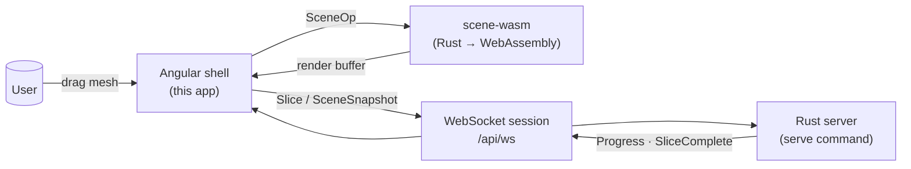
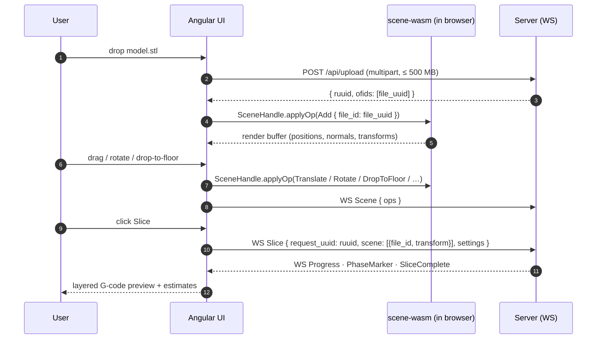
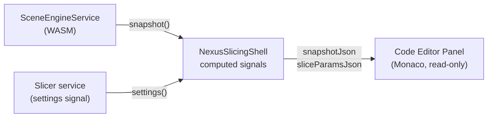
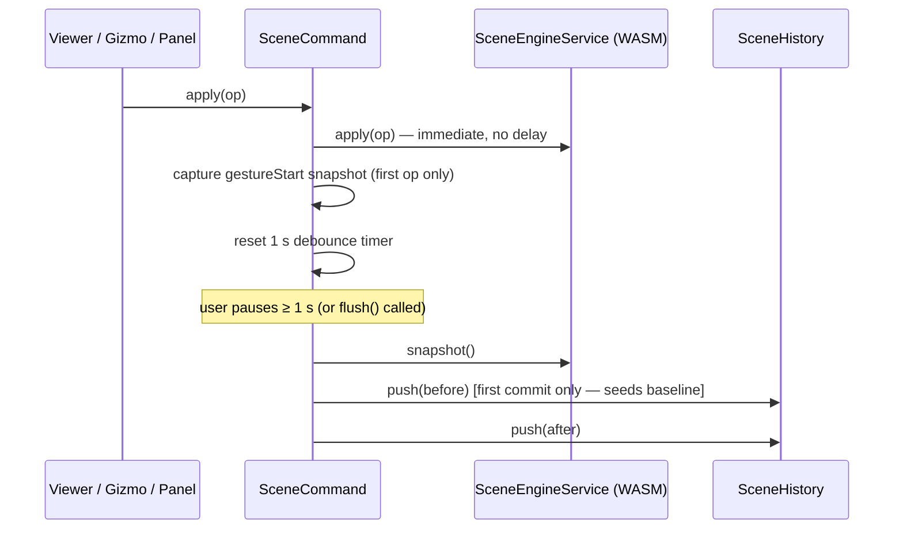

# Slicer Engine — Web UI

The Angular front-end of Slicer Engine. It uploads meshes, drives the slice, renders the live G-code preview, and lets you tweak settings — all against a single Rust core that also powers the CLI.

It exists for one reason: **what you preview in the browser must be exactly what slices on the server.** Both run the same Rust code. The UI compiles part of the engine to WebAssembly so scene placement is computed locally, and delegates the heavy slicing to the server over WebSocket.

---

## The contract



- The Angular app **never reimplements** scene math. Translate, rotate, drop-to-floor, align-face — every gesture becomes a `SceneOp` and is applied by the Rust scene engine compiled to WASM. See [src/scene/README.md](../src/scene/README.md) for the SSOT contract.
- Schemas and TypeScript types are **generated from the Rust definitions**, not hand-written. See "Generated artifacts" below.
- The G-code preview is decoded from the same `SliceResult` produced by the CLI's `slice` command.

---

## Anatomy

```
ui/src/app/
├── app.config.ts          providers (router, http, markdown, input-modality, keyboard-shortcuts)
├── app-routes.ts          /, /slice/(new|:requestUuid)
├── pages/
│   ├── home/              landing dashboard
│   ├── slice-new/         upload + initial slice
│   └── slice-viewer/      G-code preview, layer scrubber, history
├── nexus/                 application shell — top bar, sidebar, layout, print-estimates
├── components/            stateless building blocks
│   ├── viewer/            three.js canvas + ViewportCube + 3D-view-toolbar
│   ├── code-editor/       Monaco editor wrapper (lazy-loaded; used by transmit-preview panel)
│   ├── settings-panel/    schema-driven forms
│   ├── file-upload/       drag-and-drop, progress, upload-guard hook
│   ├── history-panel/     past slice runs from the server's SQLite ledger
│   ├── status-panel/ connection-state/ notification-center/ logo/
│   └── …                  card, list-history, viewport-cube
├── services/
│   ├── scene-engine.service.ts       wraps the WASM SceneHandle (single instance)
│   ├── scene-command/scene-command.ts  single dispatch point for SceneOps; gesture-batching + history
│   ├── scene-history/scene-history.ts  linear undo/redo stack (max 50 snapshots)
│   ├── keyboard-shortcuts/             global Ctrl+Z / Ctrl+Y undo/redo hotkeys
│   ├── editor-panel.ts               toggle signal for the transmit-preview panel
│   ├── slicer.ts                     high-level slice orchestration
│   ├── slicer-connection.ts          WebSocket transport (typed messages)
│   ├── slicer-file.ts                mesh upload (REST), download
│   ├── upload-guard.ts               CanDeactivate guard for in-flight uploads
│   ├── viewer-control.ts             camera / framing helpers
│   ├── object-tracker/               per-object UI state
│   ├── print-area/                   build-volume + bed config from server
│   ├── history.ts                    slice history client
│   ├── notifications.ts              toast layer
│   ├── browser-storage.ts            localStorage wrapper
│   ├── logger.service.ts             structured logger (mirrors server logs in console)
│   └── app-theme.ts                  light / dark token switcher
├── schema-form/           generic form renderer driven by JSON Schema
├── models/                shared types (mostly re-exports from generated/)
└── shared/                cross-cutting widgets, directives, input-modality
```



---

## Monaco Transmit Preview

The **transmit preview panel** is a toggleable side panel that shows, in real time, the exact JSON payloads that the UI would send to the server when a slice job starts.

Toggle it with the **pipeline** (⊞) button — the `filter-list` icon — in the 3D-view toolbar, or press the button again to hide it. The button turns active (highlighted) when the panel is open. The panel sits alongside the 3D viewport and does not obscure the model.



The panel contains two read-only Monaco editor instances, each updated live as signals change:

| Editor | Content                                           | WebSocket field    |
| ------ | ------------------------------------------------- | ------------------ |
| Top    | Scene snapshot — objects, transforms, world AABBs | `scene` payload    |
| Bottom | Slice settings — layer height, walls, infill, …   | `settings` payload |

`bigint` object IDs are serialised as strings so `JSON.stringify` does not throw.

### `CodeEditorComponent` (`components/code-editor/`)

A thin Angular wrapper around Monaco editor:

- **Lazy-loaded** — the Monaco bundle is not included in the initial chunk. It is fetched once, the first time the panel is opened.
- **Inputs**: `content` (string signal), `language` (Monaco language ID, default `'plaintext'`), `readOnly` (boolean).
- **Live updates** — an `effect()` pushes content and readOnly changes into the live editor instance, so Angular signals drive Monaco without re-creating the editor.
- **Resource cleanup** — `DestroyRef.onDestroy` disposes the editor and releases its DOM/worker resources when the component is destroyed.
- **Workers** — language workers (JSON, CSS, TypeScript, …) are spawned via `Blob` URLs so no separate worker bundle entry-point is needed. `MonacoEnvironment` is set once globally on `window`.
- **Options**: dark theme (`vs-dark`), auto-layout, word-wrap on, minimap off, folding on.

### `EditorPanel` service (`services/editor-panel.ts`)

Holds the single `visible: Signal<boolean>` toggle state. Lives in the root injector because the toolbar (toggle button) and the shell (conditional rendering) are in separate component trees. Call `toggle()` to flip it.

---

## Undo / Redo History

Every scene mutation goes through `SceneCommand`, which maintains a snapshot-based undo/redo stack via `SceneHistory`.



### `SceneCommand` (`services/scene-command/`)

The **only** place where `SceneEngineService.apply` should be called for user-driven mutations. Initialisation paths (`ready()`, `addMesh()`, `resetWithBed()`) still go directly to `SceneEngineService` — they are not undoable.

- `apply(op)` — forwards the op to WASM immediately, then starts/resets a 1-second debounce timer. When the timer fires the gesture is committed to history.
- `flush()` — commit immediately without waiting for the timer. Call on pointer-up / gesture-end events (e.g. drag release in the viewer).

### `SceneHistory` (`services/scene-history/`)

Linear stack of complete `SceneSnapshot` values — no deltas, no partial patches.

| Signal / method  | Description                                   |
| ---------------- | --------------------------------------------- |
| `canUndo`        | `true` when cursor > 0                        |
| `canRedo`        | `true` when cursor < stack tail               |
| `entryCount`     | total snapshots stored                        |
| `push(snapshot)` | append; trims redo branch; caps at 50 entries |
| `undo()`         | step cursor back and restore                  |
| `redo()`         | step cursor forward and restore               |
| `clear()`        | wipe the stack                                |

**Restoration** issues `set_transform` ops for every object in the target snapshot and `remove` ops for objects that no longer exist. Objects that should be re-added but whose mesh bytes are no longer in memory are permanently skipped in the current implementation — re-add support requires a future mesh-byte retention layer.

The baseline snapshot (`s0`) is seeded by `SceneCommand` on the very first gesture commit, so the user can always undo back to the state before any edits.

---

## Keyboard Shortcuts

`KeyboardShortcuts` is eagerly instantiated in `app.config.ts` and adds a single `keydown` listener to `document` for the lifetime of the app.

| Shortcut                  | Action                                     |
| ------------------------- | ------------------------------------------ |
| `Ctrl+Z` (or `⌘Z`)        | Undo                                       |
| `Ctrl+Y` (or `⌘Y`)        | Redo                                       |
| `Ctrl+Shift+Z` (or `⌘⇧Z`) | Redo (alternate — common on macOS / Linux) |

Shortcuts are no-ops when the corresponding history direction is unavailable (guards `canUndo` / `canRedo`). The `keydown` event is consumed with `preventDefault()` only when the shortcut fires, so browser defaults are unaffected otherwise.

---

## Generated artifacts

Anything under `src/generated/` is **regenerated, not edited**. Each file maps 1:1 to a Rust type or wasm-pack output, and any drift is treated as a bug in the generator, not in this folder.

| Path                        | Source of truth                                   | Regenerated by                          |
| --------------------------- | ------------------------------------------------- | --------------------------------------- |
| `src/generated/*.d.ts`      | Rust schemas via `slicer-engine gen-schemas`      | `pnpm run gen` (also runs on `install`) |
| `src/generated/scene-wasm/` | `src/scene/wasm.rs` (`cfg(target_arch="wasm32")`) | `make build-wasm` at the repo root      |
| `src/schemas/*.json`        | JSON Schema emitted by the Rust CLI               | `pnpm run gen-schemas`                  |

The `postinstall` script in [package.json](package.json) wires this up: cloning the repo and running `pnpm install` (with the WASM bundle already built) is enough to get a working dev environment.

---

## Quick start

```bash
# From the repo root, build the WASM scene engine first
make build-wasm                                  # writes ui/src/generated/scene-wasm/

# Then, in this folder:
pnpm install                                     # also runs `pnpm run gen`
pnpm start                                       # ng serve --host 0.0.0.0 → http://localhost:4200

# In a second terminal, run the slicer-engine server (UI talks to this)
cargo run --release -- serve                     # default http://localhost:5201
```

Reset the generated folder anytime with `pnpm run gen`. If types or schemas look stale after editing Rust, run `pnpm run gen` — never edit `src/generated/` by hand.

---

## Development workflow

| Task                            | Command                                 |
| ------------------------------- | --------------------------------------- |
| Dev server with HMR             | `pnpm start`                            |
| Production build                | `pnpm build`                            |
| Watch incremental dev build     | `pnpm watch`                            |
| Unit tests (Vitest, jsdom)      | `pnpm test`                             |
| Regenerate JSON schemas + .d.ts | `pnpm run gen`                          |
| Rebuild the WASM scene engine   | `make build-wasm` (repo root)           |
| Format                          | Prettier (configured in `package.json`) |

The UI follows the project [`.editorconfig`](.editorconfig) and is formatted with Prettier.

---

## Tech stack

- **Angular 21** — standalone components, signals, `provideRouter` with view transitions, zoneless-ready.
- **Monaco Editor** — VS Code's editor component, lazy-loaded for the transmit-preview panel. Workers spawned via Blob URLs; no separate worker bundle entry point required.
- **three.js 0.184** — 3D viewer, custom camera/orbit controls (`viewer-control.ts`), `viewport-cube` orientation widget.
- **Iconoir 7** — icon set.
- **fuse.js 7** — fuzzy search inside settings/history.
- **ngx-markdown 21** — renders Rust READMEs and docs inline where useful.
- **Vitest 4** — fast unit tests via `@angular/build`.
- **wasm-bindgen** (via `scene-wasm`) — typed bridge to the Rust scene engine.

---

## What this UI deliberately does not do

- **No client-side slicing.** The browser only handles scene placement and preview. The slice runs on the server, against the same Rust core.
- **No second source of truth for transforms.** All placement state lives in the WASM `SceneHandle`. The UI reads from it, never duplicates it.
- **No hand-written API types.** If a Rust struct changes, regenerate; do not patch the `.d.ts`.
- **No bundled meshes.** Test fixtures live in [`/stls`](../stls/) and [`/tests/fixtures`](../tests/fixtures/) at the repo root.
- **No undo across sessions.** The `SceneHistory` stack is in-memory and is cleared on page reload or navigation. Persistence is a future concern.
- **No undo for mesh uploads / removes.** Re-adding an object requires the original mesh bytes, which are not retained in the history stack. Only transforms are restored on undo.

---

## See also

- [src/scene/README.md](../src/scene/README.md) — the scene engine SSOT this UI sits on top of
- [src/server/README.md](../src/server/README.md) — HTTP + WebSocket protocol
- [src/cli/README.md](../src/cli/README.md) — the same engine, different surface
- [ui/src/styles/README.md](src/styles/README.md) — design tokens and SCSS architecture
- [THEME.md](THEME.md) — colour and spacing system
- [AGENTS.md](../AGENTS.md) — repo-wide conventions and AI-agent guidance
