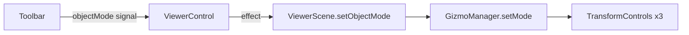
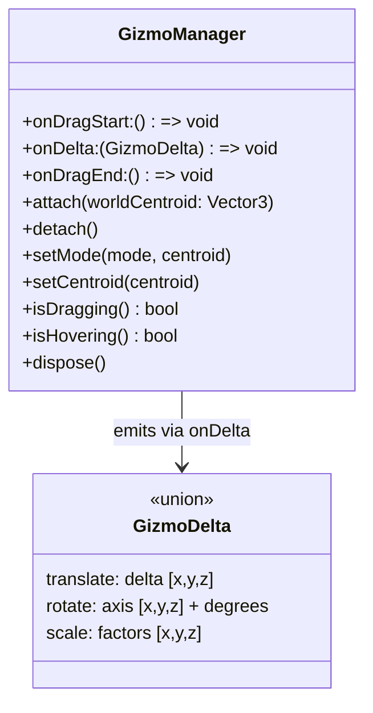
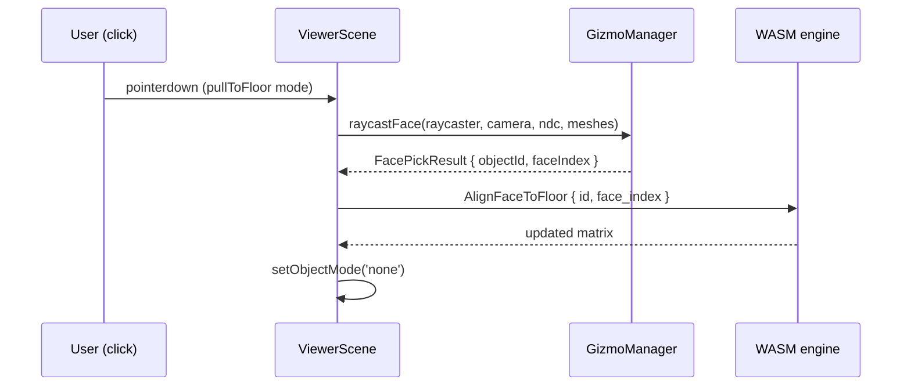
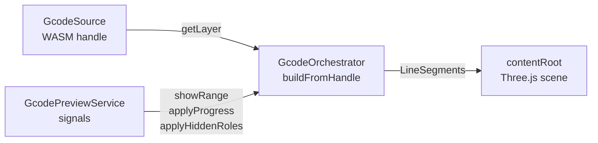

# Viewer — 3D Canvas, Gizmos, and Object Manipulation

The viewer is the single entry point for 3D visualisation. It owns the
Three.js scene, the WebGL render loop, camera controls, and — introduced in
this PR — a full suite of interactive object-manipulation gizmos.

> _Every gesture the user makes becomes a `SceneOp`. The renderer reads the
> result back. It never invents transforms of its own._

---

## Why gizmos live here

Scene placement is owned by the Rust scene engine (compiled to WASM). The
viewer's job is to translate pointer events into the right `SceneOp` and then
reflect the updated state back into Three.js.

Before this PR only orbit/pan/zoom were interactive. Object placement required
clicking toolbar buttons ("center on bed", "drop to floor"). The gizmo layer
adds direct on-canvas manipulation without breaking the SSOT contract: every
drag still ends with a `Rotate`, `Translate`, or `Scale` op dispatched to the
WASM engine; Three.js receives the resulting matrix and mirrors it — nothing
more.

---

## Object-manipulation modes

The `ObjectMode` union defined in `viewer-control.ts` drives what happens when
the user interacts with a selected mesh:

| Mode          | What it shows                                   | What it does on interaction              |
| ------------- | ----------------------------------------------- | ---------------------------------------- |
| `none`        | No gizmo (default)                              | Clicks select / deselect objects         |
| `translate`   | Three-axis / three-plane translation handles    | Emits `Translate` ops per frame          |
| `rotate`      | Three arc rotation handles                      | Emits `Rotate` ops per frame             |
| `scale`       | Three-axis scale handles (no planar handles)    | Emits `Scale` ops per frame              |
| `pullToFloor` | Face-highlight cursor; no handles on the canvas | Single face-pick → `AlignFaceToFloor` op |

The toolbar (`3d-view-toolbar`) exposes one button per mode in a radio group
that writes to `ViewerControl.objectMode`. The viewer reacts via an Angular
`effect()` and calls `ViewerScene.setObjectMode()`.



---

## GizmoManager

`GizmoManager` (`gizmo.ts`) wraps Three.js
[`TransformControls`](https://threejs.org/docs/#examples/en/controls/TransformControls)
and hides all its mechanical details behind a clean delta-stream interface.



### Ghost object

`GizmoManager` attaches `TransformControls` to an invisible `Group` (the
"ghost") instead of directly to a scene mesh. The ghost lives at the world
centroid of the current selection and acts purely as a drag surface. At the end
of each frame the ghost is reset to its anchor with identity rotation and unit
scale — so the WASM engine is always the authoritative record of where things
actually are.

### Incremental deltas

`TransformControls` reports absolute transforms of its target object. The
manager converts those to per-frame incremental deltas that map directly to
WASM ops:

- **translate** → position difference from last frame → `Translate { delta }`
- **rotate** → quaternion difference → axis-angle decomposition → `Rotate { axis, degrees }`
- **scale** → ratio of current to last scale → `Scale { factors }`

Zero-magnitude deltas are filtered before dispatch so the WASM pipeline is not
flooded with no-ops.

### Shift-key snapping

While **Shift** is held, each TransformControls instance snaps to a fixed step
defined in `GIZMO_SNAP`:

| Mode      | Snap step  |
| --------- | ---------- |
| translate | 1 mm       |
| rotate    | 15°        |
| scale     | 0.1 (±10%) |

When Shift is released, the snap reverts to continuous free motion (`null`).

### Always-on-top rendering

Gizmo handles are rendered on top of the model so they are never occluded.
Every `Mesh` node in the `TransformControls` helper tree has its material
configured with `depthTest: false`, `depthWrite: false`, `transparent: true`,
and `renderOrder: 999`. This is applied once in `makeControls()` — from that
point `TransformControls` reuses the same materials.

---

## Pull-to-floor — face picking

`pullToFloor` is a one-shot mode: the user clicks any face on any object and
that face is aligned to the build plate floor (Z = 0) via an
`AlignFaceToFloor` op. The mode exits automatically to `'none'` after the
pick.

### How face picking works



`raycastFace()` runs a Three.js raycaster against all scene meshes and returns
the `selectableId` (the string form of the WASM object id stored in
`userData.selectableId`) and the triangle index of the nearest hit.

### Face-group highlighting

When the cursor enters `pullToFloor` mode, the viewer asks the WASM engine for
coplanar face groups (`SceneEngineService.getFaceGroups`). As the cursor moves,
`raycastFace` identifies the hovered triangle and the viewer highlights all
faces in the same coplanar group — giving the user a clear preview of which
flat face will be aligned to the floor.

The highlight is applied as a per-vertex color buffer attribute on a cloned
`BufferGeometry`. The original geometry is restored when the mode exits.

---

## Coplanar face groups (Rust side)

`src/mesh/analysis.rs::compute_coplanar_groups` is the Rust function that
powers the face-pick highlight. See [src/mesh/README.md](../../../../../src/mesh/README.md)
for the full algorithm description.

The WASM bridge method `SceneHandle.getFaceGroups(id, angleThresholdDeg)` calls
it and returns a `Uint32Array` of group ids (one per triangle). The
`SceneEngineService.getFaceGroups()` wrapper logs the call timing and hands the
array to the viewer.

---

## Interaction priority

When multiple input consumers are active at the same time (orbit, selection
raycaster, gizmo), the viewer applies a clear priority order:

1. **Gizmo dragging in progress** — gizmo owns the pointer; OrbitControls
   and the selection raycaster are both suppressed.
2. **Gizmo hovering** (cursor over a handle, not yet dragging) — the selection
   raycaster is suppressed on this frame so a click registers on the handle,
   not on an underlying mesh.
3. **pullToFloor mode** — selection raycaster is disabled; pointer is entirely
   dedicated to face picking.
4. **Normal mode** — the selection raycaster runs; OrbitControls handles any
   gesture that misses a selectable object.

---

## Anatomy

The viewer is split into focused files so each concern stays under ~300 lines.

```
viewer/
├── viewer.ts                  Angular component — effects wiring, WASM ↔ Three bridge
├── scene/                     ViewerScene and all Three.js sub-systems
│   ├── index.ts               ViewerScene — owns renderer, render loop, delegates to sub-modules
│   ├── camera.ts              SceneCamera — animations, view presets, fit-to-content, near/far
│   ├── controls.ts            SceneControls — orbit inertia, multi-touch (pinch/pan/roll), autoscroll zoom
│   ├── grid.ts                SceneGrid — adaptive build-plate grid with cross-fade and fade-on-graze
│   ├── selection.ts           SceneSelection — selectable registry, emissive highlight, raycasting, face-pick
│   ├── types.ts               Shared public types (SceneSelectionHandlers, SceneGizmoHandlers, ViewerView, …)
│   └── utils.ts               disposeObject — recursive Three.js geometry/material cleanup
├── gizmo.ts                   GizmoManager, computeSelectionCentroid, raycastFace
├── gcode-orchestrator.ts      GcodeOrchestrator — owns layer groups; Three.js visibility only (no geometry)
├── gcode-layer-renderer.ts    buildLayerGroup, showLayerRange, applySegmentProgress, applyHiddenRoles
└── index.ts                   Public re-exports
```

### ViewerScene sub-module responsibilities

| File                 | Class            | Owns                                                                                        |
| -------------------- | ---------------- | ------------------------------------------------------------------------------------------- |
| `scene/camera.ts`    | `SceneCamera`    | `PerspectiveCamera` pose, view animations, `fitToContent`                                   |
| `scene/controls.ts`  | `SceneControls`  | `OrbitControls` config, orbit inertia, touch gestures, autoscroll zoom                      |
| `scene/grid.ts`      | `SceneGrid`      | Bed grid `LineSegments`, adaptive spacing, CSS theme integration                            |
| `scene/selection.ts` | `SceneSelection` | Selectable `Map`, emissive highlight, pointer event plumbing, face-pick overlay             |
| `scene/index.ts`     | `ViewerScene`    | Three.js primitives (`Scene`, `WebGLRenderer`, `OrbitControls`), `contentRoot`, render loop |

### G-code layer architecture

All G-code geometry is built exclusively inside `GcodeOrchestrator.buildFromHandle()` by
calling the WASM-side `GcodeSource.getLayer()`. Three.js receives finished `Float32Array`
buffers and is responsible only for showing/hiding layer groups and scrubbing segment
draw-ranges. No geometry is constructed in TypeScript.



---

## What this module deliberately does _not_ do

- **No scene-state ownership.** Transforms are not stored here. The WASM
  `SceneHandle` is the only truth; Three.js matrices are a read-only mirror of
  it.
- **No G-code geometry construction.** `GcodeOrchestrator` never builds
  `BufferGeometry` itself — it only routes the WASM-emitted `Float32Array`
  buffers into Three.js `LineSegments` via `gcode-layer-renderer`.
- **No multi-object gizmo.** When multiple objects are selected, the gizmo
  appears at their collective world centroid but each object receives
  independent `Rotate`/`Translate`/`Scale` ops with the same delta. A unified
  pivot is not implemented for v1.
- **No undo stack.** `onDragEnd` is the hook point for a history layer; the
  viewer itself discards the delta stream when the drag ends.

---

## See also

- [scene/index.ts](scene/index.ts) — `ViewerScene`, `SceneSelectionHandlers`, `SceneGizmoHandlers`
- [scene/camera.ts](scene/camera.ts) — `SceneCamera`
- [scene/controls.ts](scene/controls.ts) — `SceneControls`
- [scene/grid.ts](scene/grid.ts) — `SceneGrid`
- [scene/selection.ts](scene/selection.ts) — `SceneSelection`
- [gizmo.ts](gizmo.ts) — `GizmoManager`, `GizmoDelta`, `FacePickResult`, `raycastFace`, `computeSelectionCentroid`
- [gcode-orchestrator.ts](gcode-orchestrator.ts) — `GcodeOrchestrator`
- [gcode-layer-renderer.ts](gcode-layer-renderer.ts) — layer builder and visibility helpers
- [viewer.ts](viewer.ts) — Angular component wiring
- [../../services/viewer-control.ts](../../services/viewer-control.ts) — `ObjectMode`, `ViewerControl` signal store
- [../../services/scene-engine.service.ts](../../services/scene-engine.service.ts) — `SceneEngineService`, `getFaceGroups`
- [../../../../src/mesh/README.md](../../../../../src/mesh/README.md) — coplanar group algorithm
- [../../../../src/scene/README.md](../../../../../src/scene/README.md) — scene engine SSOT contract
